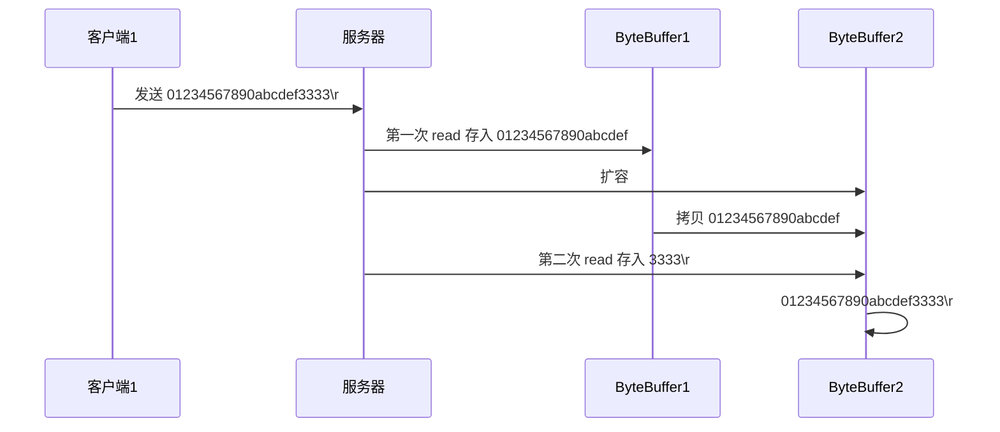
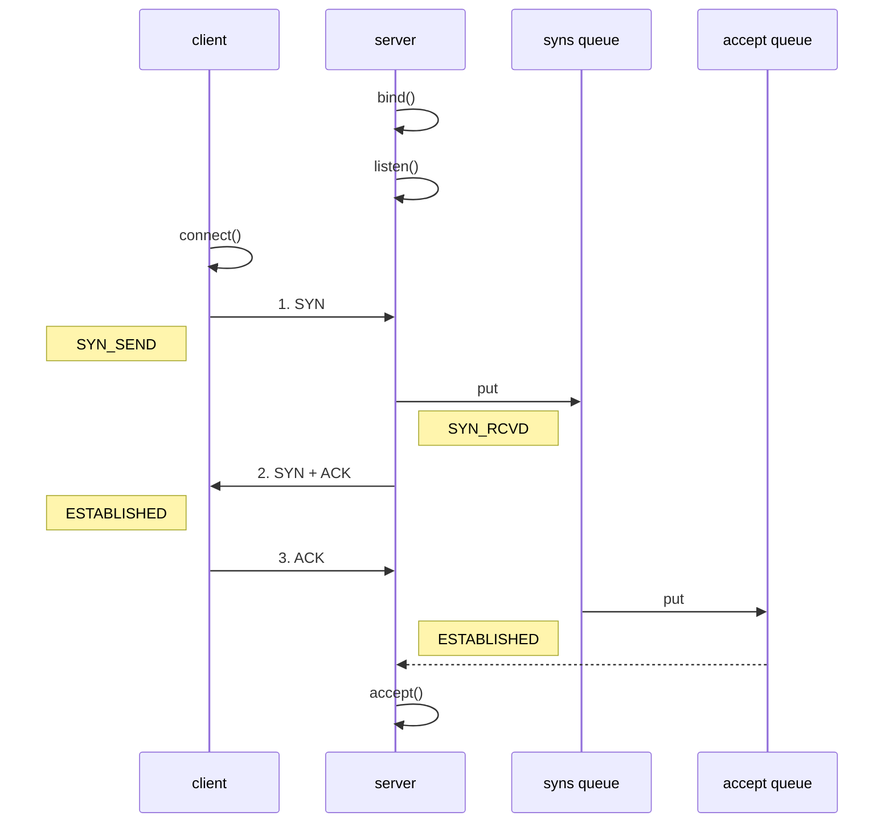

> pom文件下`	<scope>test</scope>`需要删掉，否则src下无法使用@Slf4j
>
> [源代码](https://gitee.com/zhang-songyao/netty-learn)

# Java IO到Netty

> Netty是一个异步的、基于时间驱动的网络应用框架，它提供了异步的、事件驱动的网络应用程序框架和工具。Netty主要用以快速开发高性能、高可靠的网络服务器和客户端程序

## NIO基础

> non-blocking io 非阻塞IO

### NIO的特点

- 一个线程可以处理多个通道，减少线程出创建的数量
- 读写非阻塞，节约资源，没有可写\可读数据时，不会发生阻塞导致线程资源的浪费

### NIO怎么实现的同步非阻塞

关键就是轮询器（Selector）的使用。轮询器（Selector）负责监视全部通道IO的状态，当其中任意一个或者多个通道具有可用的IO操作时，该轮询器会通过一个方法返回一个大于0的整数，该整数值就表示具体在那个通道上有可用的IO操作。服务器正是通过该轮询器完成单事件轮询机制，并实现了多路复用

[IO与NIO](https://www.jianshu.com/p/5bb812ca5f8e)

### Java BIO与NIO比较

#### BIO（传统IO）

BIO是一个同步并阻塞的IO模式，**传统的 java.io 包**，它基于流模型实现，提供了我们最熟知的一些 IO 功能，比如**File抽象、输入输出流**等。**交互方式是同步、阻塞的方式**，也就是说，在读取输入流或者写入输出流时，在读、写动作完成之前，线程会一直阻塞在那里，它们之间的调用是可靠的线性顺序


传统BIO模式下的服务器端包含一个接收器（Acceptor）该接收器负责监听每一个客户端的连接请求，并创建相对应的线程来处理该客户端请求，不过当客户端数量急剧增加时，对应服务器端数量也会按照1:1的比例同步增加，势必会占用Java虚拟机中的大量资源，当量变引起质变的时候就会导致系统能急剧下降（譬如：内存溢出、系统崩溃等），于是想到了降低服务器端线程数量（必须满足客户端数量的需求）来解决这个问题

#### 伪异步IO模式

针对传统BIO模式在性能上的瓶颈问题，Java IO通信模型改进设计了一种伪异步IO模型，就是通过在服务端控制线程的数量来灵活有效地调配系统线程资源


此服务器端同样是由Acceptor接收器负责监听连接请求，与传统BIO（一个请求对应一个线程）不同的是，服务器端通过一个任务处理模块Task（主要是通过JDK的Runnable接口来实现）来处理这些客户端连接，Task负责将这些连接请求放入一个线程池（Thread Pool）来处理，这个线程池维护着最大数量为M的活跃线程组（通常客户端数量是远大于M的），再该模式下，由于服务器端负责创建和维护的线程数量可控，因此服务器端占用资源也是可控的，最大程度避免了因资源耗尽而导致的系统崩溃问题

> 但是该模式底层仍然使用的同步阻塞的BIO，所以无法从根本上解决问题

#### NIO（Non-blocking / New I/O）

NIO是一种==同步非阻塞的IO模型==，于 JDK1.4 中引入，对应 java.nio 包，提供了Channel（通道）、Selector（轮询器）、Buffer（缓冲区）等抽象。NIO中的N可以理解为Non-blocking，不单纯是 New。它支持面向缓冲的，基于通道的 I/O 操作方法。NIO提供了与传统BIO模型中的Socket和ServerSocket相对应的SocketChannel和ServerSocketChannel两种不同的套接字通道实现,两种通道都支持阻塞和非阻塞两种模式。对于高负载、高并发的（网络）应用，应使用 NIO 的非阻塞模式来开发


##### BIO和NIO对比

| IO模型 |  BIO   |   NIO    |
| :----: | :----: | :------: |
|  通信  | 面向流 | 面向缓冲 |
|  处理  | 阻塞IO | 非阻塞IO |
|  触发  |   无   |  选择器  |

#### AIO模式

Java AIO（Java Asynchronous IO）模式是在JDK1.7版本中对NIO模式的一种改进。AIO就是`异步非阻塞`的IO方式。该模式利用了异步IO操作所基于的事件回调机制，实现了服务器后台操作的非阻塞功能，即服务器会在操作完成后通知相应线程进行后续工作

> AIO相比于NIO改进

虽然NIO提供了非阻塞的方法，但本质上NIO的操作还是同步的（体现在Selector同步器上）。具体来讲，就是NIO的服务器线程是在IO操作准备好时得到通知的，接着就有这个线程自行进行IO操作，因此本质上是同步操作

AIO模式下没有轮询器，而是在服务端的IO操作完成后，再给线程发出通知（通过异步回调事件机制）。因此AIO模式不会阻塞的，回调操作是在等待IO操作完成后由系统自动触发

> 异步模型需要底层操作系统（Kernel）提供支持

- Windows系统通过IOCP实现了真正的异步IO
- Linux系统异步IO在2.6版本引入，但是其底层还是用多路服用模拟了异步IO，性能没有优势（Netty5引入了异步IO，被废弃了）

##### 文件AIO

```java
/**
 * @author ：zsy
 * @date ：Created 2021/11/23 19:55
 * @description：
 */
@Slf4j
public class AioFileChannel {

    public static void main(String[] args) {
        try (AsynchronousFileChannel channel = AsynchronousFileChannel.open(Paths.get("data.txt"), StandardOpenOption.READ)) {

            ByteBuffer buffer = ByteBuffer.allocate(16);
            log.debug("read begin...");
            // 参数1：ByteBuffer
            // 参数2：读取的起始位置
            // 参数3：附加
            // 参数4：回调函数，以守护线程的形式回调
            channel.read(buffer, 0, buffer, new CompletionHandler<Integer, ByteBuffer>() {
                @Override
                public void completed(Integer result, ByteBuffer attachment) {
                    log.debug("read completed...{}", result);
                    attachment.flip();
                    // System.out.println(Charset.defaultCharset().decode(attachment));
                    debugRead(buffer);
                }

                @Override
                public void failed(Throwable exc, ByteBuffer attachment) {
                    exc.printStackTrace();
                }
            });
            log.debug("read end");
            System.in.read();
        } catch (IOException e) {
            e.printStackTrace();
        }
    }
}
```

运行结果


##### 网络通信AIO

```java
public class AioServer {
    public static void main(String[] args) throws IOException {
        AsynchronousServerSocketChannel ssc = AsynchronousServerSocketChannel.open();
        ssc.bind(new InetSocketAddress(8080));
        ssc.accept(null, new AcceptHandler(ssc));
        System.in.read();
    }

    private static void closeChannel(AsynchronousSocketChannel sc) {
        try {
            System.out.printf("[%s] %s close\n", Thread.currentThread().getName(), sc.getRemoteAddress());
            sc.close();
        } catch (IOException e) {
            e.printStackTrace();
        }
    }

    private static class ReadHandler implements CompletionHandler<Integer, ByteBuffer> {
        private final AsynchronousSocketChannel sc;

        public ReadHandler(AsynchronousSocketChannel sc) {
            this.sc = sc;
        }

        @Override
        public void completed(Integer result, ByteBuffer attachment) {
            try {
                if (result == -1) {
                    closeChannel(sc);
                    return;
                }
                System.out.printf("[%s] %s read\n", Thread.currentThread().getName(), sc.getRemoteAddress());
                attachment.flip();
                System.out.println(Charset.defaultCharset().decode(attachment));
                attachment.clear();
                // 处理完第一个 read 时，需要再次调用 read 方法来处理下一个 read 事件
                sc.read(attachment, attachment, this);
            } catch (IOException e) {
                e.printStackTrace();
            }
        }

        @Override
        public void failed(Throwable exc, ByteBuffer attachment) {
            closeChannel(sc);
            exc.printStackTrace();
        }
    }

    private static class WriteHandler implements CompletionHandler<Integer, ByteBuffer> {
        private final AsynchronousSocketChannel sc;

        private WriteHandler(AsynchronousSocketChannel sc) {
            this.sc = sc;
        }

        @Override
        public void completed(Integer result, ByteBuffer attachment) {
            // 如果作为附件的 buffer 还有内容，需要再次 write 写出剩余内容
            if (attachment.hasRemaining()) {
                sc.write(attachment);
            }
        }

        @Override
        public void failed(Throwable exc, ByteBuffer attachment) {
            exc.printStackTrace();
            closeChannel(sc);
        }
    }

    private static class AcceptHandler implements CompletionHandler<AsynchronousSocketChannel, Object> {
        private final AsynchronousServerSocketChannel ssc;

        public AcceptHandler(AsynchronousServerSocketChannel ssc) {
            this.ssc = ssc;
        }

        @Override
        public void completed(AsynchronousSocketChannel sc, Object attachment) {
            try {
                System.out.printf("[%s] %s connected\n", Thread.currentThread().getName(), sc.getRemoteAddress());
            } catch (IOException e) {
                e.printStackTrace();
            }
            ByteBuffer buffer = ByteBuffer.allocate(16);
            // 读事件由 ReadHandler 处理
            sc.read(buffer, buffer, new ReadHandler(sc));
            // 写事件由 WriteHandler 处理
            sc.write(Charset.defaultCharset().encode("server hello!"), ByteBuffer.allocate(16), new WriteHandler(sc));
            // 处理完第一个 accpet 时，需要再次调用 accept 方法来处理下一个 accept 事件
            ssc.accept(null, this);
        }

        @Override
        public void failed(Throwable exc, Object attachment) {
            exc.printStackTrace();
        }
    }
}
```

### BIO、NIO和AIO区别

BIO：一个连接一个线程，客户端有连接请求时服务端就需要启动一个线程进行处理。线程开销大

伪异步IO：将请求连接放入线程池，一对多，但是线程资源依然有限

NIO：一个请求一个线程，但客户端发送的连接请求会注册到多路复用器上，多路复用器轮询到连接有IP请求是才启动一个线程进行处理

AIO：一个有效请求一个线程，客户端的IO请求都是由OS先完成了再通知服务器应用去启动线程进行处理

BIO是面向流的，NIO是面向缓冲区的；BIO的各种流是阻塞的。而NIO是非阻塞的；BIO的Stream是单向的，而NIO的channel是双向的。

NIO的特点：事件驱动模型、单线程处理多任务、非阻塞I/O，I/O读写不再阻塞，而是返回0、基于block的传输比基于流的传输更高效、更高级的IO函数zero-copy、IO多路复用大大提高了Java网络应用的可伸缩性和实用性。基于Reactor线程模型。

### 零拷贝

#### 传统IO的问题

传统IO将一个文件通过socket写出的步骤

```java
File f = new Flie("helloworld/data.txt");
RandomAccessFile flie = RandomAccessFile(f, "r");

byte[] buf = new byte[(int) f.length];
file.read(buf);

Socket socket = ...;
socket.getOutputStream().write(buf);
```

工作过程


1. Java本身不具备IO读写能力，因此read方法调用后，要从java程序的用户态切换至内核态，去调用操作系统（Kernel）的读能力，将数据读入内核缓冲区。这期间用户线程阻塞，操作系统使用DMA（Direct Memory Access）来实现文件读，其间也不会使用cpu

   >DMA也可以理解为硬件单元，用来解放cpu完成文件IO

2. 从内核态切换回用户态，将数据从内缓冲区读入用户缓冲区（即byte[] buf），这期间cpu会参与拷贝，无法利用DMA

3. 调用write方法，这时将数据从用户缓冲区（byte[] buf）写入socket缓冲区，cpu会参与拷贝

4. 接下来要向网卡写数据，这项能力java又不具备，因此又需要从用户态切换这内核态，调用操作系统的写能力，使用DMA将socket缓冲区的数据写入网卡，不会使用cpu

> 可以看到中间环节较多，java的IO实际不是物理设备级别的读写，而是缓存的复制，底层真正读写是操作系统来完成的

- 用户态与内核态切换发生了3次，这个操作比较耗费资源
- 数据拷贝了4次

#### NIO的优化

- ByteBuffer.allocate(10)  HeapByteBuffer 使用的还是 java 内存
- ByteBuffer.allocateDirect(10)  DirectByteBuffer 使用的是操作系统内存


java可以使用DirectByteBuffer将**堆外内存映射到JVM内存中来直接访问使用**

- 这块内存不收JVM垃圾回收的影响，因此内存地址固定，有助于IO读写
- Java中的DirectByteBuffer对象仅维护了此内存的虚引用，内存回收分成两部分
  - DirectByteBuffer 对象被垃圾回收，将虚引用加入引用队列
  - 通过专门线程访问引用队列，根据虚引用释放堆外内存
- 减少了一次数据拷贝，用户态与内核态的切换次数没有减少

#### sendFile

进一步优化（底层采用了linux2.1后提供的sendFile方法），Java中对应两个channel调用transferTo/transferFrom方法拷贝数据


- Java调用transferTo方法后，要从Java程序的用户态切换至内核态，使用DMA将数据读入内核缓冲区，不会使用cpu
- 数据从内核缓冲传输到socket缓冲区，cpu会参与拷贝
- 最后使用DMA将socket缓冲区的数据写入网卡，不会使用cpu

> 可以看到

- 只发生了一次用户态内核态的切换
- 数据拷贝了3次

#### linux2.4后


1. java 调用 transferTo 方法后，要从 java 程序的**用户态**切换至**内核态**，使用 DMA将数据读入**内核缓冲区**，不会使用 cpu
2. 只会将一些 offset 和 length 信息拷入 **socket 缓冲区**，几乎无消耗
3. 使用 DMA 将 **内核缓冲区**的数据写入网卡，不会使用 cpu

整个过程仅只发生了一次用户态与内核态的切换，数据拷贝了 2 次。**所谓的【零拷贝】，并不是真正无拷贝，而是在不会拷贝重复数据到 jvm 内存中**，零拷贝的优点有

* 更少的用户态与内核态的切换
* 不利用 cpu 计算，减少 cpu 缓存伪共享
* 零拷贝适合小文件传输

### 三大组件

#### Channel（通道）

传统IO操作对read()或write()方法的调用，可能会因为没有数据可读/可写而阻塞，直到有数据响应。也就是说读写数据的IO调用，可能会无限期的阻塞等待，效率依赖网络传输的速度。最重要的是在调用一个方法前，无法知道是否会被阻塞。

NIO的Channel抽象了一个重要特征就是可以通过配置它的阻塞行为，来实现非阻塞式的通道。

Channel是一个**双向通道**，与传统IO操作只允许单向的读写不同的是，NIO的Channel允许在一个通道上进行读和写的操作。

> 主要实现

- FileChannel：文件数据传输通道
- SocketChannel：TCP网络编程数据传输通道服务器端和客户端
- ServerSocketChannel：TCP网络编程数据传输通道服务器端
- DatagramChannel：UDP网络编程数据传输通道

#### Buffer（缓冲区）

buffer顾名思义，他是一个缓冲区，实际上是一个容器，一个连续数组，Channel提供从文件、网络读取数据的渠道，但是读写的数据都必须经过Buffer


常见的 buffer 有

* ByteBuffer
  * MappedByteBuffer
  * DirectByteBuffer
  * HeapByteBuffer
* ShortBuffer
* IntBuffer
* LongBuffer
* FloatBuffer
* DoubleBuffer
* CharBuffer

Buffer缓冲区本质是一块可以写入数据，然后可以从中读取数据的内存这块内存被包装成NIO Buffer对象，并提供了一组方法，用来方便的访问该模块内存。为了理解Buffer的工作原理，需要熟悉它的三个属性：capacity、position和limit。

#### Selector（多路复用器）

Selector与Channel是相互配合使用的，将Channel注册在Selector上之后，才可以正确的使用Selector，但此时Channel必须为非阻塞模式，Selector可以监听Channel的四种状态（Connect、Accept、Read、Write），当监听到某一个Channel的某个状态时，才允许对Channel进行相应的操作，不会让线程吊死在一个channel上。适合连接数特别多，但流量低的场景（low traffic）

- Connect：某一个客户端连接成功后
- Accept：准备好进行连接
- Read:可读
- Write:可写


调用 selector 的 select() 会阻塞直到 channel 发生了读写就绪事件，这些事件发生，select 方法就会返回这些事件交给 thread 来处理

### ByteBuffer

#### 最佳实践

在类路径下创建一个data.txt文件

使用byteBuffer读取文件数据

```java
/**
 * @author ：zsy
 * @date ：Created 2021/11/19 20:33
 * @description：测试ByteBuffer
 */
@Slf4j
public class TestByteBuffer {
    public static void main(String[] args) {
        // FileChannel
        // 通过输入输出流获取文件 或者 RandomAccessFile
        // try-with-resource语法无需自己写代码关闭资源，资源必须实现AutoClosable接口，重写close方法
        //原理：编译器自动帮我们生成了finally块，并且在里面调用了资源的close方法
        try (FileChannel channel = new FileInputStream("data.txt").getChannel()) {
            // 准备缓冲区
            ByteBuffer buffer = ByteBuffer.allocate(10);
            while (true) {
                // 从channel中读数据，向buffer写入数据
                int len = channel.read(buffer);
                log.debug("读到字节数：{}", len);
                if (len == -1) break;
                // 切换至读模式
                buffer.flip();
                // 打印buffer中的内容
                while (buffer.hasRemaining()) { // 还有剩余未读数据
                    byte b = buffer.get();
                    System.out.print((char) b);
                }
                // 切换至写模式
                buffer.clear();
            }
        } catch (IOException e) {
        }
        ;
    }
}
```

##### twr

twr（try-with-resources）：如果在try语句块同时打开了多个资源，那么在finally语句块中为了关闭所有的资源，不得不借助finally中嵌套finally的方式关闭所有的资源，如下图

```java
public class Demo {
  public static void main(String[] args) {
    BufferedInputStream bin = null;
    BufferedOutputStream bout = null;
    try {
      bin = new BufferedInputStream(new FileInputStream(new File("test.txt")));
      bout = new BufferedOutputStream(new FileOutputStream(new File("out.txt")));
      int b;
      while ((b = bin.read()) != -1) {
        bout.write(b);
      }
    }
    catch (IOException e) {
      e.printStackTrace();
    }
    finally {
      if (bin != null) {
        try {
          bin.close();
        }
        catch (IOException e) {
          throw e;
        }
        finally {
          if (bout != null) {
            try {
              bout.close();
            }
            catch (IOException e) {
              throw e;
            }
          }
        }
      }
    }
  }
}
```

关闭资源的代码比业务代码还多，这是因为，我们不仅需要关闭 `BufferedInputStream `，还需要保证如果关闭 `BufferedInputStream `时出现了异常， `BufferedOutputStream `也要能被正确地关闭。所以我们不得不借助finally中嵌套finally

JDK1.7中引入了try-with-resources语法来打开资源，无需程序员自己关闭资源

[原理](https://www.jb51.net/article/156189.htm)

##### RandomAccessFile

```java
/**
 * @author ：zsy
 * @date ：Created 2021/11/19 20:51
 * @description：
 */
@Slf4j
public class TestByteBuffer0 {

    public static void main(String[] args) {

        try (RandomAccessFile file = new RandomAccessFile("data.txt", "rw")) {
            FileChannel channel = file.getChannel();
            ByteBuffer buffer = ByteBuffer.allocate(10);
            while (true) {
                int len = channel.read(buffer);
                buffer.flip();
                log.debug("读取到的字节数：{}", len);
                if (len == -1) break;
                while (buffer.hasRemaining()) {
                    byte b = buffer.get();
                    System.out.println((char) b);
                }
                buffer.clear();
            }
        } catch (IOException e) {
        }
    }
}
```


#### ByteBuffer使用步骤

1. 向 buffer 写入数据，例如调用 channel.read(buffer)
2. 调用 flip() 切换至**读模式**
3. 从 buffer 读取数据，例如调用 buffer.get()
4. 调用 clear() 或 compact() 切换至**写模式**
5. 重复 1~4 步骤

#### ByteBuffer结构

ByteBuffer有以下属性：

- capacity
- position
- limit

写模式下，limit等于容量，position是写入的位置


写入4个字节后的状态


 buffer.flip()方法执行后，进入读模式，position切换到读取位置，limit切换为读取位置


读取四个字节后


buffer.clear()方法执行后，进入写模式


compact 方法，是把未读完的部分向前压缩，然后切换至写模式


#### ByteBuffer常见方法

##### 分配空间

allocate/allocateDirect

```java
/**
 * @author ：zsy
 * @date ：Created 2021/11/20 11:48
 * @description：
 */
public class TestByteBufferAllocate {
    public static void main(String[] args) {
        System.out.println(ByteBuffer.allocate(16));            // java.nio.HeapByteBuffer[pos=0 lim=16 cap=16]
        System.out.println(ByteBuffer.allocateDirect(16));      // java.nio.DirectByteBuffer[pos=0 lim=16 cap=16]
    }
}
```

区别:

- allocate：Java堆内存，读写效率较低，收到GC的影响，根据不同的垃圾回收器的不同垃圾回收算法，buffer的空间可能会被压缩整理
- allocateDirect：直接内存，读写效率高（少一次拷贝），不会受GC的影响，分配效率低（需要调用操作系统函数进行分配）

##### 向 buffer 写入数据

有两种办法

* 调用 channel 的 read 方法
* 调用 buffer 自己的 put 方法

```java
int readBytes = channel.read(buf);
```

和

```java
buf.put((byte)127);
```

##### 从 buffer 读取数据

同样有两种办法

* 调用 channel 的 write 方法
* 调用 buffer 自己的 get 方法

```java
int writeBytes = channel.write(buf);
```

和

```java
byte b = buf.get();
```

get 方法会让 position 读指针向后走，如果想重复读取数据

* 可以调用 rewind 方法将 position 重新置为 0
* 或者调用 get(int i) 方法获取索引 i 的内容，它不会移动读指针
* mark和reset：mark做一个标记，记录当前position的位置，reset是将position的位置重置到mark的位置

```java
/**
 * @author ：zsy
 * @date ：Created 2021/11/20 12:07
 * @description：
 */
public class TestByteBufferRead {

    public static void main(String[] args) {
        ByteBuffer buffer = ByteBuffer.allocate(10);
        buffer.put(new byte[]{'a', 'b', 'c', 'd'});
        buffer.flip();

        /*buffer.get(new byte[4]);
        buffer.rewind();
        debugAll(buffer);*/

        System.out.println((char) buffer.get());
        System.out.println((char) buffer.get());
        buffer.mark();
        System.out.println((char) buffer.get());
        System.out.println((char) buffer.get());
        debugAll(buffer);
        buffer.reset();
        debugAll(buffer);

    }
}
```

##### 字符串与 ByteBuffer 互转

```java
/**
 * @author ：zsy
 * @date ：Created 2021/11/20 12:25
 * @description：
 */
public class TestByteBufferString {

    public static void main(String[] args) {
        ByteBuffer buffer = ByteBuffer.allocate(16);
        buffer.put("hello Netty".getBytes());
        debugAll(buffer);

        ByteBuffer buffer2 = Charset.forName("utf-8").encode("您好");
        debugAll(buffer2);

        CharBuffer buffer3 = StandardCharsets.UTF_8.decode(buffer2);
        System.out.println(buffer3.toString());
        
        ByteBuffer buffer4 = ByteBuffer.wrap("hello".getBytes());
        debugAll(buffer4);
    }
}

```

#### Scattering Reads

> 分散读取一个文本文件   word1.txt：onetwothree

```java
/**
 * @author ：zsy
 * @date ：Created 2021/11/20 15:21
 * @description：
 */
public class TestScatteringReads {

    public static void main(String[] args) {
        try (FileChannel channel = new FileInputStream("word1.txt").getChannel()) {
            ByteBuffer a = ByteBuffer.allocate(3);
            ByteBuffer b = ByteBuffer.allocate(3);
            ByteBuffer c = ByteBuffer.allocate(5);
            channel.read(new ByteBuffer[]{a, b, c});
            a.flip();
            b.flip();
            c.flip();
            debugAll(a);
            debugAll(b);
            debugAll(c);
        } catch (IOException e) {
        }
    }
}
```

#### Gathering Writes

>集中写，可以将多个buffer中的数据写入文件中

```java
/**
 * @author ：zsy
 * @date ：Created 2021/11/20 15:32
 * @description：
 */
public class TestGatherWrites {

    public static void main(String[] args) {
        try (RandomAccessFile randomAccessFile = new RandomAccessFile("word2.txt", "rw")) {
            FileChannel channel = randomAccessFile.getChannel();
            final ByteBuffer b1 = StandardCharsets.UTF_8.encode("Hello");
            final ByteBuffer b2 = StandardCharsets.UTF_8.encode("Netty");
            final ByteBuffer b3 = StandardCharsets.UTF_8.encode("您好");
            channel.write(new ByteBuffer[]{b1, b2, b3});
        } catch (IOException e) {
        }
    }
}
```

#### 粘包半包练习

网络上有多条数据发送给服务端，数据之间使用 \n 进行分隔
但由于某种原因这些数据在接收时，被进行了重新组合，例如原始数据有3条为

* Hello,world\n
* I'm zhangsan\n
* How are you?\n

变成了下面的两个 byteBuffer (黏包，半包)

* Hello,world\nI'm zhangsan\nHo
* w are you?\n

现在要求你编写程序，将错乱的数据恢复成原始的按 \n 分隔的数据

```java
/**
 * @author ：zsy
 * @date ：Created 2021/11/20 15:54
 * @description：
 */
public class TestByteBufferExam {

    public static void main(String[] args) {
        ByteBuffer source = ByteBuffer.allocate(32);
        source.clear();
        source.put("Hello World\nI'm zhangsan\nHo".getBytes());
        split(source);
        source.put("w are you\n".getBytes());
        split(source);
    }

    private static void split(ByteBuffer source) {
        source.flip();
        for (int i = 0; i < source.limit(); i++) {
            if (source.get(i) == '\n') {
                int len = i + 1 - source.position();
                ByteBuffer tmp = ByteBuffer.allocate(len);
                tmp.clear();
                for (int j = 0; j < len; j++) {
                    tmp.put(source.get());
                }
                tmp.flip();
                debugAll(tmp);
            }
        }
        //可能没有读完，不能使用clear
        source.compact();
    }
}


+--------+-------------------- all ------------------------+----------------+
position: [0], limit: [12]
         +-------------------------------------------------+
         |  0  1  2  3  4  5  6  7  8  9  a  b  c  d  e  f |
+--------+-------------------------------------------------+----------------+
|00000000| 48 65 6c 6c 6f 20 57 6f 72 6c 64 0a             |Hello World.    |
+--------+-------------------------------------------------+----------------+
+--------+-------------------- all ------------------------+----------------+
position: [0], limit: [13]
         +-------------------------------------------------+
         |  0  1  2  3  4  5  6  7  8  9  a  b  c  d  e  f |
+--------+-------------------------------------------------+----------------+
|00000000| 49 27 6d 20 7a 68 61 6e 67 73 61 6e 0a          |I'm zhangsan.   |
+--------+-------------------------------------------------+----------------+
+--------+-------------------- all ------------------------+----------------+
position: [0], limit: [12]
         +-------------------------------------------------+
         |  0  1  2  3  4  5  6  7  8  9  a  b  c  d  e  f |
+--------+-------------------------------------------------+----------------+
|00000000| 48 6f 77 20 61 72 65 20 79 6f 75 0a             |How are you.    |
+--------+-------------------------------------------------+----------------+
```

## 文件编程

### FileChannel

>FileChannel工作在阻塞模式下

#### 获取

不能直接打开 FileChannel，必须通过 FileInputStream、FileOutputStream 或者 RandomAccessFile 来获取 FileChannel，它们都有 getChannel 方法

* 通过 FileInputStream 获取的 channel 只能读
* 通过 FileOutputStream 获取的 channel 只能写
* 通过 RandomAccessFile 是否能读写根据构造 RandomAccessFile 时的读写模式决定

#### 读取

会从 channel 读取数据填充 ByteBuffer，返回值表示读到了多少字节，-1 表示到达了文件的末尾

```java
int readBytes = channel.read(buffer);
```

#### 写入

写入的正确姿势如下， SocketChannel

```java
ByteBuffer buffer = ...;
buffer.put(...); // 存入数据
buffer.flip();   // 切换读模式

while(buffer.hasRemaining()) {
    channel.write(buffer);
}
```

在 while 中调用 channel.write 是因为 write 方法并不能保证一次将 buffer 中的内容全部写入 channel

#### 关闭

channel 必须关闭，不过调用了 FileInputStream、FileOutputStream 或者 RandomAccessFile 的 close 方法会间接地调用 channel 的 close 方法

#### 位置

获取当前位置

```java
long pos = channel.position();
```

设置当前位置

```java
long newPos = ...;
channel.position(newPos);
```

设置当前位置时，如果设置为文件的末尾

* 这时读取会返回 -1 
* 这时写入，会追加内容，但要注意如果 position 超过了文件末尾，再写入时在新内容和原末尾之间会有空洞（00）

#### 大小

使用 size 方法获取文件的大小

#### 强制写入

操作系统出于性能的考虑，会将数据缓存，不是立刻写入磁盘。可以调用 force(true)  方法将文件内容和元数据（文件的权限等信息）立刻写入磁盘

### Channel传输文件

> transferTo一次传输问价

```java
/**
 * @author ：zsy
 * @date ：Created 2021/11/20 16:33
 * @description：
 */
public class TestFileChannelTransferTo {

    public static void main(String[] args) {
        try (
                FileChannel from = new FileInputStream("data.txt").getChannel();
                FileChannel to = new RandomAccessFile("to.txt", "rw").getChannel()
        ) {
            long size = from.size();
            for (long left = size; left > 0;) {
                System.out.println("position：" + (size - left) + "   count：" + left);
                left -= from.transferTo(left - size, left, to);
            }
        } catch (IOException e) {
            e.printStackTrace();;
        }
    }

}
```

### Path

JDK7引入了Paths和Path类

- Path用来表示文件路径
- Paths是工具类，用来获取Path实例

```java
Path source = Paths.get("1.txt"); // 相对路径 使用 user.dir 环境变量来定位 1.txt

Path source = Paths.get("d:\\1.txt"); // 绝对路径 代表了  d:\1.txt

Path source = Paths.get("d:/1.txt"); // 绝对路径 同样代表了  d:\1.txt

Path projects = Paths.get("d:\\data", "projects"); // 代表了  d:\data\projects
```

- `.`代表当前路径
- `..`代表上一级目录

例如目录结构如下

```
d:
	|- data
		|- projects
			|- a
			|- b
```

代码

```java
Path path = Paths.get("d:\\data\\projects\\a\\..\\b");
System.out.println(path);
System.out.println(path.normalize()); // 正常化路径
```

会输出

```
d:\data\projects\a\..\b
d:\data\projects\b
```

### Files

检查文件是否存在

```java
Path path = Paths.get("helloword/data.txt");
System.out.println(Files.exists(path));
```

创建一级目录

```java
Path path = Paths.get("helloword/d1");
Files.createDirectory(path);
```

* 如果目录已存在，会抛异常 FileAlreadyExistsException
* 不能一次创建多级目录，否则会抛异常 NoSuchFileException

创建多级目录用

```java
Path path = Paths.get("helloword/d1/d2");
Files.createDirectories(path);
```

拷贝文件

```java
Path source = Paths.get("helloword/data.txt");
Path target = Paths.get("helloword/target.txt");

Files.copy(source, target);
```

* 如果文件已存在，会抛异常 FileAlreadyExistsException

如果希望用 source 覆盖掉 target，需要用 StandardCopyOption 来控制

```java
Files.copy(source, target, StandardCopyOption.REPLACE_EXISTING);
```

移动文件

```java
Path source = Paths.get("helloword/data.txt");
Path target = Paths.get("helloword/data.txt");

Files.move(source, target, StandardCopyOption.ATOMIC_MOVE);
```

* StandardCopyOption.ATOMIC_MOVE 保证文件移动的原子性

删除文件

```java
Path target = Paths.get("helloword/target.txt");

Files.delete(target);
```

* 如果文件不存在，会抛异常 NoSuchFileException

删除目录

```java
Path target = Paths.get("helloword/d1");

Files.delete(target);
```

* 如果目录还有内容，会抛异常 DirectoryNotEmptyException

#### 遍历JDK8下文件夹

```java
/**
 * @author ：zsy
 * @date ：Created 2021/11/20 22:27
 * @description：
 */
public class TestFilesWalkFileTree {
    public static void main(String[] args) throws IOException {
        AtomicInteger dirCount = new AtomicInteger();
        AtomicInteger fileCount = new AtomicInteger();
        AtomicInteger jarCount = new AtomicInteger();
        Files.walkFileTree(Paths.get("E:\\java tools\\JDK8\\jdk1.8.0_101"), new SimpleFileVisitor<Path>(){
            @Override
            public FileVisitResult preVisitDirectory(Path dir, BasicFileAttributes attrs) throws IOException {
                System.out.println("====>" + dir);
                dirCount.getAndIncrement();
                return super.preVisitDirectory(dir, attrs);
            }

            @Override
            public FileVisitResult visitFile(Path file, BasicFileAttributes attrs) throws IOException {
                System.out.println(file);
                fileCount.getAndIncrement();
                if (file.toFile().getName().endsWith(".jar")) {
                    jarCount.getAndIncrement();
                }
                return super.visitFile(file, attrs);
            }
        });
        System.out.println("目录数量：" + dirCount);
        System.out.println("文件数量：" + fileCount);
        System.out.println("jar文件数量：" + jarCount);
    }
}
```

#### 删除多级目录

```java
public void remove_dir() throws IOException {
    Files.walkFileTree(Paths.get("C:\\Users\\dell\\Desktop\\target"), new SimpleFileVisitor<Path>() {
        @Override
        public FileVisitResult visitFile(Path file, BasicFileAttributes attrs) throws IOException {
            System.out.println(file.toFile().toString());
            Files.delete(file);
            return super.visitFile(file, attrs);
        }
        @Override
        public FileVisitResult preVisitDirectory(Path dir, BasicFileAttributes attrs) throws IOException {
            System.out.println("====>" + dir);
            return super.preVisitDirectory(dir, attrs);
        }
        @Override
        public FileVisitResult postVisitDirectory(Path dir, IOException exc) throws IOException {
            System.out.println("删除" + dir);
            Files.delete(dir);
            return super.postVisitDirectory(dir, exc);
        }
    });
}
```

#### 拷贝多级目录

```java
/**
 * @author ：zsy
 * @date ：Created 2021/11/21 10:24
 * @description：
 */
public class TestFileCopy {

    public static void main(String[] args) throws IOException {
        String source = "E:\\java tools\\JDK8\\jdk1.8.0_101";
        String target = "E:\\java tools\\JDK8\\jdk1.8.0_101_new";
        Files.walk(Paths.get(source)).forEach(path -> {
            try {
                String targetName = path.toString().replace(source, target);
                if (Files.isDirectory(path)) {
                    Files.createDirectory(Paths.get(targetName));
                } else if (Files.isRegularFile(path)) {
                    Files.copy(path, Paths.get(targetName));
                }
            } catch (IOException e) {
                e.printStackTrace();
            }
        });
    }

}
```


## 网络编程

Java中的IO通信在本质上属于网络范畴，通俗的讲就是网络之间的数据交互传递。IO通信与传统的Java文件读写、Java标准设备输入输出（java.io核心库）操作不是一个概念。Java IO通信源于Unix网络编程所定义的5种I/O模型

### 同步（Synchronous）与异步（Asynchronous）

同步和异步都是基于应用程序和操作系统处理IO时间所采用的方式

**同步**：请求方发起一个请求后，`被请求方在未处理完请求之前，不向请求方返回结果`，此时请求方也不会收到被请求方的返回结果==请求方主动获取结果==

**异步**：请求方发起一个请求后，`被请求方在得到请求后，立刻向请求方返回相关响应`（表示已经收到该请求），此时，请求方已经知道被请求方收到的自己的请求，但是很可能没有返回结果，不过请求方不会在意，可以执行自己的任务，`返回结果通过事件回调等机制获取`	==线程不自己获取结果，由其他线程推送结果==

同步方式在处理 IO 事件的时候，必须阻塞在某个方法上面等待我们的 IO 事件完成（阻塞 IO 事件或者通过轮询 IO事件的方式），对于异步来说，所有的 IO 读写都交给了操作系统。这个时候，我们可以去做其他的事情，并不需要去完成真正的 IO 操作，当操作完成 IO 后，会给我们的应用程序一个通知。

> 异步相比于同步最大的不同就通过响应而不需要等待返回结果，可以继续自己的任务

#### 同步IO


#### 异步IO


### 阻塞（Block）与非阻塞（Non-Block）

阻塞和非阻塞是进程在访问数据的时候，数据是否准备就绪的一种处理方式。

**阻塞**：请求方发起一个请求，然后一直等待被请求方返回结果，这期间一直处于`挂起等待状态`，知道返回结果满足条件后才会继续执行后续任务

**非阻塞**：请求方发送一个请求，但`不用一直等待被请求方返回结果`，可以先执行后续任务

#### 阻塞IO


##### 代码实现

> 单线程-阻塞

服务端

```java
@Slf4j
public class Server {

    public static void main(String[] args) throws IOException {
        // 创建缓冲区
        ByteBuffer buffer = ByteBuffer.allocate(16);

        // 创建服务器
        ServerSocketChannel ssc = ServerSocketChannel.open();

        // 绑定端口号
        ssc.bind(new InetSocketAddress(8080));

        // 创建连接集合
        List<SocketChannel> channels = new ArrayList<>();

        // 循环接受多个客户端发送的数据
        while (true) {

            // accept用来和客户端建立连接，SocketChannel用来与客户端通信
            log.debug("connecting...");
            SocketChannel curChannel = ssc.accept(); // 阻塞方法，线程停止运行
            log.debug("connected->{}", curChannel);
            channels.add(curChannel);

            // 循环读取每个channel中的数据
            for (SocketChannel channel : channels) {
                log.debug("before read->{}", channel);
                channel.read(buffer); // 阻塞方法，线程停止运行
                buffer.flip();
                debugRead(buffer);
                buffer.clear();
                log.debug("after read->{}", channel);
            }
        }
    }

}
```

客户端

```java
/**
 * @author ：zsy
 * @date ：Created 2021/11/21 11:18
 * @description：
 */
public class Client {

    public static void main(String[] args) throws IOException {
        // 创建客户端
        SocketChannel sc = SocketChannel.open();

        // 连接服务端
        sc.connect(new InetSocketAddress("localhost", 8080));

        System.out.println("wait......");
    }

}
```

分析阻塞过程

开启服务端->开启客户端->尝试用该客户端给服务端发送数据


再次尝试用该客户端给服务端发送数据，发现服务端被阻塞


再次打开一个客户端，accept阻塞结束，收到刚才发的Netty


当前客户端发送两次！第一次收到，第二次被阻塞


#### 非阻塞IO


##### 代码实现

服务端

```java
/**
 * @author ：zsy
 * @date ：Created 2021/11/21 11:03
 * @description： 阻塞模式（单线程）
 */
@Slf4j
public class Server {

    public static void main(String[] args) throws IOException {
        ByteBuffer buffer = ByteBuffer.allocate(16);
        ServerSocketChannel ssc = ServerSocketChannel.open();
        ssc.bind(new InetSocketAddress(8080));
        // 设置为非阻塞模式，此时accept()方法将不会阻塞
        ssc.configureBlocking(false);
        List<SocketChannel> channels = new ArrayList<>();
        while (true) {
            // log.debug("connecting...");
            SocketChannel curChannel = ssc.accept();
            if (curChannel != null) {
                log.debug("connect->{}", curChannel);
                // 设置为非阻塞状态，此时read()方法将不会阻塞
                curChannel.configureBlocking(false);
                channels.add(curChannel);
            }
            for (SocketChannel channel : channels) {
                int read = channel.read(buffer);
                if (read > 0) {
                    buffer.flip();
                    debugRead(buffer);
                    buffer.clear();
                    log.debug("after read...{}", channel);
                }
            }
        }

    }

}
```

客户端同上

同时创建三个客户端并发起请求


### IO模型

同步阻塞、同步非阻塞、同步多路复用、异步阻塞（无）、异步非阻塞

当调用一次 channel.read 或 stream.read 后，会切换至操作系统内核态来完成真正数据读取，而读取又分为两个阶段，分别为：

* 等待数据阶段
* 复制数据阶段


* 阻塞 IO

  

* 非阻塞  IO

  

* 多路复用

  

* 信号驱动

* 异步 IO

  

* 阻塞 IO vs 多路复用

  

  

#### 🔖 参考

UNIX 网络编程 - 卷 I

### Selector

> 使用Selector构建非阻塞IO通道，一个线程配合Selector可以监控多个Channel的事件，事件发生再去处理，避免在非阻塞模式下，做无用功，cpu空耗

好处

* 一个线程配合 selector 就可以监控多个 channel 的事件，事件发生线程才去处理。避免非阻塞模式下所做无用功
* 让这个线程能够被充分利用
* 节约了线程的数量
* 减少了线程上下文切换


#### 创建

```java
Selector selector = Selector.open();
```


#### 绑定 Channel 事件

也称之为注册事件，绑定的事件 selector 才会关心 

```java
channel.configureBlocking(false);
SelectionKey key = channel.register(selector, 绑定事件);
```

* channel 必须工作在非阻塞模式
* FileChannel 没有非阻塞模式，因此不能配合 selector 一起使用
* 绑定的事件类型可以有
  * connect - 客户端连接成功时触发
  * accept - 服务器端成功接受连接时触发
  * read - 数据可读入时触发，有因为接收能力弱，数据暂不能读入的情况
  * write - 数据可写出时触发，有因为发送能力弱，数据暂不能写出的情况

#### 监听 Channel 事件

可以通过下面三种方法来监听是否有事件发生，方法的返回值代表有多少 channel 发生了事件

方法1，阻塞直到绑定事件发生

```java
int count = selector.select();
```

方法2，阻塞直到绑定事件发生，或是超时（时间单位为 ms）

```java
int count = selector.select(long timeout);
```

方法3，不会阻塞，也就是不管有没有事件，立刻返回，自己根据返回值检查是否有事件

```java
int count = selector.selectNow();
```

#### 💡 select 何时不阻塞

> * 事件发生时
>   * 客户端发起连接请求，会触发 accept 事件
>   * 客户端发送数据过来，客户端正常、异常关闭时，都会触发 read 事件，另外如果发送的数据大于 buffer 缓冲区，会触发多次读取事件
>   * channel 可写，会触发 write 事件
>   * 在 linux 下 nio bug 发生时
> * 调用 selector.wakeup()
> * 调用 selector.close()
> * selector 所在线程 interrupt

#### 处理Read事件和Accept事件

##### 客户端

```java
/**
 * @author ：zsy
 * @date ：Created 2021/11/21 16:15
 * @description：
 */
public class Client {

    public static void main(String[] args) {
        try (SocketChannel sc = SocketChannel.open()) {
            sc.connect(new InetSocketAddress("localhost", 8080));

            System.out.println("wait....");
        } catch (IOException e) {
        }
    }
}
```

##### 服务端

```java
/**
 * @author ：zsy
 * @date ：Created 2021/11/21 16:00
 * @description：
 */
@Slf4j
public class Server {

    public static void main(String[] args) throws IOException {
        // 创建Selector
        Selector selector = Selector.open();

        // 创建服务端通道，设置为非阻塞
        ServerSocketChannel ssc = ServerSocketChannel.open();
        ssc.configureBlocking(false);

        // 将服务端通道注册到Selector中
        // SelectionKey就是事件发生后，通过它可以知道事件和那个channel的事件(客户端channel)
        SelectionKey sscKey = ssc.register(selector, 0, null);

        // 设置关注事件
        sscKey.interestOps(SelectionKey.OP_ACCEPT); // 四种事件：accept、connect、read、write

        log.debug("register key -> {}", sscKey);

        // 绑定端口
        ssc.bind(new InetSocketAddress(8080));

        while (true) {
            // select()方法没有事件发生，线程阻塞，有事件发生，线程恢复运行
            // 在事件未处理是不会阻塞，事件发生后要么处理，要么取消
            selector.select();

            // 从selector中获取事件发生的所有SelectionKeys
            Iterator<SelectionKey> iterator = selector.selectedKeys().iterator();

            // 通过迭代器遍历
            while (iterator.hasNext()) {
                SelectionKey sKey = iterator.next();
                log.debug("sKey -> {}", sKey);
                // 手动删除selectedKeys中的当前selectionKey
                iterator.remove();

                if (sKey.isAcceptable()) { // 如果是一个accept事件
                    // 获取对应channel
                    ServerSocketChannel channel = (ServerSocketChannel) sKey.channel();
                    // log.debug("serverSocketChannel -> {}", channel);
                    SocketChannel sc = channel.accept();
                    log.debug("socketChannel -> {}", sc);

                    // 注册当前socketChannel
                    sc.configureBlocking(false);
                    SelectionKey scKey = sc.register(selector, 0, null);
                    scKey.interestOps(SelectionKey.OP_READ);
                    log.debug("scKey -> {}", scKey);
                } else if (sKey.isReadable()) { // 如果是一个读事件
                    try {
                        SocketChannel sc = (SocketChannel) sKey.channel();
                        // 创建缓冲区
        				ByteBuffer buffer = ByteBuffer.allocate(16);
                        int read = sc.read(buffer);
                        if (read > 0) {
                            buffer.flip();
                            debugAll(buffer);
                            buffer.clear();
                        } else {
                            // 因为关闭连接也是一个读时间
                            // 如果客户端主动关闭，需要手动取消事件
                            sKey.cancel();
                        }
                    } catch (IOException e) {
                        e.printStackTrace();
                        // 如果客户端强制关闭，则会触发异常，需要手动取消事件
                        sKey.cancel();
                    }
                }
            }
        }

    }

}
```

#### 分析为什么需要手动删除selectionKey

开启服务器


打开客户端


客户端发送数据

```java
sc.write(Charset.defaultCharset().encode("Hello"));
```


首先处理的是selectionKeys中的**sscKey@22f71333**，此时这个sscKey没有监听事件，所以socketChannel为null

#### 消息边界处理


* 一种思路是固定消息长度，数据包大小一样，服务器按预定长度读取，缺点是浪费带宽
* 另一种思路是按分隔符拆分，缺点是效率低
* TLV 格式，即 Type 类型、Length 长度、Value 数据，类型和长度已知的情况下，就可以方便获取消息大小，分配合适的 buffer，缺点是 buffer 需要提前分配，如果内容过大，则影响 server 吞吐量
  * Http 1.1 是 TLV 格式
  * Http 2.0 是 LTV 格式

解决方案：

1. 服务端客户端约定好一次传输的buffer长度
2. 通过\n进行分割
3. LV 长度- 数据

> 此处以\n分割举例处理粘包/半包问题，并解决边界问题，实现ByteBuffer的扩容

##### 服务端

> 使用split实现\n分割读取，使用attachment附件功能使得每个channel维护一个独立的Channel



```java
/**
 * @author ：zsy
 * @date ：Created 2021/11/21 16:00
 * @description：
 */
@Slf4j
public class Server {

    public static void main(String[] args) throws IOException {
        // 创建Selector
        Selector selector = Selector.open();

        // 创建服务端通道，设置为非阻塞
        ServerSocketChannel ssc = ServerSocketChannel.open();
        ssc.configureBlocking(false);

        // 将服务端通道注册到Selector中
        // SelectionKey就是事件发生后，通过它可以知道事件和那个channel的事件(客户端channel)
        SelectionKey sscKey = ssc.register(selector, 0, null);

        // 设置关注事件
        sscKey.interestOps(SelectionKey.OP_ACCEPT); // 四种事件：accept、connect、read、write

        log.debug("register key -> {}", sscKey);

        // 绑定端口
        ssc.bind(new InetSocketAddress(8080));

        while (true) {
            // select()方法没有事件发生，线程阻塞，有事件发生，线程恢复运行
            // 在事件未处理是不会阻塞，事件发生后要么处理，要么取消
            selector.select();

            // 从selector中获取事件发生的所有SelectionKeys
            Iterator<SelectionKey> iterator = selector.selectedKeys().iterator();

            // 通过迭代器遍历
            while (iterator.hasNext()) {
                SelectionKey sKey = iterator.next();
                log.debug("sKey -> {}", sKey);
                // 手动删除selectedKeys中的当前selectionKey
                iterator.remove();

                if (sKey.isAcceptable()) { // 如果是一个accept事件
                    // 获取对应channel
                    ServerSocketChannel channel = (ServerSocketChannel) sKey.channel();
                    // log.debug("serverSocketChannel -> {}", channel);
                    SocketChannel sc = channel.accept();
                    log.debug("socketChannel -> {}", sc);

                    // 注册当前socketChannel
                    sc.configureBlocking(false);
                    ByteBuffer buffer = ByteBuffer.allocate(16);

                    // attachment 附件，绑定当前selectKey
                    SelectionKey scKey = sc.register(selector, 0, buffer);
                    scKey.interestOps(SelectionKey.OP_READ);
                    log.debug("scKey -> {}", scKey);
                } else if (sKey.isReadable()) { // 如果是一个读事件
                    try {
                        SocketChannel sc = (SocketChannel) sKey.channel();
                        ByteBuffer buffer = (ByteBuffer) sKey.attachment();
                        int read = sc.read(buffer);
                        if (read > 0) {
                            split(buffer);
                            if (buffer.position() == buffer.limit()) {
                                ByteBuffer newBuffer = ByteBuffer.allocate(buffer.capacity() * 2);
                                buffer.flip();
                                newBuffer.put(buffer);
                                sKey.attach(newBuffer);
                            }
                        } else {
                            // 因为关闭连接也是一个读时间
                            // 如果客户端主动关闭，需要手动取消事件
                            sKey.cancel();
                        }
                    } catch (IOException e) {
                        e.printStackTrace();
                        // 如果客户端强制关闭，则会触发异常，需要手动取消事件
                        sKey.cancel();
                    }
                }
            }
        }

    }

    private static void split(ByteBuffer buffer) {
        buffer.flip();
        for (int i = 0; i < buffer.limit(); i++) {
            if (buffer.get(i) == '\n') {
                int len = i + 1 - buffer.position();
                ByteBuffer tmp = ByteBuffer.allocate(len);
                for (int j = 0; j < len; j++) {
                    tmp.put(buffer.get());
                }
                tmp.flip();
                debugRead(tmp);
            }
        }
        buffer.compact();
    }

}
```

##### 客户端

```java
/**
 * @author ：zsy
 * @date ：Created 2021/11/21 16:15
 * @description：
 */
public class Client {

    public static void main(String[] args) {
        try (SocketChannel sc = SocketChannel.open()) {
            sc.connect(new InetSocketAddress("localhost", 8080));
            sc.write(Charset.defaultCharset().encode("Hello\nWorld-Netty-Zhang-San\n"));
            System.in.read();
        } catch (IOException e) {
        }
    }
}
```

#### ByteBuffer 大小分配

* 每个 channel 都需要记录可能被切分的消息，因为 ByteBuffer 不能被多个 channel 共同使用，因此需要为每个 channel 维护一个独立的 ByteBuffer
* ByteBuffer 不能太大，比如一个 ByteBuffer 1Mb 的话，要支持百万连接就要 1Tb 内存，因此需要设计大小可变的 ByteBuffer
  * 一种思路是首先分配一个较小的 buffer，例如 4k，如果发现数据不够，再分配 8k 的 buffer，将 4k buffer 内容拷贝至 8k buffer，优点是消息连续容易处理，缺点是数据拷贝耗费性能，参考实现 [http://tutorials.jenkov.com/java-performance/resizable-array.html](http://tutorials.jenkov.com/java-performance/resizable-array.html)
  * 另一种思路是用多个数组组成 buffer，一个数组不够，把多出来的内容写入新的数组，与前面的区别是消息存储不连续解析复杂，优点是避免了拷贝引起的性能损耗

#### 处理Write事件

> 一次无法写完例子

* 非阻塞模式下，无法保证把 buffer 中所有数据都写入 channel，因此需要追踪 write 方法的返回值（代表实际写入字节数）
* 用 selector 监听所有 channel 的可写事件，每个 channel 都需要一个 key 来跟踪 buffer，但这样又会导致占用内存过多，就有两阶段策略
  * 当消息处理器第一次写入消息时，才将 channel 注册到 selector 上
  * selector 检查 channel 上的可写事件，如果所有的数据写完了，就取消 channel 的注册
  * 如果不取消，会每次可写均会触发 write 事件

##### 服务端

```java
/**
 * @author ：zsy
 * @date ：Created 2021/11/22 0:14
 * @description：
 */
public class WriteServer {
    public static void main(String[] args) throws IOException {
        ServerSocketChannel ssc = ServerSocketChannel.open();
        ssc.configureBlocking(false);
        ssc.bind(new InetSocketAddress(8080));

        Selector selector = Selector.open();
        ssc.register(selector, SelectionKey.OP_ACCEPT, null);

        while (true) {
            selector.select();

            Iterator<SelectionKey> iterator = selector.selectedKeys().iterator();

            while (iterator.hasNext()) {
                SelectionKey key = iterator.next();
                iterator.remove();

                if (key.isAcceptable()) {
                    SocketChannel sc = ssc.accept();
                    sc.configureBlocking(false);
                    SelectionKey scKey = sc.register(selector, SelectionKey.OP_READ, null);

                    // 向客户端发送数据
                    StringBuilder builder = new StringBuilder();
                    for (int i = 0; i < 30000000; i++) {
                        builder.append("a");
                    }
                    ByteBuffer buffer = Charset.defaultCharset().encode(builder.toString());
                    int write = sc.write(buffer);
                    System.out.println("实际写了多少字节：" + write);

                    // 如果剩余字节没有写完，需要注册事件
                    if (buffer.hasRemaining()) {
                        // 在原有读事件的基础上注册写事件
                        scKey.interestOps(scKey.interestOps() + SelectionKey.OP_WRITE);

                        // 将buffer作为附件加到scKey中
                        scKey.attach(buffer);
                    }
                } else if(key.isWritable()) {
                    ByteBuffer buffer = (ByteBuffer) key.attachment();
                    SocketChannel sc = (SocketChannel) key.channel();
                    int write = sc.write(buffer);
                    System.out.println("实际写了多少字节：" + write);
                    if (!buffer.hasRemaining()) {
                        key.interestOps(key.interestOps() - SelectionKey.OP_WRITE);
                        // 删除缓冲区
                        key.attach(null);
                    }
                }
            }
        }
    }
}
```

##### 客户端

```java
/**
 * @author ：zsy
 * @date ：Created 2021/11/22 0:20
 * @description：
 */
public class WriteClient {
    public static void main(String[] args) throws IOException {
        SocketChannel sc = SocketChannel.open();
        sc.configureBlocking(false);

        Selector selector = Selector.open();
        sc.register(selector, SelectionKey.OP_CONNECT + SelectionKey.OP_READ, null);
        sc.connect(new InetSocketAddress("localhost", 8080));

        int count = 0;
        while (true) {
            selector.select();

            Iterator<SelectionKey> iterator = selector.selectedKeys().iterator();
            while (iterator.hasNext()) {
                SelectionKey key = iterator.next();
                iterator.remove();
                if (key.isConnectable()) {
                    System.out.println(sc.finishConnect());
                } else if (key.isReadable()) {
                    ByteBuffer buffer = ByteBuffer.allocate(1024 * 1024);
                    count += sc.read(buffer);
                    buffer.clear();
                    System.out.println(count);
                }

            }
        }
    }
}

```

#### 练习

服务端

> 可以发送数据，可以接收数据

```java
/**
 * @author ：zsy
 * @date ：Created 2021/11/22 13:47
 * @description：
 */
public class WriteServer {

    public static void main(String[] args) throws IOException {
        ServerSocketChannel ssc = ServerSocketChannel.open();
        ssc.configureBlocking(false);
        ssc.bind(new InetSocketAddress(8080));

        Selector select = Selector.open();
        ssc.register(select, SelectionKey.OP_ACCEPT, null);

        while (true) {
            select.select();
            Iterator<SelectionKey> iterator = select.selectedKeys().iterator();

            while (iterator.hasNext()) {
                SelectionKey key = iterator.next();
                iterator.remove();
                if (key.isAcceptable()) {
                    SocketChannel sc = ssc.accept();
                    sc.configureBlocking(false);
                    Map<String, ByteBuffer> map = new HashMap<>();
                    map.put("read", ByteBuffer.allocate(4));
                    SelectionKey scKey = sc.register(select, SelectionKey.OP_READ, map);

                    StringBuilder builder = new StringBuilder();
                    for (int i = 0; i < 30000000; i++) {
                        builder.append("a");
                    }
                    ByteBuffer buffer = Charset.defaultCharset().encode(builder.toString());

                    int write = sc.write(buffer);
                    System.out.println("实际写了多少字节：" + write);

                    if (buffer.hasRemaining()) {
                        scKey.interestOps(scKey.interestOps() + SelectionKey.OP_WRITE);
                        map.put("write", buffer);
                    }
                } else if (key.isWritable()) {
                    ByteBuffer buffer = (ByteBuffer) ((HashMap) key.attachment()).get("write");
                    SocketChannel sc = (SocketChannel) key.channel();
                    int write = sc.write(buffer);
                    System.out.println("实际写了字节数：" + write);
                    if (!buffer.hasRemaining()) {
                        key.interestOps(key.interestOps() - SelectionKey.OP_WRITE);
                        key.attach(null);
                    }
                } else if (key.isReadable()) {
                    try {
                        SocketChannel sc = (SocketChannel) key.channel();
                        Map<String, ByteBuffer> map = (HashMap) key.attachment();
                        ByteBuffer buffer = map.get("read");
                        int read = sc.read(buffer);
                        if (read > 0) {
                            split(buffer);
                            if (buffer.position() == buffer.limit()) {
                                ByteBuffer newBuffer = ByteBuffer.allocate(buffer.capacity() * 2);
                                // 切换buffer至读模式
                                buffer.flip();
                                newBuffer.put(buffer);
                                map.put("read", newBuffer);
                            }
                        } else {
                            key.cancel();
                        }
                    } catch (IOException e) {
                        e.printStackTrace();
                        key.cancel();
                    }
                }
            }
        }
    }

    private static void split(ByteBuffer buffer) {
        buffer.flip();
        for (int i = 0; i < buffer.limit(); i++) {
            char c = (char) buffer.get(i);
            if (buffer.get(i) == '\n') {
                int len = i + 1 - buffer.position();
                ByteBuffer tmp = ByteBuffer.allocate(len);
                for (int j = 0; j < len; j++) {
                    tmp.put(buffer.get());
                }
                tmp.flip();
                System.out.println("客户端发送的数据 -> " + Charset.defaultCharset().decode(tmp));
            }
        }
        buffer.compact();
    }

}
```

客户端

> 可以接收数据，可以发送数据

```java
/**
 * @author ：zsy
 * @date ：Created 2021/11/22 14:00
 * @description：
 */
public class WriteClient {

    public static void main(String[] args) throws IOException {
        SocketChannel sc = SocketChannel.open();
        sc.configureBlocking(false);
        sc.connect(new InetSocketAddress("localhost", 8080));

        Selector selector = Selector.open();
        sc.register(selector, SelectionKey.OP_CONNECT, null);

        int count = 0;
        while (true) {
            selector.select();

            Iterator<SelectionKey> iterator = selector.selectedKeys().iterator();

            while (iterator.hasNext()) {
                SelectionKey key = iterator.next();
                iterator.remove();

                if (key.isConnectable()) {
                    if (sc.finishConnect()) {
                        key.interestOps(key.interestOps() + SelectionKey.OP_READ);
                        sc.write(Charset.defaultCharset().encode("Hello\nWorld-Netty-Zhang-San\n"));
                    } else {
                        key.cancel();
                    }
                } else if (key.isReadable()) {
                    ByteBuffer buffer = ByteBuffer.allocate(1024 * 1024);
                    count += sc.read(buffer);
                    System.out.println(count);
                    if (!buffer.hasRemaining()) {
                        key.interestOps(key.interestOps() - SelectionKey.OP_READ);
                    }
                }
            }
        }
    }

}

```

####  利用多线程优化

> 现在都是多核 cpu，设计时要充分考虑别让 cpu 的力量被白白浪费


前面的代码只有一个选择器，没有充分利用多核 cpu，如何改进呢？

分两组选择器

* 单线程配一个选择器，专门处理 accept 事件
* 创建 cpu 核心数的线程，每个线程配一个选择器，轮流处理 read 事件


服务端

> 使用队列进行线程间通信

```java
@Slf4j
public class Server {

    public static void main(String[] args) throws IOException {
        Thread.currentThread().setName("boss");
        ServerSocketChannel ssc = ServerSocketChannel.open();
        ssc.configureBlocking(false);
        ssc.bind(new InetSocketAddress(8080));

        Selector boss = Selector.open();
        ssc.register(boss, SelectionKey.OP_ACCEPT, null);

        Worker[] workers = new Worker[Runtime.getRuntime().availableProcessors()];
        for (int i = 0; i < workers.length; i++) {
            workers[i] = new Worker("worker_" + i);
        }

        AtomicInteger index = new AtomicInteger(0);
        while (true) {
            boss.select();
            Iterator<SelectionKey> iterator = boss.selectedKeys().iterator();

            while (iterator.hasNext()) {
                SelectionKey key = iterator.next();
                iterator.remove();

                if (key.isAcceptable()) {
                    SocketChannel sc = ssc.accept();
                    log.debug("connect -> {}", sc);
                    sc.configureBlocking(false);
                    // 轮询获取worker
                    workers[index.getAndIncrement() % workers.length].register(sc);
                }
            }
        }
    }

    static class Worker implements Runnable {
        private String name;
        private Selector selector;
        private Thread thread;
        private boolean start;
        private ConcurrentLinkedQueue<Runnable> queue = new ConcurrentLinkedQueue<>();

        public Worker(String name) {
            this.name = name;
        }

        public void register(SocketChannel sc) throws IOException {
            if (!start) {
                this.selector = Selector.open();
                this.thread = new Thread(this, name);
                thread.start();
                start = true;
            }
            // 在注册事件时，为了防止worker_0线程被阻塞，需要使用wakeup()唤醒线程
            // wakeup():相当于一个通行证，可以使用一次，无论先后顺序
            selector.wakeup();
            sc.register(selector, SelectionKey.OP_READ, null);

            // 使用队列进行线程间通信
            /*queue.add(() -> {
                try {
                    sc.register(selector, SelectionKey.OP_READ, null);
                } catch (ClosedChannelException e) {
                    e.printStackTrace();
                }
            });
            selector.wakeup();*/
        }

        @Override
        public void run() {
            while (true) {
                try {
                    selector.select();
                    Runnable task = queue.poll();
                    if (task != null) {
                        task.run();
                    }
                    Iterator<SelectionKey> iterator = selector.selectedKeys().iterator();
                    while (iterator.hasNext()) {
                        SelectionKey key = iterator.next();
                        iterator.remove();

                        if (key.isReadable()) {
                            SocketChannel channel = (SocketChannel) key.channel();
                            ByteBuffer buffer = ByteBuffer.allocate(16);
                            log.debug("before read -> {}", channel);
                            int read = channel.read(buffer);
                            if (read > 0) {
                                buffer.flip();
                                debugRead(buffer);
                                System.out.println(Charset.defaultCharset().decode(buffer));
                                buffer.clear();
                            }
                            log.debug("after read -> {}", channel);
                        }
                    }
                } catch (IOException e) {
                    e.printStackTrace();
                }
            }
        }
    }

}
```

> 直接唤醒线程

```java
static class Worker implements Runnable {
    private String name;
    private Selector selector;
    private Thread thread;
    private boolean start;
    private ConcurrentLinkedQueue<Runnable> queue = new ConcurrentLinkedQueue<>();
    public Worker(String name) {
        this.name = name;
    }
    public void register(SocketChannel sc) throws IOException {
        if (!start) {
            this.selector = Selector.open();
            this.thread = new Thread(this, name);
            thread.start();
            start = true;
        }
        // 在注册事件时，为了防止worker_0线程被阻塞，需要使用wakeup()唤醒线程
        // wakeup():相当于一个通行证，可以使用一次，无论先后顺序
       	selector.wakeup();
        sc.register(selector, SelectionKey.OP_READ, null);
    }
    @Override
    public void run() {
        while (true) {
            try {
                selector.select();
                Iterator<SelectionKey> iterator = selector.selectedKeys().iterator();
                while (iterator.hasNext()) {
                    SelectionKey key = iterator.next();
                    iterator.remove();
                    if (key.isReadable()) {
                        SocketChannel channel = (SocketChannel) key.channel();
                        ByteBuffer buffer = ByteBuffer.allocate(16);
                        int read = channel.read(buffer);
                        if (read > 0) {
                            buffer.flip();
                            debugRead(buffer);
                            System.out.println(Charset.defaultCharset().decode(buffer));
                            buffer.clear();
                        }
                    }
                }
            } catch (IOException e) {
                e.printStackTrace();
            }
        }
    }
}
```

> 将boss和worker都拆成两个线程

```java
/**
 * @author ：zsy
 * @date ：Created 2021/11/23 14:19
 * @description：
 */
@Slf4j
public class MultithreadingServer {

    public static void main(String[] args) {
        new Boss("boss").register();
    }

    static class Boss implements Runnable {
        private String name;
        private Selector selector;
        private Worker[] workers;
        private volatile boolean start = false;
        private AtomicInteger index = new AtomicInteger(0);

        public Boss(String name) {
            this.name = name;
        }

        public void register() {
            if (!start) {
                try {
                    ServerSocketChannel ssc = ServerSocketChannel.open();
                    ssc.configureBlocking(false);
                    ssc.bind(new InetSocketAddress(8080));

                    this.selector = Selector.open();
                    ssc.register(selector, SelectionKey.OP_ACCEPT, null);
                    workers = initWorkers();
                    new Thread(this, name).start();
                    log.debug("boss start -> {}", ssc);
                    start = true;
                } catch (IOException e) {
                    e.printStackTrace();
                }

            }
        }

        private Worker[] initWorkers() {
            int len = Runtime.getRuntime().availableProcessors();
            Worker[] workers = new Worker[len];
            for (int i = 0; i < len; i++) {
                workers[i] = new Worker("worker_" + i);
            }
            return workers;
        }

        @Override
        public void run() {
            while (true) {
                try {
                    selector.select();
                    Iterator<SelectionKey> iterator = selector.selectedKeys().iterator();

                    while (iterator.hasNext()) {
                        SelectionKey key = iterator.next();
                        if (key.isAcceptable()) {
                            ServerSocketChannel ssc = (ServerSocketChannel) key.channel();
                            SocketChannel sc = ssc.accept();
                            sc.configureBlocking(false);
                            log.debug("connected -> {}", sc);
                            workers[index.getAndIncrement() % workers.length].register(sc);
                        }
                    }
                } catch (IOException e) {
                    e.printStackTrace();
                }
            }
        }
    }

    static class Worker implements Runnable {
        private String name;
        private Selector selector;
        private volatile boolean start;

        public Worker(String name) {
            this.name = name;
        }

        public void register(SocketChannel sc) {
            if (!start) {
                try {
                    this.selector = Selector.open();
                    new Thread(this, name).start();
                    start = true;
                } catch (IOException e) {
                    e.printStackTrace();
                }
            }
            selector.wakeup();
            try {
                sc.register(selector, SelectionKey.OP_READ, null);
            } catch (ClosedChannelException e) {
                e.printStackTrace();
            }
        }

        @Override
        public void run() {
            while (true) {
                try {
                    selector.select();
                    Iterator<SelectionKey> iterator = selector.selectedKeys().iterator();

                    while (iterator.hasNext()) {
                        SelectionKey key = iterator.next();
                        iterator.remove();

                        if (key.isReadable()) {
                            try {
                                SocketChannel sc = (SocketChannel) key.channel();
                                ByteBuffer buffer = ByteBuffer.allocate(32);
                                log.debug("before read -> {}", sc);
                                int read = sc.read(buffer);
                                if (read > 0) {
                                    buffer.flip();
                                    System.out.println(Charset.defaultCharset().decode(buffer));
                                    buffer.clear();
                                    log.debug("after read -> {}", sc);
                                } else {
                                    key.cancel();
                                }
                            } catch (IOException e) {
                                e.printStackTrace();
                                key.cancel();
                            }
                        }
                    }
                } catch (IOException e) {
                    e.printStackTrace();
                }
            }
        }
    }

}
```


# Netty入门

## 概述

### 定义

```
Netty is an asynchronous event-driven network application framework
for rapid development of maintainable high performance protocol servers & clients.
```

Netty是一个高性能的、异步事件驱动的、基于Java NIO实现的网络通信框架，是由JBoss所提供支持的Java开源网络编程框架

### 特点

Netty对Java NIO API 进行了高效的封装，提供了读TCP、UDP和文件传输的良好支持，尤其适用于互联网中的==大数据和分布式==应用开发

特点：

- 高并发：Netty自身具有吞吐量大、延迟时间短、传输速度快和资源消耗低的高并发处理性能
- 传输块：Netty的传输依赖于零拷贝，尽量减少不必要的内存拷贝，实现了更高效率的传输
- 封装好：Netty很好的封装了Java NIO的各种细节，尤其是针对阻塞和非阻塞进行了优化，提供了简单易用的API
- 安全性：Netty提供了完整的SSL/TLS和StartTLS支持

### Netty 的应用场景

Netty 在 Java 网络应用框架中的地位就好比：Spring 框架在 JavaEE 开发中的地位

以下的框架都使用了 Netty，因为它们有网络通信需求！

* Cassandra - nosql 数据库
* Spark - 大数据分布式计算框架
* Hadoop - 大数据分布式存储框架
* RocketMQ - ali 开源的消息队列
* ElasticSearch - 搜索引擎
* gRPC - rpc 框架
* Dubbo - rpc 框架
* Spring 5.x - flux api 完全抛弃了 tomcat ，使用 netty 作为服务器端
* Zookeeper - 分布式协调框架

### Netty 的优势

- 文档丰富：Netty具有完整的JavaDoc、用户指南及实用案例，便于学习
- 社区支持：社区活跃度高、版本迭代周期短、新发现BUG可以及时被修复

* Netty vs NIO，工作量大，bug 多
  * 需要自己构建协议
  * 解决 TCP 传输问题，如粘包、半包
  * epoll 空轮询导致 CPU 100%
  * 对 API 进行增强，使之更易用，如 FastThreadLocal => ThreadLocal，ByteBuf => ByteBuffer
* Netty vs 其它网络应用框架
  * Mina 由 apache 维护，将来 3.x 版本可能会有较大重构，破坏 API 向下兼容性，Netty 的开发迭代更迅速，API 更简洁、文档更优秀
  * 久经考验，16年，Netty 版本
    * 2.x 2004
    * 3.x 2008
    * 4.x 2013
    * 5.x 已废弃（没有明显的性能提升，维护成本高）

## HelloNetty

### 引入Netty依赖

```xml
<!-- Netty -->
<!-- https://mvnrepository.com/artifact/io.netty/netty-all -->
<dependency>
    <groupId>io.netty</groupId>
    <artifactId>netty-all</artifactId>
    <version>4.1.70.Final</version>
</dependency>
```

### Netty服务端

```java
/**
 * @author ：zsy
 * @date ：Created 2021/11/23 23:10
 * @description：
 */
public class HelloServer {

    public static void main(String[] args) {
        // 启动器，负责组装netty组件，启动服务器
        new ServerBootstrap()

                // NioEventLoopGroup 相当于之前的boss和worker是(selector, thread)，group组
                .group(new NioEventLoopGroup())

                // 服务器的 ServerSocketChannel实现
                .channel(NioServerSocketChannel.class) // OIO(BIO) NIO epoll

                // boss负责处理连接 worker负责处理读写事件 childHandler决定了worker能够执行那些操作（handler）
                .childHandler(

                        // channel代表和客户端进行数据读写的通道SocketChannel，ChannelInitializer初始化器 负责添加别的handler
                        new ChannelInitializer<NioSocketChannel>() {
                            @Override
                            protected void initChannel(NioSocketChannel nioSocketChannel) throws Exception {
                                // 添加具体的handler

                                // 解码 ByteBuf -> String
                                nioSocketChannel.pipeline().addLast(new StringDecoder());
                                // 自定义handler
                                nioSocketChannel.pipeline().addLast(new ChannelInboundHandlerAdapter() {

                                    // 处理读事件
                                    @Override
                                    public void channelRead(ChannelHandlerContext ctx, Object msg) throws Exception {
                                        // 打印字符串
                                        System.out.println(msg);
                                    }
                                });
                            }
                        }
                )
                .bind(new InetSocketAddress(8080));
    }
}
```

### 客户端

#### 使用windows自带的Telnet客户端

首先检查是否开启Telnet客户端->如果没有开启开启即可


开启后在windows命令行输入open localhost 8080


回车输入Hello Netty在IDEA命令行即可看到

#### java实现

```java
/**
 * @author ：zsy
 * @date ：Created 2021/11/23 23:39
 * @description：
 */
public class HelloClient {

    public static void main(String[] args) throws InterruptedException {
        // 启动器
        new Bootstrap()
                // 添加EventLoopGroup
                .group(new NioEventLoopGroup())
                // 选择客户端channel实现
                .channel(NioSocketChannel.class)
                // 添加处理器
                .handler(new ChannelInitializer<NioSocketChannel>() {
                    @Override
                    protected void initChannel(NioSocketChannel ch) throws Exception {
                        //添加编码器
                        ch.pipeline().addLast(new StringEncoder());
                    }
                })
                // 连接服务器
                .connect(new InetSocketAddress("localhost", 8080))
                .sync()
                .channel()
                // 发送数据
                .writeAndFlush("Hello Netty");
    }
}
```

### 理解

- channel理解为数据的通道
- msg理解为流动的数据，最开始输入的是ByteBuf，但经过pipeline加工，会变成其他类型的对象，最后输出再编程ByteBuf对象
- handler理解为数据处理的工序
  - 工序有很多道，合在一起就是pipeline，pipeline负责发布事件（读、读取完成...）传播给每个handler，handler对自己注册事件进行处理
  - handler分为Inbound和Outbound（入栈和出栈）
- eventLoop理解为处理数据的工人（底层为线程池）
  - 工人可以管理多个channel的IO操作，并且一旦工人负责了某个channel，就要负责到底（绑定），线程安全
  - 工人既可以执行IO操作，也可以进行任务处理，每位工人有任务队列，队列可以放多个channel的待处理任务，任务可以分为普通任务和定时任务
  - 工人按照pipeline的顺序，一次按照handler的代码处理数据，每道工序可以指定不同的工人（非IO操作）

## 组件

### EventLoop

#### 对象

##### 事件循环对象

EventLoop本质是一个单线程执行器（同时维护了一个Selector），其中包含run()方法处理Channel上源源不断的IO事件


继承关系

- java.util.concurrent.ScheduledExecutorService 包含线程池中的所有方法
- io.netty.util.concurrent.OrderedEventExecutor
  - 提供方法 boolean inEventLoop(Thread thread) 判断一个线程是否属于次EventLoop
  - 提供方法 EventExecutorGroup parent() 获取自己属于那一个EventLoopGroup

##### 事件循环组（EventLoopGroup）

EventLoopGroup是一组EventLoop，Channel一般会调用EventLoopGroup的register()方法来绑定其中一个EventLoop，后序这个Channel上的IO事件都由此EventLoop处理（保证处理IO事件的线程安全性）

继承自 netty 自己的 EventExecutorGroup

* 实现了 Iterable 接口提供遍历 EventLoop 的能力
* 另有 next 方法获取集合中下一个 EventLoop

> 执行普通任务和定时任务

```java
/**
 * @author ：zsy
 * @date ：Created 2021/11/24 15:46
 * @description：
 */
@Slf4j
public class TestEventLoopGroup {

    public static void main(String[] args) {
        NioEventLoopGroup eventLoopGroup = new NioEventLoopGroup(2);
        // System.out.println(NettyRuntime.availableProcessors());

        // 获取下一个事件循环对象
        /*System.out.println(eventLoopGroup.next());
        System.out.println(eventLoopGroup.next());
        System.out.println(eventLoopGroup.next());*/

        // 执行普通任务
        /*eventLoopGroup.submit(() -> {
            try {
                TimeUnit.SECONDS.sleep(1);
            } catch (InterruptedException e) {
                e.printStackTrace();
            }
            log.debug("普通任务...");
        });*/

        // 执行定时任务
        eventLoopGroup.scheduleAtFixedRate(() -> {
            log.debug("定时任务...");
        }, 0, 1, TimeUnit.SECONDS);

        log.debug("main...");
    }
}
```

#### 处理IO事件

##### 服务端

> 创建EventLoopGroup中工人的数量为2

```java
/**
 * @author ：zsy
 * @date ：Created 2021/11/24 16:17
 * @description：
 */
@Slf4j
public class EventLoopServer {

    public static void main(String[] args) {
        new ServerBootstrap()
                .group(new NioEventLoopGroup(2))
                .channel(NioServerSocketChannel.class)
                .childHandler(new ChannelInitializer<NioSocketChannel>() {
                    @Override
                    protected void initChannel(NioSocketChannel ch) throws Exception {
                        ch.pipeline().addLast(new ChannelInboundHandlerAdapter() {
                            @Override
                            public void channelRead(ChannelHandlerContext ctx, Object msg) throws Exception {
                                ByteBuf buf = (ByteBuf) msg;
                                log.debug(buf.toString(Charset.defaultCharset()));
                            }
                        });
                    }
                })
                .bind(8080);
    }
}
```

##### 客户端

```java
/**
 * @author ：zsy
 * @date ：Created 2021/11/24 16:20
 * @description：
 */
public class EventLoopClient {

    public static void main(String[] args) {
        Channel channel = new Bootstrap()
                .group(new NioEventLoopGroup())
                .channel(NioSocketChannel.class)
                .handler(new ChannelInitializer<NioSocketChannel>() {
                    @Override
                    protected void initChannel(NioSocketChannel ch) throws Exception {
                        ch.pipeline().addLast(new StringEncoder());
                    }
                })
                .connect("localhost", 8080)
                .channel();
        System.out.println(channel);
        System.out.println("");
    }
}
```

启动三个客户端，观察输出


可以看到两个工人轮流处理三个channel，但是工人和channel之间IO事件进行了绑定


#### 分工细化

> 服务端修改如下

- 添加一个boss事件循环组对象负责处理连接时间
- 添加两个worker事件循环组对象负责处理读写事件
- 针对一些耗时比较长的读写事件，创建一个DefaultEventLoopGroup对象进行处理

##### 服务端

```java
/**
 * @author ：zsy
 * @date ：Created 2021/11/24 16:17
 * @description：
 */
@Slf4j
public class EventLoopServer {

    public static void main(String[] args) throws InterruptedException {
        // 拆分EventLoopGroup boss worker
        // boss负责建立连接， worker负责读写
        NioEventLoopGroup boss = new NioEventLoopGroup();   // 不需要设置成1个，默认一个服务端
        NioEventLoopGroup worker = new NioEventLoopGroup(2);
        // 创建两个非NIOEventLoopGroup 负责事件处理
        DefaultEventLoopGroup group = new DefaultEventLoopGroup(2);
        new ServerBootstrap()
                .group(boss, worker)
                .channel(NioServerSocketChannel.class)
                .childHandler(new ChannelInitializer<NioSocketChannel>() {
                    @Override
                    protected void initChannel(NioSocketChannel ch) throws Exception {
                        ch.pipeline().addLast("nio_handler", new ChannelInboundHandlerAdapter() {
                            @Override
                            public void channelRead(ChannelHandlerContext ctx, Object msg) throws Exception {
                                ByteBuf buf = (ByteBuf) msg;
                                log.debug(buf.toString(Charset.defaultCharset()));
                                ctx.fireChannelRead(msg); // 将消息传递给下一个handler
                            }
                        })
                                // 创建一个DefaultEventLoopGroup对象进行处理
                                .addLast(group, "default_handler", new ChannelInboundHandlerAdapter() {
                                    @Override
                                    public void channelRead(ChannelHandlerContext ctx, Object msg) throws Exception {
                                        ByteBuf buf = (ByteBuf) msg;
                                        log.debug(buf.toString(Charset.defaultCharset()));
                                    }
                                });
                    }
                })
                .bind(8080).sync();
    }
}
```

客户端代码不变，启动三次


执行图解


#### handler执行中怎么切换

```java
static void invokeChannelRead(final AbstractChannelHandlerContext next, Object msg) {
    final Object m = next.pipeline.touch(ObjectUtil.checkNotNull(msg, "msg"), next);
    // 获取下一个事件循环的hanlder对象
    EventExecutor executor = next.executor();
    
    // 判断下一个事件循环的handler对象是否是当前线程
    if (executor.inEventLoop()) {
        next.invokeChannelRead(m);
    } else {
        // 如果不是，将需要处理的代码交给下一个事件循环去处理	
        executor.execute(new Runnable() {
            @Override
            public void run() {
                next.invokeChannelRead(m);
            }
        });
    }
}
```

### Channel

Channel的主要作用：

- close()可以关闭channel
- closeFuture()可以用来处理channel的关闭
  - sync()同步等待channel关闭
  - addListener()异步等待channel的关闭
- pipeline()用来添加handler处理器
- write()进行数据的写入
- writeAndFlush()将数据写入并刷出

#### ChannelFuture

> connect方法是异步的，由主线程发起连接的请求，具体的connect操作是由nio线程完成的，因此main线程发起后不会等待连接建立完成，继续向下运行，因此ChannelFuture不能够立刻得到结果

通过两种方式可以获取ChannelFuture中的结果

- sync()方法使主线程同步阻塞等待结果
- addListener()使用异步回调的方式获取结果

```java
/**
 * @author ：zsy
 * @date ：Created 2021/11/25 0:28
 * @description：
 */
@Slf4j
public class Client {

    public static void main(String[] args) throws InterruptedException {
        // 带有Future和Promise的都是异步方法的返回结果，用来处理结果
        ChannelFuture channelFuture = new Bootstrap()
                .group(new NioEventLoopGroup())
                .channel(NioSocketChannel.class)
                .handler(new ChannelInitializer<NioSocketChannel>() {
                    @Override
                    protected void initChannel(NioSocketChannel ch) throws Exception {
                        ch.pipeline().addLast(new StringEncoder());
                    }
                })
                // 连接到服务器
                // 异步非阻塞，main发起了调用，真正执行connect操作的是nio线程
                .connect("localhost", 8080);
        /*
        // sync()方法同步处理结果
        channelFuture.sync();
        log.debug("channel -> {}", channelFuture.channel());
        Channel channel = channelFuture.channel();
        channel.writeAndFlush("Hello Netty");
        */

        // 使用异步回调的方式
        channelFuture.addListener(new ChannelFutureListener() {
            @Override
            public void operationComplete(ChannelFuture future) throws Exception {
                Channel channel = future.channel();
                log.debug("channel -> {}", channel);
                channel.writeAndFlush("Hello Netty");
            }
        });
    }

}
```

#### 处理channel关闭操作

配置loggingHandler

```xml
<logger name="io.netty.handler.logging.LoggingHandler" level="DEBUG" additivity="false">
    <appender-ref ref="STDOUT"/>
</logger>
<root level="ERROR">
    <appender-ref ref="STDOUT"/>
</root>
```

> 通过CloseFuture对象处理关闭

同步处理

```java
/**
 * @author ：zsy
 * @date ：Created 2021/11/25 13:58
 * @description：
 */
@Slf4j
public class CloseFutureClient {

    public static void main(String[] args) throws InterruptedException {
        ChannelFuture channelFuture = new Bootstrap()
                .group(new NioEventLoopGroup())
                .channel(NioSocketChannel.class)
                .handler(new ChannelInitializer<NioSocketChannel>() {
                    @Override
                    protected void initChannel(NioSocketChannel ch) throws Exception {
                        ch.pipeline().addLast(new LoggingHandler());
                        ch.pipeline().addLast(new StringEncoder());
                    }
                })
                .connect("localhost", 8080);
        channelFuture.sync();
        Channel channel = channelFuture.channel();
        new Thread(() -> {
            Scanner in = new Scanner(System.in);
            while (true) {
                String next = in.nextLine();
                if (next.equals("q")) {
                    channel.close();
                    break;
                }
                channel.writeAndFlush(next);
            }
        }, "input").start();
        // 获取CloseFuture对象
        ChannelFuture closeFuture = channel.closeFuture();

        // 同步处理
        System.out.println("main");
        closeFuture.sync();
        log.debug("处理关闭后操作");
    }

}
```

输出结果


异步处理结果

```java
// 异步处理
closeFuture.addListener(new ChannelFutureListener() {
    @Override
    public void operationComplete(ChannelFuture future) throws Exception {
        log.debug("处理关闭后操作");
        group.shutdownGracefully();
    }
});
```

输出结果


### shutdownGraceFully

> 优雅的关闭：该方法会首先切换EventLoopGroup到关闭状态，从而拒绝新的任务加入，然后在任务队列中的任务都处理完后，停止线程运行，从而保证整个应用在正常有序状态下退出

### Future & Promise

在异步处理时，经常用到这两个接口

> Netty中的Future与JDK中的Future同名，但是是两个接口，Netty的Future继承自JDK的Future，而Promise是对Netty Future进行了扩展


- JDK Future 只能同步等待任务结束（成功或者结束）才能得到结果
- Netty Future可以同步等待结果，也可以异步等待结果，但是都需要等待任务结束
- Netty Promise不能有Netty Future的功能，而且脱离任务独立存在，只作为两个线程间传递结果的容器

| 功能/名称    | jdk Future                     | netty Future                                                 | Promise      |
| ------------ | ------------------------------ | ------------------------------------------------------------ | ------------ |
| cancel       | 取消任务                       | -                                                            | -            |
| isCanceled   | 任务是否取消                   | -                                                            | -            |
| isDone       | 任务是否完成，不能区分成功失败 | -                                                            | -            |
| get          | 获取任务结果，阻塞等待         | -                                                            | -            |
| getNow       | -                              | 获取任务结果，非阻塞，还未产生结果时返回 null                | -            |
| await        | -                              | 等待任务结束，如果任务失败，不会抛异常，而是通过 isSuccess 判断 | -            |
| sync         | -                              | 等待任务结束，如果任务失败，抛出异常                         | -            |
| isSuccess    | -                              | 判断任务是否成功                                             | -            |
| cause        | -                              | 获取失败信息，非阻塞，如果没有失败，返回null                 | -            |
| addLinstener | -                              | 添加回调，异步接收结果                                       | -            |
| setSuccess   | -                              | -                                                            | 设置成功结果 |
| setFailure   | -                              | -                                                            |              |


#### JDK Future

> 通过线程池的submit方法执行

```java
/**
 * @author ：zsy
 * @date ：Created 2021/11/26 20:14
 * @description：
 */
@Slf4j
public class TestJDKFuture {

    public static void main(String[] args) throws ExecutionException, InterruptedException {
        // 创建线程池
        ThreadPoolExecutor thread_pool = new ThreadPoolExecutor(
                2,
                2,
                0L,
                TimeUnit.SECONDS,
                new LinkedBlockingDeque<>(2),
                new ThreadPoolExecutor.AbortPolicy());
        Future<Integer> submit = thread_pool.submit(() -> {
            log.debug("正在计算结果...");
            TimeUnit.SECONDS.sleep(1);
            return 50;
        });
        log.debug("计算结果 -> {}", submit.get());
    }

}
```

#### Netty Future

> 通过事件循环组对象的submit方法

```java
/**
 * @author ：zsy
 * @date ：Created 2021/11/26 20:24
 * @description：
 */

@Slf4j
public class TestNettyFuture {

    public static void main(String[] args) throws InterruptedException, ExecutionException {
        // 创建时间循环组
        NioEventLoopGroup executors = new NioEventLoopGroup();

        Future<Integer> future = executors.submit(() -> {
            log.debug("正在计算结果....");
            try {
                TimeUnit.SECONDS.sleep(2);
            } catch (InterruptedException e) {
                e.printStackTrace();
            }
            return 30;
        });

        log.debug("等待计算结果...");
        /*Integer now = future.getNow();
        while (now == null) {
            Thread.sleep(200);
            log.debug("获取到的结果 -> {}", now);
            now = future.getNow();
        }
        log.debug("获取到的结果 -> {}", now);*/

        // 同步阻塞
        /*future.sync();
        System.out.println(future.get());
        log.debug("获取到计算结果...");*/

        // 异步等待
        future.addListener(new GenericFutureListener() {
            @Override
            public void operationComplete(Future future) throws Exception {
                log.debug("获取到的结果 -> {}", future.get());
            }
        });
    }

}
```

#### Netty Promise

> setSuccess()

```java
/**
 * @author ：zsy
 * @date ：Created 2021/11/26 23:54
 * @description：
 */
@Slf4j
public class TestNettyPromise {

    public static void main(String[] args) throws ExecutionException, InterruptedException {
        DefaultEventLoop executors = new DefaultEventLoop();
        Promise<Integer> promise = new DefaultPromise<>(executors);

        new Thread(() -> {
            log.debug("开始计算...");
            try {
                TimeUnit.SECONDS.sleep(1);
	            promise.setSuccess(10);
            } catch (InterruptedException e) {
                e.printStackTrace();
            }
        }, "son").start();

        log.debug("等待处理结果...");
        log.debug("处理结果 -> {}", promise.get());
    }

}
```

> setFailure()

```java
public static void main(String[] args) throws ExecutionException, InterruptedException {
    DefaultEventLoop executors = new DefaultEventLoop();
    Promise<Integer> promise = new DefaultPromise<>(executors);
    new Thread(() -> {
        log.debug("开始计算...");
        try {
            int i = 10 / 0;
            TimeUnit.SECONDS.sleep(1);
            promise.setSuccess(10);
        } catch (InterruptedException e) {
            // e.printStackTrace();
            promise.setFailure(e);
        }
    }, "son").start();
    log.debug("等待处理结果...");
    log.debug("处理结果 -> {}", promise.get());
}
```

### Handler & pipeline

#### Channel的生命周期

Interface Channel定义了一组和ChannelInboundHandler API密切相关的简单但功能强大的状态模型

|        状态         |                        描述                         |
| :-----------------: | :-------------------------------------------------: |
| ChannelUnregistered |       Channel已经被创建，但未注册到EventLoop        |
|  ChannelRegistered  |            Channel已经被注册到EventLoop             |
|    ChannelActive    | Channel处于活动状态，已经连接远程节点，可以收发数据 |
|   ChannelInactive   |               Channel没有连接远程节点               |

生命周期如下图，当状态发生改变时，将会生成对应的事件，这些事件会发给ChannelPipeline的ChannelHandler，其可以随后对他们做出响应


#### ChannelHandler的生命周期

Interface ChannelHandler定义的生命周期操作，在ChannelHandler被添加到ChannelPipeline中或者被从ChannelPipeline中移除是会调用这些操作，每一个方法都接受一个ChannelHandlerContext参数

|      类型      |                       描述                        |
| :------------: | :-----------------------------------------------: |
|   handlerAdd   |  当把ChannelHandler添加到ChannelPipeline中被调用  |
| handlerRemoved |  当把ChannelPipeline中移除ChannelHandler时被调用  |
| handlerCaught  | 当处理过程中在ChannelPipeline中有错误产生时被调用 |

两个子类

- ChannelInboundHandler
- ChannelOutboundHandler

ChannelHandler用来处理Channel上的各种事件，分为入站和出站两种，所有ChannelHandler被连成一串，就是pipeline

- 入站处理器通常是ChannelInboundHandlerAdapter的子类，主要用来读取客户端数据，写回结果
- 出栈处理器通常是ChannelOutboundHanderAdapter的子类，主要对写回结果进行加工

> 入站处理器中ctx.fireChannelRead(msg)和super.channelRead(ctx, msg)是调用下一个入站处理器，如果不调用，无法执行下一个入站处理器

服务端代码

```java
/**
 * @author ：zsy
 * @date ：Created 2021/11/29 12:24
 * @description：
 */
@Slf4j
public class TestHandlerServer {

    public static void main(String[] args) {
        NioEventLoopGroup boss = new NioEventLoopGroup();
        NioEventLoopGroup worker = new NioEventLoopGroup(2);
        new ServerBootstrap()
                .group(boss, worker)
                .channel(NioServerSocketChannel.class)
                .childHandler(new ChannelInitializer<NioSocketChannel>() {
                    @Override
                    protected void initChannel(NioSocketChannel ch) throws Exception {
                        ChannelPipeline pipeline = ch.pipeline();
                        pipeline.addLast("h1", new ChannelInboundHandlerAdapter() {
                            @Override
                            public void channelRead(ChannelHandlerContext ctx, Object msg) throws Exception {
                                log.debug("1");
                                super.channelRead(ctx, msg);
                            }
                        });
                        pipeline.addLast("2", new ChannelInboundHandlerAdapter() {
                            @Override
                            public void channelRead(ChannelHandlerContext ctx, Object msg) throws Exception {
                                log.debug("2");
                                super.channelRead(ctx, msg);
                            }
                        });
                        pipeline.addLast("3", new ChannelInboundHandlerAdapter() {
                            @Override
                            public void channelRead(ChannelHandlerContext ctx, Object msg) throws Exception {
                                log.debug("3");
                                super.channelRead(ctx, msg);
                                log.debug("输出内容 -> {}", ch);
                                // ch.writeAndFlush("123");
                                ctx.write(msg);
                            }
                        });
                        pipeline.addLast("4", new ChannelOutboundHandlerAdapter() {
                            @Override
                            public void write(ChannelHandlerContext ctx, Object msg, ChannelPromise promise) throws Exception {
                                System.out.println(4);
                                super.write(ctx, msg, promise);
                            }
                        });
                        pipeline.addLast("5", new ChannelOutboundHandlerAdapter() {
                            @Override
                            public void write(ChannelHandlerContext ctx, Object msg, ChannelPromise promise) throws Exception {
                                System.out.println(5);
                                super.write(ctx, msg, promise);
                            }
                        });
                        pipeline.addLast("6", new ChannelOutboundHandlerAdapter() {
                            @Override
                            public void write(ChannelHandlerContext ctx, Object msg, ChannelPromise promise) throws Exception {
                                System.out.println(6);
                                super.write(ctx, msg, promise);
                            }
                        });
                    }
                })
                .bind(8080);
    }
}
```

可以看到，ChannelInboundHandlerAdapter 是按照 addLast 的顺序执行的，而 `ChannelOutboundHandlerAdapter` 是按照 `addLast` 的逆序执行的。`ChannelPipeline` 的实现是一个 `ChannelHandlerContext`（包装了 ChannelHandler） 组成的双向链表


> 出站处理器需要通过write事件调用

- 通过调用`ctx.channel().write(msg)`程序会从尾部开始触发出站处理器


- 通过调用`ctx.write(msg)`程序会从上一个出站处理器开始触发出站处理器


### EmbededChannel

> 可以测试handler

```java
/**
 * @author ：zsy
 * @date ：Created 2021/11/29 19:33
 * @description：
 */
@Slf4j
public class TestEmbeddedChannel {

    public static void main(String[] args) {
        ChannelInboundHandlerAdapter h1 = new ChannelInboundHandlerAdapter() {
            @Override
            public void channelRead(ChannelHandlerContext ctx, Object msg) throws Exception {
                log.debug("1");
                super.channelRead(ctx, msg);
            }
        };

        ChannelInboundHandlerAdapter h2 = new ChannelInboundHandlerAdapter() {
            @Override
            public void channelRead(ChannelHandlerContext ctx, Object msg) throws Exception {
                log.debug("2");
                super.channelRead(ctx, msg);
            }
        };

        ChannelOutboundHandlerAdapter h3 = new ChannelOutboundHandlerAdapter() {
            @Override
            public void write(ChannelHandlerContext ctx, Object msg, ChannelPromise promise) throws Exception {
                log.debug("3");
                super.write(ctx, msg, promise);
            }
        };

        ChannelOutboundHandlerAdapter h4 = new ChannelOutboundHandlerAdapter() {
            @Override
            public void write(ChannelHandlerContext ctx, Object msg, ChannelPromise promise) throws Exception {
                log.debug("4");
                super.write(ctx, msg, promise);
            }
        };

        EmbeddedChannel channel = new EmbeddedChannel(h1, h2, h3, h4);

        // 模拟入站操作
        // channel.writeInbound("张三");

        // 模拟出站操作
        channel.writeOutbound(ByteBufAllocator.DEFAULT.buffser().writeBytes("world".getBytes()));

    }

}
```

### ByteBuf

#### 创建

```java
ByteBuf buf = ByteBufAllocator.DEFAULT.buffer();
```

创建一个默认的ByteBuf，默认容量为256

> log方法

```java
public static void log(ByteBuf buffer) {
    int length = buffer.readableBytes();
    int rows = length / 16 + (length % 15 == 0 ? 0 : 1) + 4;
    StringBuilder buf = new StringBuilder(rows * 80 * 2)
            .append("read index:").append(buffer.readerIndex())
            .append(" write index:").append(buffer.writerIndex())
            .append(" capacity:").append(buffer.capacity())
            .append(NEWLINE);
    appendPrettyHexDump(buf, buffer);
    System.out.println(buf.toString());
}
```


#### 直接内存 & 堆内存

可以使用下面代码来创建池化基于堆的ByteBuf

```java
ByteBuf buf = ByteBufAllocator.DEFAULT.heapBuffer();
```

创建池化基于直接内存的ByteBuf

```java
ByteBuf buf = ByteBufAllocator.DEFAULT.directBuffer();
```

- 直接内存创建和销毁的代价昂贵，但读写性能高（少一次内存复制）,适合配合池化功能一起使用
- 直接内存对GC压力小，因为这部分内存不收JVM垃圾回收的管理，但也要注意即时制动释放

#### 池化 & 非池化

> 池化的最大意义在于可以重用ByteBuf

- 没有池化，每次都需要重新创建新的ByteBuf实例，这个操作对直接内存代价昂贵，就算是堆内存，也会增加GC压力

* 有了池化，则可以重用池中 ByteBuf 实例，并且采用了与 jemalloc 类似的内存分配算法提升分配效率
* 高并发时，池化功能更节约内存，减少内存溢出的可能

池化功能是否开启，可以通过下面的系统变量来设置

```bash
-Dio.netty.allocator.type={unpooled|pooled}
```

* 4.1 以后，非 Android 平台默认启用池化实现，Android 平台启用非池化实现
* 4.1 之前，池化功能还不成熟，默认是非池化实现

#### 组成

> 区别与ByteBuffer是，添加了写指针和读指针，不需要求换写模式和读模式，增加了最大容量的改建，可以主动扩容


#### 写入

方法列表，省略一些不重要的方法

| 方法签名                                                     | 含义                   | 备注                                        |
| ------------------------------------------------------------ | ---------------------- | ------------------------------------------- |
| writeBoolean(boolean value)                                  | 写入 boolean 值        | 用一字节 01\|00 代表 true\|false            |
| writeByte(int value)                                         | 写入 byte 值           |                                             |
| writeShort(int value)                                        | 写入 short 值          |                                             |
| writeInt(int value)                                          | 写入 int 值            | Big Endian，即 0x250，写入后 00 00 02 50    |
| writeIntLE(int value)                                        | 写入 int 值            | Little Endian，即 0x250，写入后 50 02 00 00 |
| writeLong(long value)                                        | 写入 long 值           |                                             |
| writeChar(int value)                                         | 写入 char 值           |                                             |
| writeFloat(float value)                                      | 写入 float 值          |                                             |
| writeDouble(double value)                                    | 写入 double 值         |                                             |
| writeBytes(ByteBuf src)                                      | 写入 netty 的 ByteBuf  |                                             |
| writeBytes(byte[] src)                                       | 写入 byte[]            |                                             |
| writeBytes(ByteBuffer src)                                   | 写入 nio 的 ByteBuffer |                                             |
| int writeCharSequence(CharSequence sequence, Charset charset) | 写入字符串             |                                             |

> 注意
>
> * 这些方法的未指明返回值的，其返回值都是 ByteBuf，意味着可以链式调用
> * 网络传输，默认习惯是 Big Endian

写入一个整数5，一个整数也是四个字节

`buf.writeIntLE(5);`

```bash
read index:0 write index:4 capacity:256
         +-------------------------------------------------+
         |  0  1  2  3  4  5  6  7  8  9  a  b  c  d  e  f |
+--------+-------------------------------------------------+----------------+
|00000000| 05 00 00 00                                     |....            |
+--------+-------------------------------------------------+----------------+
```

`buf.writeInt(5);`

```bash
read index:0 write index:4 capacity:256
         +-------------------------------------------------+
         |  0  1  2  3  4  5  6  7  8  9  a  b  c  d  e  f |
+--------+-------------------------------------------------+----------------+
|00000000| 00 00 00 05                                     |....            |
+--------+-------------------------------------------------+----------------+
```

#### 扩容

```java
final void ensureWritable0(int minWritableBytes) {
    final int writerIndex = writerIndex();
    final int targetCapacity = writerIndex + minWritableBytes;
    // using non-short-circuit & to reduce branching - this is a hot path and targetCapacity should rarely overflow
    // 没有超过容量
    if (targetCapacity >= 0 & targetCapacity <= capacity()) {
        ensureAccessible();
        return;
    }
    // 目标容量小于零或者目标容量大于最大容量
    if (checkBounds && (targetCapacity < 0 || targetCapacity > maxCapacity)) {
        ensureAccessible();
        throw new IndexOutOfBoundsException(String.format(
                "writerIndex(%d) + minWritableBytes(%d) exceeds maxCapacity(%d): %s",
                writerIndex, minWritableBytes, maxCapacity, this));
    }
    // Normalize the target capacity to the power of 2.
    final int fastWritable = maxFastWritableBytes();
    int newCapacity = fastWritable >= minWritableBytes ? writerIndex + fastWritable
            : alloc().calculateNewCapacity(targetCapacity, maxCapacity);
    // Adjust to the new capacity.
    capacity(newCapacity);
}
```

> 选择下一个2^n

```java
public static int findNextPositivePowerOfTwo(final int value) {
    assert value > Integer.MIN_VALUE && value < 0x40000000;
    return 1 << (32 - Integer.numberOfLeadingZeros(value - 1));
}
```

扩容规则

* 如何写入后数据大小未超过 512，则选择下一个 16 的整数倍，例如写入后大小为 12 ，则扩容后 capacity 是 16
* 如果写入后数据大小超过 512，则选择下一个 2^n，例如写入后大小为 513，则扩容后 capacity 是 2^10=1024（2^9=512 已经不够了）
* 扩容不能超过 max capacity 会报错

#### 读取

`buf.readByte()`按字节读取

`buf.readInt()`按整型读取

`buf.markReaderIndex()`读指针做标记

`buf.resetReaderIndex()`重置读指针	

#### retain & release

由于Netty中有堆外内存的ByteBuf实现，堆外内存最好是手动释放，而不是GC垃圾回收

- UnpooledHeapByteBuf使用的是JVM内存，只需等待GC回收内存即可
- UnpoleadDirectByteBuf使用的是直接内存，需要特殊方法来回收内存
- PooleadByteBuf和它的子类使用了池化机制，需要更复杂的规则来回收内存

> 回收内存的源码实现，请关注下面方法的不同实现
>
> `protected abstract void deallocate()`

Netty 这里采用了引用计数法来控制回收内存，每个 ByteBuf 都实现了 ReferenceCounted 接口

* 每个 ByteBuf 对象的初始计数为 1
* 调用 release 方法计数减 1，如果计数为 0，ByteBuf 内存被回收
* 调用 retain 方法计数加 1，表示调用者没用完之前，其它 handler 即使调用了 release 也不会造成回收
* 当计数为 0 时，底层内存会被回收，这时即使 ByteBuf 对象还在，其各个方法均无法正常使用


> 因为pipeline的存在，一般需要将ByteBuf传递给下一个ChannelHandler，如果finally中的release了，就失去了传递性（如果ByteBuf不需要传递，则无所谓）

处理的基本规则==实时最后的调用者，谁负责release==

一般情况：入站操作的ByteBuf由tail_hanlder负责处理释放，出站操作的ByteBuf由head_hanlder负责处理释放

tail源码

```java
// 实现了入站处理器接口
final class TailContext extends AbstractChannelHandlerContext implements ChannelInboundHandler
    
    
@Override
public void channelRead(ChannelHandlerContext ctx, Object msg) {
    onUnhandledInboundMessage(ctx, msg);
}

protected void onUnhandledInboundMessage(ChannelHandlerContext ctx, Object msg) {
    onUnhandledInboundMessage(msg);
    if (logger.isDebugEnabled()) {
        logger.debug("Discarded message pipeline : {}. Channel : {}.",
                     ctx.pipeline().names(), ctx.channel());
    }
}

protected void onUnhandledInboundMessage(Object msg) {
    try {
        logger.debug(
                "Discarded inbound message {} that reached at the tail of the pipeline. " +
                        "Please check your pipeline configuration.", msg);
    } finally {
        // 释放ByteBuf
        ReferenceCountUtil.release(msg);
    }
}

```

head源码

```java
// 既需要实现第一次入站操作，也要实现出站操作
final class HeadContext extends AbstractChannelHandlerContext
            implements ChannelOutboundHandler, ChannelInboundHandler
    
@Override
public void write(ChannelHandlerContext ctx, Object msg, ChannelPromise promise) {
    unsafe.write(msg, promise);
}

public final void write(Object msg, ChannelPromise promise) {
    assertEventLoop();
    // 出站缓冲区
    ChannelOutboundBuffer outboundBuffer = this.outboundBuffer;
    // 缓冲区为空
    if (outboundBuffer == null) {
        try {
            // release message now to prevent resource-leak
            // 释放ByteBuf
            ReferenceCountUtil.release(msg);
        } finally {
            // If the outboundBuffer is null we know the channel was closed and so
            // need to fail the future right away. If it is not null the handling of the rest
            // will be done in flush0()
            // See https://github.com/netty/netty/issues/2362
            safeSetFailure(promise,
                    newClosedChannelException(initialCloseCause, "write(Object, ChannelPromise)"));
        }
        return;
    }
```

#### slice

零拷贝的体现之一，对原始ByteBuf进行切片成多个ByteBuf，切片后的ByteBuf并没有发生内存复制，还是使用的原始ByteBuf的内存，切片后的ByteBuf维护独立的read write指针

`逻辑分片`


```java
/**
 * @author ：zsy
 * @date ：Created 2021/11/30 21:36
 * @description：
 */
public class TestSlice {
    public static void main(String[] args) {
        byte[] bytes = {'a', 'b', 'c', 'd', 'e', 'f', 'g', 'h', 'i', 'j'};
        ByteBuf buf = ByteBufAllocator.DEFAULT.buffer();
        buf.writeBytes(bytes);
        log(buf);
        ByteBuf f1 = buf.slice(0, 5);
        ByteBuf f2 = buf.slice(5, 5);
        log(f1);
        log(f2);

    }
}
read index:0 write index:10 capacity:256
         +-------------------------------------------------+
         |  0  1  2  3  4  5  6  7  8  9  a  b  c  d  e  f |
+--------+-------------------------------------------------+----------------+
|00000000| 61 62 63 64 65 66 67 68 69 6a                   |abcdefghij      |
+--------+-------------------------------------------------+----------------+
read index:0 write index:5 capacity:5
         +-------------------------------------------------+
         |  0  1  2  3  4  5  6  7  8  9  a  b  c  d  e  f |
+--------+-------------------------------------------------+----------------+
|00000000| 61 62 63 64 65                                  |abcde           |
+--------+-------------------------------------------------+----------------+
read index:0 write index:5 capacity:5
         +-------------------------------------------------+
         |  0  1  2  3  4  5  6  7  8  9  a  b  c  d  e  f |
+--------+-------------------------------------------------+----------------+
|00000000| 66 67 68 69 6a                                  |fghij           |
+--------+-------------------------------------------------+----------------+
```

无参的slice()方法，是从原始的ByteBuf的read index 到 write index之间的内容进行切片，切片后的max capacity被固定为这个区间大小，因此不能追加write，否则会抛出异常

如果原始的ByteBuf被释放，则slice的分片将无法读取，通过retain()方法进行计数加一，使用完后的分片，自己release()

#### duplicate

截取了原始 ByteBuf 所有内容，并且没有 max capacity 的限制，也是与原始 ByteBuf 使用同一块底层内存，只是读写指针是独立的


#### copy

会将底层内存数据进行深拷贝，因此无论读写，都与原始 ByteBuf 无关

#### CompositeByteBuf

CompositeByteBuf 是一个组合的 ByteBuf，它内部维护了一个 Component 数组，每个 Component 管理一个 ByteBuf，记录了这个 ByteBuf 相对于整体偏移量等信息，代表着整体中某一段的数据。

* 优点，对外是一个虚拟视图，组合这些 ByteBuf 不会产生内存复制
* 缺点，复杂了很多，多次操作会带来性能的损耗

```java
/**
 * @author ：zsy
 * @date ：Created 2021/11/30 21:59
 * @description：
 */
public class TestCompositeByteBuf {

    public static void main(String[] args) {
        ByteBuf buf1 = ByteBufAllocator.DEFAULT.buffer(5);
        buf1.writeBytes(new byte[]{1, 2, 3, 4, 5});
        ByteBuf buf2 = ByteBufAllocator.DEFAULT.buffer(5);
        buf2.writeBytes(new byte[]{6, 7, 8, 9, 10});
        CompositeByteBuf bufs = ByteBufAllocator.DEFAULT.compositeBuffer();
        bufs.addComponents(true, buf1, buf2);
        log(bufs);
    }

}
```

#### Unpooled

Unpooled 是一个工具类，类如其名，提供了非池化的 ByteBuf 创建、组合、复制等操作

这里仅介绍其跟【零拷贝】相关的 wrappedBuffer 方法，可以用来包装 ByteBuf

```java
ByteBuf buf1 = ByteBufAllocator.DEFAULT.buffer(5);
buf1.writeBytes(new byte[]{1, 2, 3, 4, 5});
ByteBuf buf2 = ByteBufAllocator.DEFAULT.buffer(5);
buf2.writeBytes(new byte[]{6, 7, 8, 9, 10});

// 当包装 ByteBuf 个数超过一个时, 底层使用了 CompositeByteBuf
ByteBuf buf3 = Unpooled.wrappedBuffer(buf1, buf2);
System.out.println(ByteBufUtil.prettyHexDump(buf3));
```

输出

```java
         +-------------------------------------------------+
         |  0  1  2  3  4  5  6  7  8  9  a  b  c  d  e  f |
+--------+-------------------------------------------------+----------------+
|00000000| 01 02 03 04 05 06 07 08 09 0a                   |..........      |
+--------+-------------------------------------------------+----------------+
```

也可以用来包装普通字节数组，底层也不会有拷贝操作

```java
ByteBuf buf4 = Unpooled.wrappedBuffer(new byte[]{1, 2, 3}, new byte[]{4, 5, 6});
System.out.println(buf4.getClass());
System.out.println(ByteBufUtil.prettyHexDump(buf4));
```

输出

```java
class io.netty.buffer.CompositeByteBuf
         +-------------------------------------------------+
         |  0  1  2  3  4  5  6  7  8  9  a  b  c  d  e  f |
+--------+-------------------------------------------------+----------------+
|00000000| 01 02 03 04 05 06                               |......          |
+--------+-------------------------------------------------+----------------+
```

#### ByteBuf优点

- 池化，可以重用池中的ByteBuf实例，更节约内存，减少内存溢出的可能
- 读写指针分离，不需要像ByteBuffer一样切换读写模式
- 可以支持扩容
- 支持链式操作，使用流畅
- 很多地方体现零拷贝，例如 slice、duplicate、CompositeByteBuf

#### 双向通信

> 创建一个Server和Client，Client可以接收用户输入，Server负责接收，接收后将数据发送给Client

Server

```java
/**
 * @author ：zsy
 * @date ：Created 2021/11/30 22:45
 * @description：服务端代码
 */
@Slf4j
public class Server {

    public static void main(String[] args) {
        new ServerBootstrap()
                .group(new NioEventLoopGroup())
                .channel(NioServerSocketChannel.class)
                .childHandler(new ChannelInitializer<NioSocketChannel>() {
                    @Override
                    protected void initChannel(NioSocketChannel ch) throws Exception {
                        ChannelPipeline pipeline = ch.pipeline();
                        pipeline.addLast(new ChannelInboundHandlerAdapter() {
                            @Override
                            public void channelRead(ChannelHandlerContext ctx, Object msg) throws Exception {
                                ByteBuf buf = (ByteBuf) msg;
                                System.out.println(buf.toString(Charset.defaultCharset()));

                                // 建议使用ctx.alloc创建ByteBuffer
                                ByteBuf response = ctx.alloc().buffer();
                                response.writeBytes(buf);
                                ctx.writeAndFlush(response);

                                // 释放资源
                                buf.release();
                                response.release();
                            }
                        });
                    }
                })
                .bind(8080);

    }

}
```

Client

```java
/**
 * @author ：zsy
 * @date ：Created 2021/11/30 23:50
 * @description：客户端代码
 */
@Slf4j
public class Client {

    public static void main(String[] args) throws InterruptedException {
        NioEventLoopGroup group = new NioEventLoopGroup();
        Channel ch = new Bootstrap()
                .group(group)
                .channel(NioSocketChannel.class)
                .handler(new ChannelInitializer<NioSocketChannel>() {
                    @Override
                    protected void initChannel(NioSocketChannel ch) throws Exception {
                        ChannelPipeline pipeline = ch.pipeline();
                        // pipeline.addLast(new LoggingHandler());
                        pipeline.addLast(new StringEncoder());
                        pipeline.addLast(new ChannelInboundHandlerAdapter() {
                            @Override
                            public void channelRead(ChannelHandlerContext ctx, Object msg) throws Exception {
                                ByteBuf buf = (ByteBuf) msg;
                                System.out.println(buf.toString(Charset.defaultCharset()));

                                // 释放资源
                                buf.release();
                            }
                        });
                    }
                })
                .connect("localhost", 8080)
                .sync()
                .channel();

        new Thread(() -> {
            Scanner in = new Scanner(System.in);
            while (true) {
                String next = in.nextLine();
                if (next.equals("q")) {
                    ch.close();
                    break;
                }
                ch.writeAndFlush(next);
            }
        }).start();

        ChannelFuture channelFuture = ch.closeFuture();
        channelFuture.addListener(new GenericFutureListener<Future<? super Void>>() {
            @Override
            public void operationComplete(Future<? super Void> future) throws Exception {
                group.shutdownGracefully();
                log.debug("执行关闭后操作");
            }
        });
    }

}
```

# Netty进阶

## 编解码器框架

> 每个网络程序都必须定义如果解析在两个节点之间来回传输的原始字节，以及如何将其和目标应用程序的数据格式做相互转换，这种转换逻辑由编解码器处理，编解码器由编码器和解码器组成，它们每种都可以将字节流从一种格式转换为另一种格式

- 如果将消息看做是对于特定的应用程序具有具体具体含义的结构化字节序列——它的数据
- 编码器：将消息转换为适合于传输的格式（最有可能的就是字节流），操作出站消息
- 解码器：将网络字节流转换回应用程序消息格式，操作入站消息

### 解码器

- 将字节解码为消息——`ByteToMessageDecoder`和`ReplayingDecoder`
- 将一种消息类型解码为另一种——`MessageToMessageDecoder`

> 因为解码器是负责将入站数据从一种格式转换为另一个格式的，所以Netty的解码器实现了`ChannelInboundHandler`

使用场景：每当需要为`ChannelPipeline`中的下一个`ChannelInboundHandler`转换入站数据时会用到

#### ByteToMessageDecoder

> 将字节解码为消息（或者另一个字节序列）是一项非常常见的任务，由于不知道远程节点是否会一次性发送完一个完整的消息，所以这个类会对入站数据进行缓冲，直到它准备好处理

```java
public abstract class ByteToMessageDecoder extends ChannelInboundHandlerAdapter {
    ...
    // 必须实现的唯一的抽象方法，ByteBuf负责传入数据，List<Object>负责添加解码消息，对这个方法的调用将会重复进行，直到没有新的元素被添加到List中，然后，如果List不为null会传给下一个ChannelInboundHandler
	protected abstract void decode(ChannelHandlerContext ctx, ByteBuf in, List<Object> out) throws Exception;
    
    // 简单调用了decode()方法，当Channel的状态变为非活动的时候，这个方法被调用有一次，可以重写以提供特殊的处理如LastHttpContent消息
    protected void decodeLast(ChannelHandlerContext ctx, ByteBuf in, List<Object> out) throws Exception {
    	if (in.isReadable()) {
        	// Only call decode() if there is something left in the buffer to decode.
        	// See https://github.com/netty/netty/issues/4386
	        decodeRemovalReentryProtection(ctx, in, out);
    	}
	}
    ...
}
```

举例：

简单接受了一个包含int的字节流，每个int都需要被单独处理，需要从ByteBuf中读取每个int，并传递给下一个ChannelInboundHandler，为了解码这个字节流，需要扩展ByteToMessageDecoder类（存在自动装箱，int->Integer）

```java
/**
 * @author ：zsy
 * @date ：Created 2021/12/9 11:56
 * @description：
 */
public class ToIntegerDecoder extends ByteToMessageDecoder {
    @Override
    protected void decode(ChannelHandlerContext ctx, ByteBuf in, List<Object> out) throws Exception {
        if (in.readableBytes() > 4) {
            out.add(in.readInt());
        }
    }
}
```

在调用`in.readInt()`方法前不得不验证ByteBuf是否有足够的数据有点繁琐，具体看`ReplayingDecoder`怎么处理

>编解码器中的引用计数
>
>一旦消息被编码或者解码，他就会被`ReferenceUtil.release(message)`调用自动释放，如果想要保留，那么可以调用`ReferenceUtil.retain(message)`方法，增加计数，防止被释放

#### ReplayingDecoder

ReplayingDecoder扩展了ByteToMessageDecoder类，不必调用readableBytes()方法，通过一个自定义的ByteBuf实现，`ReplayingDecoderBytebuf`，包装出传入的Bytebuf是，其将在内部执行该调用

`public abstract class ReplayingDecoder<S> extends ByteToMessageDecoder `

类型参数S制定了用于状态管理的类型，其中Void代表不需要状态管理

```java
/**
 * @author ：zsy
 * @date ：Created 2021/12/9 12:07
 * @description：
 */
public class ToIntegerDecoder2 extends ReplayingDecoder {
    @Override
    protected void decode(ChannelHandlerContext ctx, ByteBuf in, List<Object> out) throws Exception {
        out.add(in.readInt());
    }
}
```

如果没有足够的字节可用，这个readInt()方法会实现抛出一个Error（Signal类），当由更多的数据可提供读取的时候，docode()方法将再次被调用

- 并不是所有的ByteBuf操作都被支持，如果调用了一个不被支持的方法，将会抛出一个`UnsupportOperationException`
- ReplayingDecoder稍慢于ByteToMessageDecoder

#### MessageToMessageDecoder

> 两个消息格式之间进行转换的基类

```java
// I指定了decode()方法的输入参数的msg的类型
public abstract class MessageToMessageDecoder<I> extends ChannelInboundHandlerAdapter {
    // 对于每个需要被解码为另一种格式的入站消息来说，都会调用这个方法进行转码
    protected abstract void decode(ChannelHandlerContext ctx, I msg, List<Object> out) throws Exception;
}
```

举例：

编写一个IntegerToStringDecoder解码器来扩展`MessageToMessageDecoder<Integer>`类

```java
/**
 * @author ：zsy
 * @date ：Created 2021/12/9 12:15
 * @description：
 */
public class IntegerToStringDecoder extends MessageToMessageDecoder<Integer> {
    @Override
    protected void decode(ChannelHandlerContext ctx, Integer msg, List<Object> out) throws Exception {
        out.add(String.valueOf(msg));
    }
}
```

#### TooLongFrameException

由于Netty是一个异步框架，所以需要在字节可以解码之前在内存中缓冲他们。因此，不能让解码器缓冲大量的数据以至于耗尽可用的内存，为了解除这个常见的顾虑，Netty提供了`TooLongFrameException`类，其将由解码器在帧超出指定的大小限制时抛出

为了避免这种情况，可以设置一个最大阈值，如果超如该阈值，则抛出该异常，如果使用的是可变帧大小的协议，那么保护措施尤为重要

```java
/**
 * @author ：zsy
 * @date ：Created 2021/12/9 12:25
 * @description：
 */
public class SafeByteToMessageDecoder extends ByteToMessageDecoder {
    private static final int MAX_FRAME_SIZE = 1024;
    @Override
    protected void decode(ChannelHandlerContext ctx, ByteBuf in, List<Object> out) throws Exception {
        int readableBytes = in.readableBytes();
        if (readableBytes > MAX_FRAME_SIZE) {
            throw new TooLongFrameException("Frame too big!");
        }
        // do else
    }
}
```

### 编码器

> 编码器实现了`ChannnelOutboundHandler`，并出站数据从一种格式转换为另一种格式

- 将消息编码为字节`MessageToByteEncoder`
- 将消息编码为消息`MessageToMessageEncoder`

#### MessageToByteEncoder

```java
public abstract class MessageToByteEncoder<I> extends ChannelOutboundHandlerAdapter {
    // 需要实现的唯一抽象方法，它被调用时将会传入要被该类编码为ByteBuf的（类型为I的）出站消息。随后将该ByteBuf传递给下一个ChannelOutboundHandler
    protected abstract void encode(ChannelHandlerContext ctx, I msg, ByteBuf out) throws Exception;
}
```

这个类只有一个抽象方法，而解码器有两个，原因是解码器需要在Channel关闭后产生最后一个消息（因此就有了decodeLast()）这个显然不适用于编码器

举例：

接受一个Short类型的实例消息，将它编码为Short的原始类型，并将它写入ByteBuf中

```java
/**
 * @author ：zsy
 * @date ：Created 2021/12/9 13:45
 * @description：
 */
public class ShortToByteEncoder extends MessageToByteEncoder<Short> {
    @Override
    protected void encode(ChannelHandlerContext ctx, Short msg, ByteBuf out) throws Exception {
        out.writeShort(msg);
    }
}
```

#### MessageToMessageEncoder

> 将入站数据从一种消息格式解码为另一种

```java
public abstract class MessageToMessageEncoder<I> extends ChannelOutboundHandlerAdapter {
    // 每个通过write()方法写入的消息都会被传递给encode()方，以编码为一个或者多个出站消息
    protected abstract void encode(ChannelHandlerContext ctx, I msg, List<Object> out) throws Exception;
}
```

举例：

使用`IntegerToStringEncoder`扩展MessageToMessageEncoder

```java
/**
 * @author ：zsy
 * @date ：Created 2021/12/9 13:54
 * @description：
 */
public class IntegerToStringEncoder extends MessageToMessageEncoder<Integer> {
    @Override
    protected void encode(ChannelHandlerContext ctx, Integer msg, List<Object> out) throws Exception {
        out.add(String.valueOf(msg));
    }
}
```

### 编解码器

一直将编码器和解码器单独讨论，但是有时会发现在同一个类中管理入站和出站数据和消息的转换是很有用的，Netty已经抽象了这些编解码器，这些类同时实现了ChannelInboundHandler和ChannelOutboundHandler接口

#### ByteToMessageCodec

我们需要将字节解码为某种形式的消息，可能是POJO，随后再次对它进行编码。ByteToMessageCodec将为我们处理这一切，因为他结合了MessageToByteEncoder和ByteToMessageDecoder

```java
public abstract class ByteToMessageCodec<I> extends ChannelDuplexHandler {
    private final TypeParameterMatcher outboundMsgMatcher;
	private final MessageToByteEncoder<I> encoder;
	private final ByteToMessageDecoder decoder = new ByteToMessageDecoder();
}
```

#### MessageToMessageCodec

```java
public abstract class MessageToMessageCodec<INBOUND_IN, OUTBOUND_IN> extends ChannelDuplexHandler {
 	// 将OUTBOUND_IN类型的消息转换为INBOUND_IN类型的消息
	protected abstract void encode(ChannelHandlerContext ctx, OUTBOUND_IN msg, List<Object> out)
        throws Exception;

    // 逆向操作
	protected abstract void decode(ChannelHandlerContext ctx, INBOUND_IN msg, List<Object> out)
        throws Exception;	
}
```

#### CombinedChannelDuplexHandler

结合一个编码器和解码器可能会对重用性造成影响，但是由一种方法即能避免这种惩罚，又不会牺牲将一个编码器和解码器作为一个单独单元部署所带来的便利性

```java
public class CombinedChannelDuplexHandler<I extends ChannelInboundHandler, O extends ChannelOutboundHandler>
        extends ChannelDuplexHandler
```

这个类充当了ChannelInboundHandler和ChannelOutboundHandler的容器，通过提供分别继承了解码器类和编码器的类型，我们可以实现一个编解码器，又不必直接扩展抽象的编解码器

举例：

实现一个byte -> char 类型消息的编解码器

```java
/**
 * @author ：zsy
 * @date ：Created 2021/12/9 14:38
 * @description：
 */
public class ByteToCharDecoder extends ByteToMessageDecoder {
    @Override
    protected void decode(ChannelHandlerContext ctx, ByteBuf in, List<Object> out) throws Exception {
        while (in.readableBytes() > 2) {
            out.add(in.readChar());
        }
    }
}


/**
 * @author ：zsy
 * @date ：Created 2021/12/9 14:39
 * @description：
 */
public class CharToByteEncoder extends MessageToByteEncoder<Character> {
    @Override
    protected void encode(ChannelHandlerContext ctx, Character msg, ByteBuf out) throws Exception {
        out.writeByte(msg);
    }
}

/**
 * @author ：zsy
 * @date ：Created 2021/12/9 14:40
 * @description：
 */
public class CombinedByteCharCodec extends CombinedChannelDuplexHandler<ByteToCharDecoder, CharToByteEncoder> {
    public CombinedByteCharCodec() {
        super(new ByteToCharDecoder(), new CharToByteEncoder());
    }
}
```


## 粘包 & 半包

服务端代码

```java
/**
 * @author ：zsy
 * @date ：Created 2021/12/1 12:15
 * @description：
 */
@Slf4j
public class HelloWorldServer {

     void start() {
        NioEventLoopGroup boss = new NioEventLoopGroup();
        NioEventLoopGroup worker = new NioEventLoopGroup(2);
        try {
            ChannelFuture channelFuture = new ServerBootstrap()
                    .group(boss, worker)
                    .channel(NioServerSocketChannel.class)
                	// 设置接收缓冲区大小
                    // .option(ChannelOption.SO_RCVBUF, 10)
                    .childHandler(new ChannelInitializer<NioSocketChannel>() {
                        @Override
                        protected void initChannel(NioSocketChannel ch) throws Exception {
                            ch.pipeline().addLast(new LoggingHandler(LogLevel.DEBUG));
                            ch.pipeline().addLast(new ChannelInboundHandlerAdapter() {
                                @Override
                                public void channelActive(ChannelHandlerContext ctx) throws Exception {
                                    log.debug("connected..->{}", ctx.channel());
                                    super.channelActive(ctx);
                                }

                                @Override
                                public void channelInactive(ChannelHandlerContext ctx) throws Exception {
                                    log.debug("disconnect..->{}", ctx.channel());
                                    super.channelInactive(ctx);
                                }
                            });
                        }
                    })
                    .bind(8080);
            channelFuture.sync();
            channelFuture.channel().closeFuture().addListener(future -> {
                boss.shutdownGracefully();
                worker.shutdownGracefully();
                log.debug("stoped..");
            });
        } catch (InterruptedException e) {
            log.error("server error -> s", e);
        }
    }

    public static void main(String[] args) {
        new HelloWorldServer().start();
    }

}
```

客户端代码

```java
/**
 * @author ：zsy
 * @date ：Created 2021/12/1 12:24
 * @description：
 */
@Slf4j
public class HelloWorldClient {
    void start() {
        NioEventLoopGroup group = new NioEventLoopGroup();
        try {
            Bootstrap bootstrap = new Bootstrap();
            bootstrap.group(group);
            bootstrap.channel(NioSocketChannel.class);
            bootstrap.handler(new ChannelInitializer<NioSocketChannel>() {
                @Override
                protected void initChannel(NioSocketChannel ch) throws Exception {
                    log.debug("connected...");
                    ch.pipeline().addLast(new ChannelInboundHandlerAdapter() {
                        @Override
                        public void channelActive(ChannelHandlerContext ctx) throws Exception {
                            log.debug("sending...");
                            for (int i = 0; i < 10; i++) {
                                ByteBuf buffer = ctx.alloc().buffer();
                                buffer.writeBytes(new byte[]{0, 1, 2, 3, 4, 5, 6, 7, 8, 9, 10, 11, 12, 13, 14, 15});
                                ctx.writeAndFlush(buffer);
                            }
                        }
                    });
                }
            });
            ChannelFuture channelFuture = bootstrap.connect("localhost", 8080);
            channelFuture.sync();
            channelFuture.channel().closeFuture().addListener(future -> {
                group.shutdownGracefully();

            });
        } catch (InterruptedException e) {
            log.error("client error -> ", e);
        }
    }

    public static void main(String[] args) {
        new HelloWorldClient().start();
    }
}
```

### 粘包现象

> 服务器端的某次输出，可以看到一次就接收了 160 个字节，而非分 10 次接收

```bash
13:40:07 [DEBUG] [nioEventLoopGroup-3-1] i.n.h.l.LoggingHandler - [id: 0x507a1d99, L:/127.0.0.1:8080 - R:/127.0.0.1:4599] REGISTERED
13:40:07 [DEBUG] [nioEventLoopGroup-3-1] i.n.h.l.LoggingHandler - [id: 0x507a1d99, L:/127.0.0.1:8080 - R:/127.0.0.1:4599] ACTIVE
13:40:07 [DEBUG] [nioEventLoopGroup-3-1] s.x.n.粘.HelloWorldServer - connected..->[id: 0x507a1d99, L:/127.0.0.1:8080 - R:/127.0.0.1:4599]
13:40:07 [DEBUG] [nioEventLoopGroup-3-1] i.n.h.l.LoggingHandler - [id: 0x507a1d99, L:/127.0.0.1:8080 - R:/127.0.0.1:4599] READ: 160B
         +-------------------------------------------------+
         |  0  1  2  3  4  5  6  7  8  9  a  b  c  d  e  f |
+--------+-------------------------------------------------+----------------+
|00000000| 00 01 02 03 04 05 06 07 08 09 0a 0b 0c 0d 0e 0f |................|
|00000010| 00 01 02 03 04 05 06 07 08 09 0a 0b 0c 0d 0e 0f |................|
|00000020| 00 01 02 03 04 05 06 07 08 09 0a 0b 0c 0d 0e 0f |................|
|00000030| 00 01 02 03 04 05 06 07 08 09 0a 0b 0c 0d 0e 0f |................|
|00000040| 00 01 02 03 04 05 06 07 08 09 0a 0b 0c 0d 0e 0f |................|
|00000050| 00 01 02 03 04 05 06 07 08 09 0a 0b 0c 0d 0e 0f |................|
|00000060| 00 01 02 03 04 05 06 07 08 09 0a 0b 0c 0d 0e 0f |................|
|00000070| 00 01 02 03 04 05 06 07 08 09 0a 0b 0c 0d 0e 0f |................|
|00000080| 00 01 02 03 04 05 06 07 08 09 0a 0b 0c 0d 0e 0f |................|
|00000090| 00 01 02 03 04 05 06 07 08 09 0a 0b 0c 0d 0e 0f |................|
+--------+-------------------------------------------------+----------------+
13:40:07 [DEBUG] [nioEventLoopGroup-3-1] i.n.h.l.LoggingHandler - [id: 0x507a1d99, L:/127.0.0.1:8080 - R:/127.0.0.1:4599] READ COMPLETE
```

### 半包现象

> 设置缓冲区大小为10字节

客户端代码希望发送 1 个消息，这个消息是 160 字节，代码改为

```java
ByteBuf buffer = ctx.alloc().buffer();
for (int i = 0; i < 10; i++) {
    buffer.writeBytes(new byte[]{0, 1, 2, 3, 4, 5, 6, 7, 8, 9, 10, 11, 12, 13, 14, 15});
}
ctx.writeAndFlush(buffer);
```

为现象明显，服务端修改一下接收缓冲区，其它代码不变

```java
serverBootstrap.option(ChannelOption.SO_RCVBUF, 10);
```

服务器端的某次输出，可以看到接收的消息被分为两节，第一次 20 字节，第二次 140 字节

```bash
13:46:30 [DEBUG] [nioEventLoopGroup-3-1] i.n.h.l.LoggingHandler - [id: 0x7a198ae1, L:/127.0.0.1:8080 - R:/127.0.0.1:4994] REGISTERED
13:46:30 [DEBUG] [nioEventLoopGroup-3-1] i.n.h.l.LoggingHandler - [id: 0x7a198ae1, L:/127.0.0.1:8080 - R:/127.0.0.1:4994] ACTIVE
13:46:30 [DEBUG] [nioEventLoopGroup-3-1] s.x.n.粘.HelloWorldServer - connected..->[id: 0x7a198ae1, L:/127.0.0.1:8080 - R:/127.0.0.1:4994]
13:46:30 [DEBUG] [nioEventLoopGroup-3-1] i.n.h.l.LoggingHandler - [id: 0x7a198ae1, L:/127.0.0.1:8080 - R:/127.0.0.1:4994] READ: 20B
         +-------------------------------------------------+
         |  0  1  2  3  4  5  6  7  8  9  a  b  c  d  e  f |
+--------+-------------------------------------------------+----------------+
|00000000| 00 01 02 03 04 05 06 07 08 09 0a 0b 0c 0d 0e 0f |................|
|00000010| 00 01 02 03                                     |....            |
+--------+-------------------------------------------------+----------------+
13:46:30 [DEBUG] [nioEventLoopGroup-3-1] i.n.h.l.LoggingHandler - [id: 0x7a198ae1, L:/127.0.0.1:8080 - R:/127.0.0.1:4994] READ COMPLETE
13:46:30 [DEBUG] [nioEventLoopGroup-3-1] i.n.h.l.LoggingHandler - [id: 0x7a198ae1, L:/127.0.0.1:8080 - R:/127.0.0.1:4994] READ: 140B
         +-------------------------------------------------+
         |  0  1  2  3  4  5  6  7  8  9  a  b  c  d  e  f |
+--------+-------------------------------------------------+----------------+
|00000000| 04 05 06 07 08 09 0a 0b 0c 0d 0e 0f 00 01 02 03 |................|
|00000010| 04 05 06 07 08 09 0a 0b 0c 0d 0e 0f 00 01 02 03 |................|
|00000020| 04 05 06 07 08 09 0a 0b 0c 0d 0e 0f 00 01 02 03 |................|
|00000030| 04 05 06 07 08 09 0a 0b 0c 0d 0e 0f 00 01 02 03 |................|
|00000040| 04 05 06 07 08 09 0a 0b 0c 0d 0e 0f 00 01 02 03 |................|
|00000050| 04 05 06 07 08 09 0a 0b 0c 0d 0e 0f 00 01 02 03 |................|
|00000060| 04 05 06 07 08 09 0a 0b 0c 0d 0e 0f 00 01 02 03 |................|
|00000070| 04 05 06 07 08 09 0a 0b 0c 0d 0e 0f 00 01 02 03 |................|
|00000080| 04 05 06 07 08 09 0a 0b 0c 0d 0e 0f             |............    |
+--------+-------------------------------------------------+----------------+
13:46:30 [DEBUG] [nioEventLoopGroup-3-1] i.n.h.l.LoggingHandler - [id: 0x7a198ae1, L:/127.0.0.1:8080 - R:/127.0.0.1:4994] READ COMPLETE
```

> 注意：
>
> `ServerBootstrap.option(ChannelOption.SO_RCVBUF, 10)`影响的是底层接收缓冲区（即滑动窗口）大小，仅决定了Netty读取的最小单位，Netty实际每次读取的一般是他的整数倍

### 现象分析

> 本质TCP是流式协议，消息无边界

#### 粘包

- 现象：发送abc	def 接收abcdef
- 原因
  - 应用层：接收方ByteBuf设置太大了（Netty默认为1024）
  - 滑动窗口：假设发送方 256 bytes 表示一个完整报文，但由于接收方处理不及时且窗口大小足够大，这 256 bytes 字节就会缓冲在接收方的滑动窗口中，当滑动窗口中缓冲了多个报文就会粘包
  - Nagle算法：会造成粘包

##### Nagle算法

即使发送一个字节，也需要加上TCP头和IP头，也就是总共41个字节，非常不经济，因此为了提高网络利用率，TCP希望尽可能发送足够大的数据，这就是Nagle算法产生的缘由

算法内容：

发送端即使还有应该发送的数据，但如果这部分数据很少的话，则进行延迟

* 如果 SO_SNDBUF 的数据达到 MSS，则需要发送
* 如果 SO_SNDBUF 中含有 FIN（表示需要连接关闭）这时将剩余数据发送，再关闭
* 如果 TCP_NODELAY = true（关闭Nagle算法），则需要发送
* 已发送的数据都收到 ack 时，则需要发送
* 上述条件不满足，但发生超时（一般为 200ms）则需要发送
* 除上述情况，延迟发送

#### 半包

- 现象：发送abcdef 接受 abc	def
- 原因
  - 应用层，接收方ByteBuf设置太小了，小于实际发送量
  - 滑动窗口：假设滑动窗口只剩了128字节，但是发送方的报文是256字节，这时放不下了，只能先发送128字节，等待就收到ACK，才能发送剩余字节，造成了半包
  - MSS限制：当发送数据超过MSS限制，则会将数据拆分发送，从而导致半包现象

##### MSS

定义：链路层一次能够发送的最大数据有限制，这个限制称为MTU（maximum transmission unit）不同的链路设备的MTU值也有所不同

- 以太网的MTU为1500
- 本地回环地址的MTU为65535（localhost）
- MSS 是最大段长度（maximum segment size），它是 MTU 刨去 TCP头和 IP 头后剩余能够作为数据传输的字节数
  - IPV4的头占20个字节，IP头占20个字节，因此以太网的MSS = 1500(MTU) - 20 - 20 = 1460 （字节）
  - TCP在传递大量数据时会按照MSS的值将数据进行分割
  - MSS的值在三次握手的时候会通知对方自己的MSS值，然后两者选择小的作为真正的MSS值

#### 滑动窗口

滑动窗口

* TCP 以一个段（segment）为单位，每发送一个段就需要进行一次确认应答（ack）处理，但如果这么做，缺点是包的往返时间越长性能就越差

  

* 为了解决此问题，引入了窗口概念，窗口大小即决定了无需等待应答而可以继续发送的数据最大值

  

* 窗口实际就起到一个缓冲区的作用，同时也能起到流量控制的作用

### 解决方案

1. 短连接，发一个包建立一个连接，这样的话连接的建立到连接的断开，就是消息的边界，但是效率低下
2. 每一条消息采用固定空间，缺点浪费空间
3. 每一条消息使用\n进行分割，缺点需要转义
4. 每一条消息分为head和body两部分，head包含body的长度
5. 格式化数据：每条数据有固定的格式（开始符和结束符）这种方法简单易行，但是选择开始符合结束符时一定确保每条数据内部不包含开始符合结束符

#### 短连接

> 发一个包建立一次连接

```java
/**
 * @author ：zsy
 * @date ：Created 2021/12/1 15:20
 * @description：
 */
@Slf4j
public class Client {
    private void send() {
        NioEventLoopGroup group = new NioEventLoopGroup();
        try {
            ChannelFuture channelFuture = new Bootstrap()
                    .group(group)
                    .channel(NioSocketChannel.class)
                    .handler(new ChannelInitializer<NioSocketChannel>() {
                        @Override
                        protected void initChannel(NioSocketChannel ch) throws Exception {
                            ch.pipeline().addLast(new ChannelInboundHandlerAdapter() {
                                @Override
                                public void channelActive(ChannelHandlerContext ctx) throws Exception {
                                    log.debug("connected...{}", ctx.channel());

                                    // 向服务端发送数据
                                    ByteBuf buffer = ctx.alloc().buffer(16);
                                    buffer.writeBytes(new byte[]{0, 1, 2, 3, 4, 5, 6, 7, 8, 9, 10, 11, 12, 13, 14, 15});
                                    ctx.channel().writeAndFlush(buffer);
                                    ctx.close();
                                }
                            });
                        }
                    })
                    .connect("localhost", 8080);
            channelFuture.sync();
            channelFuture.channel().closeFuture().addListener(future -> {
                group.shutdownGracefully();
                log.debug("stoped..");
            });
        } catch (InterruptedException e) {
            log.error("client error", e);
        }
    }

    public static void main(String[] args) {
        for (int i = 0; i < 10; i++) {
            new Client().send();
        }
    }
}
```

#### 固定长度

> 使用`public FixedLengthFrameDecoder(int frameLength)`对服务端接收到的数据进行固定长度解码

服务端

```java
/**
 * @author ：zsy
 * @date ：Created 2021/12/1 15:12
 * @description：
 */
@Slf4j
public class Server {
    private void start() {
        NioEventLoopGroup boss = new NioEventLoopGroup();
        NioEventLoopGroup worker = new NioEventLoopGroup(2);
        try {
            ServerBootstrap group = new ServerBootstrap().group(boss, worker);
            ChannelFuture channelFuture = group.channel(NioServerSocketChannel.class)
                    .childHandler(new ChannelInitializer<NioSocketChannel>() {
                        @Override
                        protected void initChannel(NioSocketChannel ch) throws Exception {
                            ch.pipeline().addLast(new FixedLengthFrameDecoder(10));
                            ch.pipeline().addLast(new LoggingHandler(LogLevel.DEBUG));
                            ch.pipeline().addLast(new ChannelInboundHandlerAdapter() {
                                @Override
                                public void channelActive(ChannelHandlerContext ctx) throws Exception {
                                    log.debug("connected...{}", ctx.channel());
                                    super.channelActive(ctx);
                                }

                                @Override
                                public void channelInactive(ChannelHandlerContext ctx) throws Exception {
                                    log.debug("disconnect..{}", ctx.channel());
                                    super.channelInactive(ctx);
                                }
                            });
                        }
                    })
                    .bind(8080);
            channelFuture.sync();
            channelFuture.channel().closeFuture().addListener(future -> {
                boss.shutdownGracefully();
                worker.shutdownGracefully();
                log.debug("stoped...");
            });
        } catch (InterruptedException e) {
            log.error("server error...", e);
        }
    }

    public static void main(String[] args) {
        new Server().start();
    }
}
```

客户端

```java
/**
 * @author ：zsy
 * @date ：Created 2021/12/1 15:48
 * @description：
 */
@Slf4j
public class Client {

    private static byte[] fill0bytes(char c, int len, int fixedLen) {
        if (len > fixedLen) {
            throw new RuntimeException("len:" + len + "超过fixedLen:" + fixedLen);
        }
        StringBuilder builder = new StringBuilder();
        byte[] bytes = new byte[fixedLen];
        int index = 0;
        while (index < len) {
            bytes[index] = (byte) c;
            builder.append(c);
            index++;
        }
        while (index < fixedLen) {
            bytes[index] = '_';
            builder.append('_');
            index++;
        }
        System.out.println(builder.toString());
        return bytes;
    }

    private void send() {
        NioEventLoopGroup group = new NioEventLoopGroup();
        try {
            ChannelFuture channelFuture = new Bootstrap()
                    .group(group)
                    .channel(NioSocketChannel.class)
                    .handler(new ChannelInitializer<NioSocketChannel>() {
                        @Override
                        protected void initChannel(NioSocketChannel ch) throws Exception {
                            ch.pipeline().addLast(new LoggingHandler(LogLevel.DEBUG));
                            ch.pipeline().addLast(new ChannelInboundHandlerAdapter() {
                                @Override
                                public void channelActive(ChannelHandlerContext ctx) throws Exception {
                                    log.debug("connected...{}", ctx.channel());

                                    // 向服务端发送数据
                                    Random random = new Random();
                                    ByteBuf buffer = ctx.alloc().buffer(16);
                                    for (int i = 0; i < 10; i++) {
                                        buffer.writeBytes(fill0bytes((char) (i + '0'), random.nextInt(10) + 1, 10));
                                    }
                                    ctx.channel().writeAndFlush(buffer);
                                }
                            });
                        }
                    })
                    .connect("localhost", 8080);
            channelFuture.sync();
            channelFuture.channel().closeFuture().addListener(future -> {
                group.shutdownGracefully();
                log.debug("stoped..");
            });
        } catch (InterruptedException e) {
            log.error("client error", e);
        }
    }

    public static void main(String[] args) {
        new Client().send();
    }
}
```

#### 固定分割符

服务端加入，默认以 \n 或 \r\n 作为分隔符，如果超出指定长度仍未出现分隔符，则抛出异常

> 使用`public LineBasedFrameDecoder(final int maxLength)`对接收到的数据以换行符进行分割
>
> 使用`DelimiterBasedFrameDecoder`自定义分割符

服务端

```java
/**
 * @author ：zsy
 * @date ：Created 2021/12/1 15:12
 * @description：
 */
@Slf4j
public class Server {
    private void start() {
        NioEventLoopGroup boss = new NioEventLoopGroup();
        NioEventLoopGroup worker = new NioEventLoopGroup(2);
        try {
            ServerBootstrap group = new ServerBootstrap().group(boss, worker);
            ChannelFuture channelFuture = group.channel(NioServerSocketChannel.class)
                    .childHandler(new ChannelInitializer<NioSocketChannel>() {
                        @Override
                        protected void initChannel(NioSocketChannel ch) throws Exception {
                            ch.pipeline().addLast(new LineBasedFrameDecoder(1024));
                            ch.pipeline().addLast(new LoggingHandler(LogLevel.DEBUG));
                            ch.pipeline().addLast(new ChannelInboundHandlerAdapter() {
                                @Override
                                public void channelActive(ChannelHandlerContext ctx) throws Exception {
                                    log.debug("connected...{}", ctx.channel());
                                    super.channelActive(ctx);
                                }

                                @Override
                                public void channelInactive(ChannelHandlerContext ctx) throws Exception {
                                    log.debug("disconnect..{}", ctx.channel());
                                    super.channelInactive(ctx);
                                }
                            });
                        }
                    })
                    .bind(8080);
            channelFuture.sync();
            channelFuture.channel().closeFuture().addListener(future -> {
                boss.shutdownGracefully();
                worker.shutdownGracefully();
                log.debug("stoped...");
            });
        } catch (InterruptedException e) {
            log.error("server error...", e);
        }
    }

    public static void main(String[] args) {
        new Server().start();
    }
}
```

客户端

```java
/**
 * @author ：zsy
 * @date ：Created 2021/12/1 15:48
 * @description：
 */
@Slf4j
public class Client {

    private static byte[] input_handler(char c, int len) {
        StringBuilder builder = new StringBuilder();
        for (int i = 0; i < len; i++) {
            builder.append(c);
        }
        builder.append('\n');
        return builder.toString().getBytes();
    }

    private void send() {
        NioEventLoopGroup group = new NioEventLoopGroup();
        try {
            ChannelFuture channelFuture = new Bootstrap()
                    .group(group)
                    .channel(NioSocketChannel.class)
                    .handler(new ChannelInitializer<NioSocketChannel>() {
                        @Override
                        protected void initChannel(NioSocketChannel ch) throws Exception {
                            ch.pipeline().addLast(new LoggingHandler(LogLevel.DEBUG));
                            ch.pipeline().addLast(new ChannelInboundHandlerAdapter() {
                                @Override
                                public void channelActive(ChannelHandlerContext ctx) throws Exception {
                                    log.debug("connected...{}", ctx.channel());
                                    Random random = new Random();
                                    ByteBuf buffer = ctx.alloc().buffer();
                                    for (int i = 0; i < 10; i++) {
                                        byte[] bytes = input_handler((char) ('a' + i), random.nextInt(100) + 1);
                                        buffer.writeBytes(bytes);
                                    }
                                    ctx.writeAndFlush(buffer);
                                }
                            });
                        }
                    })
                    .connect("localhost", 8080);
            channelFuture.sync();
            channelFuture.channel().closeFuture().addListener(future -> {
                group.shutdownGracefully();
                log.debug("stoped..");
            });
        } catch (InterruptedException e) {
            log.error("client error", e);
        }
    }

    public static void main(String[] args) {
        new Client().send();
    }
}
```

#### 预设长度

> 使用`LengthFieldBasedFrameDecoder`进行解码

```java
public LengthFieldBasedFrameDecoder(
        int maxFrameLength,
        int lengthFieldOffset, int lengthFieldLength,
        int lengthAdjustment, int initialBytesToStrip) {
    this(
            maxFrameLength,
            lengthFieldOffset, lengthFieldLength, lengthAdjustment,
            initialBytesToStrip, true);
}
```

参数解读

- `lengthFieldOffset`：长度字段偏移量
- `lengthFieldLength`：长度字段长度
- `lengthAdjustment`：以长度字段为开始，还有多少个字段为内容，如果最终数据想包含长度数据，咋设为0
- `initialBytesToStrip`：从头开始剥离几个字节

```bash
lengthFieldOffset   = 1 (= the length of HDR1)
lengthFieldLength   = 2
lengthAdjustment    = 1 (= the length of HDR2)
initialBytesToStrip = 3 (= the length of HDR1 + LEN)
BEFORE DECODE (16 bytes)                       AFTER DECODE (13 bytes)
+------+--------+------+----------------+      +------+----------------+
| HDR1 | Length | HDR2 | Actual Content |----->| HDR2 | Actual Content |
| 0xCA | 0x000C | 0xFE | "HELLO, WORLD" |      | 0xFE | "HELLO, WORLD" |
+------+--------+------+----------------+      +------+----------------+
```

服务端

```java
/**
 * @author ：zsy
 * @date ：Created 2021/12/1 15:12
 * @description：
 */
@Slf4j
public class Server {
    private void start() {
        NioEventLoopGroup boss = new NioEventLoopGroup();
        NioEventLoopGroup worker = new NioEventLoopGroup(2);
        try {
            ServerBootstrap group = new ServerBootstrap().group(boss, worker);
            ChannelFuture channelFuture = group.channel(NioServerSocketChannel.class)
                    .childHandler(new ChannelInitializer<NioSocketChannel>() {
                        @Override
                        protected void initChannel(NioSocketChannel ch) throws Exception {
                            ch.pipeline().addLast(
                                    new LengthFieldBasedFrameDecoder(
                                            1024,
                                            0,
                                            4,
                                            1,
                                            5));
                            ch.pipeline().addLast(new LoggingHandler(LogLevel.DEBUG));
                            ch.pipeline().addLast(new ChannelInboundHandlerAdapter() {
                                @Override
                                public void channelActive(ChannelHandlerContext ctx) throws Exception {
                                    log.debug("connected...{}", ctx.channel());
                                    super.channelActive(ctx);
                                }

                                @Override
                                public void channelInactive(ChannelHandlerContext ctx) throws Exception {
                                    log.debug("disconnect..{}", ctx.channel());
                                    super.channelInactive(ctx);
                                }
                            });
                        }
                    })
                    .bind(8080);
            channelFuture.sync();
            channelFuture.channel().closeFuture().addListener(future -> {
                boss.shutdownGracefully();
                worker.shutdownGracefully();
                log.debug("stoped...");
            });
        } catch (InterruptedException e) {
            log.error("server error...", e);
        }
    }

    public static void main(String[] args) {
        new Server().start();
    }
}
```

客户端

```java
/**
 * @author ：zsy
 * @date ：Created 2021/12/1 15:48
 * @description：
 */
@Slf4j
public class Client {

    private static void decorate_buffer(ByteBuf buffer, String content) {
        int length = content.length();
        buffer.writeInt(length);
        // 写入版本号
        buffer.writeByte(1);
        buffer.writeBytes(content.getBytes());
    }

    private void send() {
        NioEventLoopGroup group = new NioEventLoopGroup();
        try {
            ChannelFuture channelFuture = new Bootstrap()
                    .group(group)
                    .channel(NioSocketChannel.class)
                    .handler(new ChannelInitializer<NioSocketChannel>() {
                        @Override
                        protected void initChannel(NioSocketChannel ch) throws Exception {
                            ch.pipeline().addLast(new LoggingHandler(LogLevel.DEBUG));
                            ch.pipeline().addLast(new ChannelInboundHandlerAdapter() {
                                @Override
                                public void channelActive(ChannelHandlerContext ctx) throws Exception {
                                    log.debug("connected...{}", ctx.channel());
                                    ByteBuf buffer = ctx.alloc().buffer();
                                    decorate_buffer(buffer, "Hello, Netty");
                                    decorate_buffer(buffer, "I'm zhangsan");
                                    ctx.writeAndFlush(buffer);
                                }
                            });
                        }
                    })
                    .connect("localhost", 8080);
            channelFuture.sync();
            channelFuture.channel().closeFuture().addListener(future -> {
                group.shutdownGracefully();
                log.debug("stoped..");
            });
        } catch (InterruptedException e) {
            log.error("client error", e);
        }
    }

    public static void main(String[] args) {
        new Client().send();
    }
}
```

## 协议设计与解析

### Redis协议

> set name zhangsan 可以通过Redis协议转换为`*3\r\n$3\r\nset\r\n$4\r\nname\r\n$8\r\nzhangsan\r\n`

```java
/**
 * @author ：zsy
 * @date ：Created 2021/12/1 20:00
 * @description：
 */
public class TestRedis {

    public static void main(String[] args) {
        NioEventLoopGroup worker = new NioEventLoopGroup();
        byte[] LINE = new byte[]{13, 10};
        try {
            ChannelFuture channelFuture = new Bootstrap()
                    .group(worker)
                    .channel(NioSocketChannel.class)
                    .handler(new ChannelInitializer<NioSocketChannel>() {
                        @Override
                        protected void initChannel(NioSocketChannel ch) throws Exception {
                            ch.pipeline().addLast(new LoggingHandler(LogLevel.DEBUG));
                            ch.pipeline().addLast(new ChannelInboundHandlerAdapter() {
                                @Override
                                public void channelActive(ChannelHandlerContext ctx) throws Exception {
                                    // set(ctx);
                                    get(ctx);
                                }
                                private void set(ChannelHandlerContext ctx) {
                                    ByteBuf buffer = ctx.alloc().buffer();
                                    buffer.writeBytes("*3".getBytes());
                                    buffer.writeBytes(LINE);
                                    buffer.writeBytes("$3".getBytes());
                                    buffer.writeBytes(LINE);
                                    buffer.writeBytes("set".getBytes());
                                    buffer.writeBytes(LINE);
                                    buffer.writeBytes("$4".getBytes());
                                    buffer.writeBytes(LINE);
                                    buffer.writeBytes("name".getBytes());
                                    buffer.writeBytes(LINE);
                                    buffer.writeBytes("$8".getBytes());
                                    buffer.writeBytes(LINE);
                                    buffer.writeBytes("zhangsan".getBytes());
                                    buffer.writeBytes(LINE);
                                    ctx.writeAndFlush(buffer);
                                }
                                private void get(ChannelHandlerContext ctx) {
                                    ByteBuf buffer = ctx.alloc().buffer();
                                    buffer.writeBytes("*2".getBytes());
                                    buffer.writeBytes(LINE);
                                    buffer.writeBytes("$3".getBytes());
                                    buffer.writeBytes(LINE);
                                    buffer.writeBytes("get".getBytes());
                                    buffer.writeBytes(LINE);
                                    buffer.writeBytes("$4".getBytes());
                                    buffer.writeBytes(LINE);
                                    buffer.writeBytes("name".getBytes());
                                    buffer.writeBytes(LINE);
                                    ctx.writeAndFlush(buffer);
                                }
                            });
                            ch.pipeline().addLast(new ChannelInboundHandlerAdapter() {
                                @Override
                                public void channelRead(ChannelHandlerContext ctx, Object msg) throws Exception {
                                    ByteBuf buf = (ByteBuf) msg;
                                    System.out.println(buf.toString(Charset.defaultCharset()));
                                }
                            });
                        }
                    })
                    .connect("localhost", 6379)
                    .sync();
            channelFuture.channel().closeFuture().addListener(future -> {
                worker.shutdownGracefully();
            });
        } catch (InterruptedException e) {
            e.printStackTrace();
        }
    }
}
```

### Http协议

```java
/**
 * @author ：zsy
 * @date ：Created 2021/12/1 20:34
 * @description：
 */
@Slf4j
public class TestHttp {
    public static void main(String[] args) {
        NioEventLoopGroup boss = new NioEventLoopGroup();
        NioEventLoopGroup worker = new NioEventLoopGroup();
        try {
            ServerBootstrap serverBootstrap = new ServerBootstrap();
            ChannelFuture channelFuture = serverBootstrap.group(boss, worker)
                    .channel(NioServerSocketChannel.class)
                    .childHandler(new ChannelInitializer<SocketChannel>() {
                        @Override
                        protected void initChannel(SocketChannel ch) throws Exception {
                            ch.pipeline().addLast(new LoggingHandler(LogLevel.DEBUG));
                            // HttpRequestDecoder如站处理器 和 HttpResponseEncoder出站处理器的组合
                            ch.pipeline().addLast(new HttpServerCodec());
                            // 只接受HttpRequest过滤掉RequestContent
                            ch.pipeline().addLast(new SimpleChannelInboundHandler<HttpRequest>() {
                                @Override
                                protected void channelRead0(ChannelHandlerContext ctx, HttpRequest msg) throws Exception {
                                    log.debug(msg.uri());

                                    // 返回响应
                                    DefaultFullHttpResponse response =
                                            new DefaultFullHttpResponse(msg.protocolVersion(), HttpResponseStatus.OK);
                                    byte[] bytes = "<h1>Hello Netty!</h1>".getBytes();
                                    response.headers().setInt(CONTENT_LENGTH, bytes.length);
                                    response.content().writeBytes(bytes);

                                    // 写会响应
                                    ctx.writeAndFlush(response);

                                }
                            });
                            /*ch.pipeline().addLast(new ChannelInboundHandlerAdapter() {
                                @Override
                                public void channelRead(ChannelHandlerContext ctx, Object msg) throws Exception {
                                    log.debug("msg类型：{}", msg.getClass());
                                }
                            });*/
                        }
                    })
                    .bind(8080).sync();
            channelFuture.channel().closeFuture().addListener(future -> {
                boss.shutdownGracefully();
                worker.shutdownGracefully();
            });
        } catch (InterruptedException e) {
            e.printStackTrace();
        }
    }
}
```

### 自定义协议要素

- 魔数：用来在第一时间判断是否是无效数据包，例如：Java二进制字节码的魔数是0xCOFFEBABE
- 版本号：可以支持协议的升级
- 序列化算法：消息正文到底采用那种序列化反序列化方式，可以由此扩展，如jdk、json、protobuf、hession
- 指令类型：登录、注册、单聊、群聊...与业务相关
- 请求序号：为了双工通信，提供异步能力
- 正文长度
- 消息正文

#### 编解码器

```java
/**
 * @author ：zsy
 * @date ：Created 2021/12/1 21:33
 * @description：
 */
public class MessageCodec extends ByteToMessageCodec<Message> {

    @Override
    public void encode(ChannelHandlerContext ctx, Message msg, ByteBuf out) throws Exception {
        // 魔数 8字节
        out.writeBytes(new byte[]{'d', 'u', 'n', 'k', 'c', 'o', 'd', 'e'});
        // 版本号 1字节
        out.writeByte(1);
        // 序列化算法 1字节 0->jdk 2->json
        out.writeByte(0);
        //指令类型 1字节
        out.writeByte(msg.getMessageType());
        // 请求序号 4字节
        out.writeInt(msg.getSequenceId());
        // 对齐填充
        out.writeByte(0xff);
        // 获取内容的字节数组
        ByteArrayOutputStream bos = new ByteArrayOutputStream();
        ObjectOutputStream oos = new ObjectOutputStream(bos);
        oos.writeObject(msg);
        byte[] bytes = bos.toByteArray();
        // 正文长度 4 字节
        out.writeInt(bytes.length);
        // 消息正文
        out.writeBytes(bytes);

    }

    @Override
    protected void decode(ChannelHandlerContext ctx, ByteBuf in, List<Object> out) throws Exception {
        byte[] magicBytes = new byte[8];
        in.readBytes(magicBytes, 0, 8);
        String magicNum = new String(magicBytes, Charset.defaultCharset());
        byte version = in.readByte();
        byte serializerType = in.readByte();
        byte messageType = in.readByte();
        int sequenceId = in.readInt();
        in.readByte();
        int length = in.readInt();
        byte[] bytes = new byte[length];
        in.readBytes(bytes, 0, length);
        ObjectInputStream ois = new ObjectInputStream(new ByteArrayInputStream(bytes));
        Message message = (Message) ois.readObject();
        System.out.println(magicNum + " " + version
                + " " +serializerType + " "
                + messageType + " " + sequenceId + " " + length);
        System.out.println(message);
        out.add(message);
    }

}
```

测试

```java
/**
 * @author ：zsy
 * @date ：Created 2021/12/1 22:03
 * @description：
 */
public class TestMessageCodec {
    public static void main(String[] args) throws Exception {
        EmbeddedChannel channel = new EmbeddedChannel(
                new LoggingHandler(),
                new LengthFieldBasedFrameDecoder(1024, 16, 4, 0, 0),
                new MessageCodec()
        );

        // encode
        LoginRequestMessage message = new LoginRequestMessage("zhangsan", "123", "fire");
        // channel.writeOutbound(message);

        // decode
        ByteBuf buffer = ByteBufAllocator.DEFAULT.buffer();
        new MessageCodec().encode(null, message, buffer);
        // 测试半包问题
        ByteBuf buf1 = buffer.slice(0, 100);
        buf1.retain();
        ByteBuf buf2 = buffer.slice(100, buffer.readableBytes() - 100);
        buf2.retain();
        channel.writeInbound(buf1); // writeInbound方法执行完后会调用buf的release方法

        channel.writeInbound(buf2);
    }
}
输出结果：
00:04:24 [DEBUG] [main] i.n.h.l.LoggingHandler - [id: 0xembedded, L:embedded - R:embedded] REGISTERED
00:04:24 [DEBUG] [main] i.n.h.l.LoggingHandler - [id: 0xembedded, L:embedded - R:embedded] ACTIVE
00:04:24 [DEBUG] [main] i.n.h.l.LoggingHandler - [id: 0xembedded, L:embedded - R:embedded] READ: 100B
         +-------------------------------------------------+
         |  0  1  2  3  4  5  6  7  8  9  a  b  c  d  e  f |
+--------+-------------------------------------------------+----------------+
|00000000| 64 75 6e 6b 63 6f 64 65 01 00 00 00 00 00 00 ff |dunkcode........|
|00000010| 00 00 00 fd ac ed 00 05 73 72 00 35 73 63 68 6f |........sr.5scho|
|00000020| 6f 6c 2e 78 61 75 61 74 2e e8 81 8a e5 a4 a9 e4 |ol.xauat........|
|00000030| b8 9a e5 8a a1 2e 6d 65 73 73 61 67 65 2e 4c 6f |......message.Lo|
|00000040| 67 69 6e 52 65 71 75 65 73 74 4d 65 73 73 61 67 |ginRequestMessag|
|00000050| 65 36 58 27 a6 a9 99 32 31 02 00 03 4c 00 08 6e |e6X'...21...L..n|
|00000060| 69 63 6b 6e                                     |ickn            |
+--------+-------------------------------------------------+----------------+
00:04:24 [DEBUG] [main] i.n.h.l.LoggingHandler - [id: 0xembedded, L:embedded - R:embedded] READ COMPLETE
00:04:24 [DEBUG] [main] i.n.h.l.LoggingHandler - [id: 0xembedded, L:embedded - R:embedded] READ: 173B
         +-------------------------------------------------+
         |  0  1  2  3  4  5  6  7  8  9  a  b  c  d  e  f |
+--------+-------------------------------------------------+----------------+
|00000000| 61 6d 65 74 00 12 4c 6a 61 76 61 2f 6c 61 6e 67 |amet..Ljava/lang|
|00000010| 2f 53 74 72 69 6e 67 3b 4c 00 08 70 61 73 73 77 |/String;L..passw|
|00000020| 6f 72 64 71 00 7e 00 01 4c 00 08 75 73 65 72 6e |ordq.~..L..usern|
|00000030| 61 6d 65 71 00 7e 00 01 78 72 00 29 73 63 68 6f |ameq.~..xr.)scho|
|00000040| 6f 6c 2e 78 61 75 61 74 2e e8 81 8a e5 a4 a9 e4 |ol.xauat........|
|00000050| b8 9a e5 8a a1 2e 6d 65 73 73 61 67 65 2e 4d 65 |......message.Me|
|00000060| 73 73 61 67 65 6d c7 4b 32 39 f7 6c b0 02 00 02 |ssagem.K29.l....|
|00000070| 49 00 0b 6d 65 73 73 61 67 65 54 79 70 65 49 00 |I..messageTypeI.|
|00000080| 0a 73 65 71 75 65 6e 63 65 49 64 78 70 00 00 00 |.sequenceIdxp...|
|00000090| 00 00 00 00 00 74 00 04 66 69 72 65 74 00 03 31 |.....t..firet..1|
|000000a0| 32 33 74 00 08 7a 68 61 6e 67 73 61 6e          |23t..zhangsan   |
+--------+-------------------------------------------------+----------------+
dunkcode 1 0 0 0 253
LoginRequestMessage(super=Message(sequenceId=0, messageType=0), username=zhangsan, password=123, nickname=fire)
00:04:24 [DEBUG] [main] i.n.h.l.LoggingHandler - [id: 0xembedded, L:embedded - R:embedded] READ COMPLETE
```

报文解读


#### 什么时候可以加@Sharable

- 当handler不保存状态时，就可以安全地在多线程下被共享
- 但要注意对于编解码器类，不能继承`ByteToMessageCodec`或`CombinedChannelDuplexHandler`它们的构造方法对@Sharable有限制
- 如果能确定编码器不会保存状态，可以继承`MessageToMessageCodec`

```java
/**
 * @author ：zsy
 * @date ：Created 2021/12/2 0:32
 * @description：必须和 LengthFieldBasedFrameDecoder 一起使用，确保接到的 ByteBuf 消息是完整的
 */
@ChannelHandler.Sharable
public class MessageCodecSharable extends MessageToMessageCodec<ByteBuf, Message> {

    @Override
    public void encode(ChannelHandlerContext ctx, Message msg, List<Object> outList) throws Exception {
        ByteBuf out = ctx.alloc().buffer();
        // 魔数 8字节
        out.writeBytes(new byte[]{'d', 'u', 'n', 'k', 'c', 'o', 'd', 'e'});
        // 版本号 1字节
        out.writeByte(1);
        // 序列化算法 1字节 0->jdk 2->json
        out.writeByte(0);
        //指令类型 1字节
        out.writeByte(msg.getMessageType());
        // 请求序号 4字节
        out.writeInt(msg.getSequenceId());
        // 对齐填充
        out.writeByte(0xff);
        // 获取内容的字节数组
        ByteArrayOutputStream bos = new ByteArrayOutputStream();
        ObjectOutputStream oos = new ObjectOutputStream(bos);
        oos.writeObject(msg);
        byte[] bytes = bos.toByteArray();
        // 正文长度 4 字节
        out.writeInt(bytes.length);
        // 消息正文
        out.writeBytes(bytes);
        outList.add(out);
    }

    @Override
    protected void decode(ChannelHandlerContext ctx, ByteBuf in, List<Object> out) throws Exception {
        byte[] magicBytes = new byte[8];
        in.readBytes(magicBytes, 0, 8);
        String magicNum = new String(magicBytes, Charset.defaultCharset());
        byte version = in.readByte();
        byte serializerType = in.readByte();
        byte messageType = in.readByte();
        int sequenceId = in.readInt();
        in.readByte();
        int length = in.readInt();
        byte[] bytes = new byte[length];
        in.readBytes(bytes, 0, length);
        ObjectInputStream ois = new ObjectInputStream(new ByteArrayInputStream(bytes));
        Message message = (Message) ois.readObject();
        System.out.println(magicNum + " " + version
                + " " +serializerType + " "
                + messageType + " " + sequenceId + " " + length);
        System.out.println(message);
        out.add(message);
    }
}
```

## 聊天室案例

功能概述：支持用户登录、单聊、群聊、加入群聊、退出群聊、获取群聊中人数

> [code](https://gitee.com/zhang-songyao/netty-learn)

### 服务端

```java
@Slf4j
public class ChatServer {
    public static void main(String[] args) {
        NioEventLoopGroup boss = new NioEventLoopGroup();
        NioEventLoopGroup worker = new NioEventLoopGroup();
        LoggingHandler LOGGING_HANDLER = new LoggingHandler(LogLevel.DEBUG);
        MessageCodecSharable MESSAGE_CODEC = new MessageCodecSharable();
        LoginRequestMessageHandler LOGIN_HANDLER = new LoginRequestMessageHandler();
        ChatRequestMessageHandler CHAT_HANDLER = new ChatRequestMessageHandler();
        GroupCreateRequestMessageHandler GROUP_CREATE_HANDLER = new GroupCreateRequestMessageHandler();
        GroupChatRequestMessageHandler GROUP_CHAT_HANDLER = new GroupChatRequestMessageHandler();
        GroupJoinRequestMessageHandler GROUP_JOIN_HANDLER = new GroupJoinRequestMessageHandler();
        GroupQuitRequestMessageHandler GROUP_QUIT_HANDLER = new GroupQuitRequestMessageHandler();
        GroupMembersRequestMessageHandler GROUP_MEMBERS_HANDLER = new GroupMembersRequestMessageHandler();
        QuitHandler QUIT_HANDLER = new QuitHandler();
        try {
            ServerBootstrap serverBootstrap = new ServerBootstrap();
            serverBootstrap.channel(NioServerSocketChannel.class);
            serverBootstrap.group(boss, worker);
            serverBootstrap.childHandler(new ChannelInitializer<SocketChannel>() {
                @Override
                protected void initChannel(SocketChannel ch) throws Exception {
                    ch.pipeline().addLast(new ProcotolFrameDecoder());
                    // ch.pipeline().addLast(LOGGING_HANDLER);
                    ch.pipeline().addLast(MESSAGE_CODEC);
                    // 接收登录消息
                    ch.pipeline().addLast(QUIT_HANDLER);
                    ch.pipeline().addLast(LOGIN_HANDLER);
                    ch.pipeline().addLast(CHAT_HANDLER);
                    ch.pipeline().addLast(GROUP_CREATE_HANDLER);
                    ch.pipeline().addLast(GROUP_CHAT_HANDLER);
                    ch.pipeline().addLast(GROUP_JOIN_HANDLER);
                    ch.pipeline().addLast(GROUP_QUIT_HANDLER);
                    ch.pipeline().addLast(GROUP_MEMBERS_HANDLER);
                }
            });
            Channel channel = serverBootstrap.bind(8080).sync().channel();
            channel.closeFuture().sync();
        } catch (InterruptedException e) {
            log.error("server error", e);
        } finally {
            boss.shutdownGracefully();
            worker.shutdownGracefully();
        }
    }

}
```

### 客户端

```java
@Slf4j
public class ChatClient {
    public static void main(String[] args) {
        NioEventLoopGroup group = new NioEventLoopGroup();
        LoggingHandler LOGGING_HANDLER = new LoggingHandler(LogLevel.DEBUG);
        // 使用CountDownLatch来进行线程之间通信
        CountDownLatch WAIT_FOR_RESPONSE = new CountDownLatch(1);
        MessageCodecSharable MESSAGE_CODEC = new MessageCodecSharable();
        // 使用AtomicBoolean来记录登录是否成功
        AtomicBoolean LOGIN_SUCCESS = new AtomicBoolean();
        // ConcurrentLinkedQueue<Message> MESSAGE_QUEUE = new ConcurrentLinkedQueue<>();
        ChatResponseMessageHandler CHAT_HANDLER = new ChatResponseMessageHandler();
        GroupCreateResponseMessageHandler GROUP_CREATE_HANDLER = new GroupCreateResponseMessageHandler();
        GroupChatResponseMessageHandler GROUP_CHAR_HANDLER = new GroupChatResponseMessageHandler();
        GroupMembersResponseMessageHandler GROUP_MEMBERS_HANDLER = new GroupMembersResponseMessageHandler();
        GroupJoinResponseMessageHandler GROUP_JOIN_HANDLER = new GroupJoinResponseMessageHandler();
        GroupQuitResponseMessageHandler GROUP_QUIT_HANDLER = new GroupQuitResponseMessageHandler();
        try {
            Bootstrap bootstrap = new Bootstrap();
            bootstrap.channel(NioSocketChannel.class);
            bootstrap.group(group);
            bootstrap.handler(new ChannelInitializer<SocketChannel>() {
                @Override
                protected void initChannel(SocketChannel ch) throws Exception {
                    ch.pipeline().addLast(new ProcotolFrameDecoder());
                    // ch.pipeline().addLast(LOGGING_HANDLER);
                    ch.pipeline().addLast(MESSAGE_CODEC);
                    // 客户端建立连接后，进行登录验证
                    ch.pipeline().addLast(CHAT_HANDLER);
                    ch.pipeline().addLast(GROUP_CREATE_HANDLER);
                    ch.pipeline().addLast(GROUP_CHAR_HANDLER);
                    ch.pipeline().addLast(GROUP_MEMBERS_HANDLER);
                    ch.pipeline().addLast(GROUP_JOIN_HANDLER);
                    ch.pipeline().addLast(GROUP_QUIT_HANDLER);
                    ch.pipeline().addLast("client_handler", new ChannelInboundHandlerAdapter() {

                        @Override
                        public void channelRead(ChannelHandlerContext ctx, Object msg) throws Exception {
                            // log.debug("msg->{}", msg);
                            WAIT_FOR_RESPONSE.countDown();
                            if (msg instanceof LoginResponseMessage) {
                                LoginResponseMessage response = (LoginResponseMessage) msg;
                                // MESSAGE_QUEUE.add(response);
                                if (response.isSuccess()) {
                                    LOGIN_SUCCESS.compareAndSet(false, true);
                                }
                            }
                        }

                        @Override
                        public void channelActive(ChannelHandlerContext ctx) throws Exception {
                            // 防止阻塞NIO线程，开启一个新的线程
                            new Thread(() -> {
                                Scanner in = new Scanner(System.in);
                                System.out.println("请输入用户名：");
                                String username = in.nextLine();
                                System.out.println("请输入登录密码：");
                                String password = in.nextLine();
                                LoginRequestMessage message = new LoginRequestMessage(username, password);
                                ctx.writeAndFlush(message);

                                System.out.println("执行后序操作...");
                                try {
                                    WAIT_FOR_RESPONSE.await();
                                } catch (InterruptedException e) {
                                    e.printStackTrace();
                                }
                                // 登录失败

                                if (!LOGIN_SUCCESS.get()) {
                                    ctx.channel().close();
                                    return;
                                }
                                /*if (!MESSAGE_QUEUE.isEmpty()) {
                                    LoginResponseMessage response = (LoginResponseMessage) MESSAGE_QUEUE.poll();
                                    if (!response.isSuccess()) {
                                        System.out.println(response.getReason());
                                        ctx.channel().close();
                                        return;
                                    }
                                }*/

                                // 登录成功
                                while (true) {
                                    System.out.println("==================================");
                                    System.out.println("send [username] [content]");
                                    System.out.println("gsend [group name] [content]");
                                    System.out.println("gcreate [group name] [m1,m2,m3...]");
                                    System.out.println("gmembers [group name]");
                                    System.out.println("gjoin [group name]");
                                    System.out.println("gquit [group name]");
                                    System.out.println("quit");
                                    System.out.println("==================================");
                                    String command = in.nextLine();
                                    String[] s = command.split(" ");
                                    switch (s[0]) {
                                        case "send" :
                                            ctx.writeAndFlush(new ChatRequestMessage(username, s[1], s[2]));
                                            break;
                                        case "gsend" :
                                            ctx.writeAndFlush(new GroupChatRequestMessage(username, s[1], s[2]));
                                            break;
                                        case "gcreate" :
                                            Set<String> set = new HashSet<>(Arrays.asList(s[2].split(",")));
                                            set.add(username);
                                            ctx.writeAndFlush(new GroupCreateRequestMessage(s[1], set));
                                            break;
                                        case "gmembers" :
                                            ctx.writeAndFlush(new GroupMembersRequestMessage(s[1]));
                                            break;
                                        case "gjoin" :
                                            ctx.writeAndFlush(new GroupJoinRequestMessage(username, s[1]));
                                            break;
                                        case "gquit" :
                                            ctx.writeAndFlush(new GroupQuitRequestMessage(username, s[1]));
                                            break;
                                        case "quit" :
                                            ctx.channel().close();
                                            return;
                                    }
                                }

                            }, "login_thread").start();
                        }
                    });
                }
            });
            Channel channel = bootstrap.connect("localhost", 8080).sync().channel();
            channel.closeFuture().sync();
        } catch (Exception e) {
            log.error("client error", e);
        } finally {
            group.shutdownGracefully();
        }
    }
}
```

### 退出Handler

> Handler比较多，代码中有解释，这里只展示退出客户端的handler，包括正常断开和异常断开

```java
/**
 * @author ：zsy
 * @date ：Created 2021/12/3 0:14
 * @description：
 */
@ChannelHandler.Sharable
@Slf4j
public class QuitHandler extends ChannelInboundHandlerAdapter {
    @Override
    public void channelInactive(ChannelHandlerContext ctx) throws Exception {
        SessionFactory.getSession().unbind(ctx.channel());
        log.debug("{} 已经断开", ctx.channel());
    }

    @Override
    public void exceptionCaught(ChannelHandlerContext ctx, Throwable cause) throws Exception {
        SessionFactory.getSession().unbind(ctx.channel());
        log.debug("{} 已经异常断开 异常是{}", ctx.channel(), cause.getMessage());
    }
}
```

### 连接假死

原因

- 网络设备出现故障，例如网卡、机房等，底层的TCP连接已经断开了，但应用程序没有感知到，仍然占用着资源
- 公网网络不稳定，出现丢包，如果连续出现丢包，这时现象就是客户端数据发不出去，服务端也一直收不到数据，就这么一直耗着
- 应用程序线程阻塞，无法进行数据读写

问题

- 假死的连接占用的资源不能自动释放
- 向假死的连接发送数据，得到的反馈是发送超时

服务端解决

- 怎么判断客户端连接是否假死？如果能收到客户端数据，说明没有假死。因此策略就可以定为，每隔一段时间就检查这段时间内是否接收到客户端数据，没有就可以判定为连接假死

```java
					// 用来判断是不是读时间过长 或者 写时间过长
                    // 如果超过5s没有收到channel中的数据，就会触发一个IdleState#READ_IDLE事件
                    ch.pipeline().addLast(new IdleStateHandler(5, 0, 0));
                    // 创建对应的Handler来处理IdleState#READ_IDLE事件
                    // ChannelDuplexHandler可以同时作为入站处理器和出站处理器
                    ch.pipeline().addLast(new ChannelDuplexHandler() {
                        @Override
                        public void userEventTriggered(ChannelHandlerContext ctx, Object evt) throws Exception {
                            IdleStateEvent event = (IdleStateEvent) evt;
                            if (event.state() == IdleState.READER_IDLE) {
                                log.debug("已经5s没有读到数据了");
                                ctx.channel().close();
                            }
                        }
                    });
```

客户端定时心跳

- 客户端可以定时向服务器端发送数据，只要这个时间间隔小于服务器定义的空闲检测的时间间隔，那么就能防止前面提到的误判，客户端可以定义如下心跳处理器

```java
					// 添加一个空闲时间处理器，作为心跳包如果客户端超过三秒没有向服务器发送数据
                    // 那么触发一个IdleState#WRITE_IDLE
                    ch.pipeline().addLast(new IdleStateHandler(0, 3, 0));
                    // 创建一个ChannelDuplexHandler来处理IdleState#WRITE_IDLE事件
                    ch.pipeline().addLast(new ChannelDuplexHandler() {
                        @Override
                        public void userEventTriggered(ChannelHandlerContext ctx, Object evt) throws Exception {
                            IdleStateEvent event = (IdleStateEvent) evt;
                            if (event.state() == IdleState.WRITER_IDLE) {
                                // log.debug("3s没有发送数据了，发送一个心跳包");
                                ctx.channel().writeAndFlush(new PingMessage());
                            }
                        }
                    });
```

# 优化 & 源码

## 优化

### 优化序列化算法

序列化反序列化主要用在消息正文的转换上

- 序列化：需要将Java对象变为传输的数据，可以是byte[]数组，也可以是json，最后都需要转换为byte[]数组
- 反序列化：需要将传输的数据转换为Java对象，方便后面处理

> 为了支持多种序列化算法，引入`Serializer`接口，通过枚举类型添加不同的序列化算法

```java
/**
 * 用于扩展序列化算法
 */
public interface Serializer {

    // 序列化方法
    <T> byte[] serialize(T object);

    // 反序列化方法
    <T> T deserialize(Class<T> clazz, byte[] bytes);

    enum Algorithm implements Serializer {

        java {
            @Override
            public <T> byte[] serialize(T object) {
                try {
                    ByteArrayOutputStream bos = new ByteArrayOutputStream();
                    ObjectOutputStream oos = new ObjectOutputStream(bos);
                    oos.writeObject(object);
                    return bos.toByteArray();
                } catch (IOException e) {
                    throw new RuntimeException("序列化失败", e);
                }
            }

            @Override
            public <T> T deserialize(Class<T> clazz, byte[] bytes) {
                try {
                    ObjectInputStream ois = new ObjectInputStream(new ByteArrayInputStream(bytes));
                    return (T) ois.readObject();
                } catch (IOException | ClassNotFoundException e) {
                    throw new RuntimeException("反序列化失败", e);
                }
            }
        },

        json {
            @Override
            public <T> byte[] serialize(T object) {
                Gson gson = new Gson();
                return gson.toJson(object).getBytes();
            }

            @Override
            public <T> T deserialize(Class<T> clazz, byte[] bytes) {
                Gson gson = new Gson();
                return gson.fromJson(new String(bytes, StandardCharsets.UTF_8), clazz);
            }
        }
    }

}
```

增加配置文件，使序列化算法可以动态配置

```bash
serializer.algorithm=json
```

添加Config类解析Config文件

```java
/**
 * @author ：zsy
 * @date ：Created 2021/12/4 14:58
 * @description：
 */
public class Config {

    static Properties properties;
    static {
        try (InputStream in = Config.class.getResourceAsStream("/application.properties")) {
             properties = new Properties();
             properties.load(in);
        } catch (IOException e) {
            throw new ExceptionInInitializerError(e);
        }
    }

    public static int getServerPort() {
        String value = properties.getProperty("server.port");
        if (value == null) {
            return 8080;
        } else {
            return Integer.parseInt(value);
        }
    }

    public static Serializer.Algorithm getSerializerAlgorithm() {
        String value = properties.getProperty("serializer.algorithm");
        if (value == null) {
            return Serializer.Algorithm.java;
        } else {
            return Serializer.Algorithm.valueOf(value);
        }
    }
}
```

修改编解码器

```java
/**
 * @author ：zsy
 * @date ：Created 2021/12/2 0:32
 * @description：必须和 LengthFieldBasedFrameDecoder 一起使用，确保接到的 ByteBuf 消息是完整的
 */
@Slf4j
@ChannelHandler.Sharable
public class MessageCodecSharable extends MessageToMessageCodec<ByteBuf, Message> {

    @Override
    public void encode(ChannelHandlerContext ctx, Message msg, List<Object> outList) throws Exception {
        ByteBuf out = ctx.alloc().buffer();
        // 魔数 8字节
        out.writeBytes(new byte[]{'d', 'u', 'n', 'k', 'c', 'o', 'd', 'e'});
        // 版本号 1字节
        out.writeByte(1);
        // 序列化算法 1字节 0->jdk 1->json
        // 获取对应序列化算法的值
        out.writeByte(Config.getSerializerAlgorithm().ordinal());
        //指令类型 1字节
        out.writeByte(msg.getMessageType());
        // 请求序号 4字节
        out.writeInt(msg.getSequenceId());
        // 对齐填充
        out.writeByte(0xff);
        // 获取内容的字节数组
        byte[] bytes = Config.getSerializerAlgorithm().serialize(msg);
        // 正文长度 4 字节
        out.writeInt(bytes.length);
        // 消息正文
        out.writeBytes(bytes);
        outList.add(out);
    }

    @Override
    protected void decode(ChannelHandlerContext ctx, ByteBuf in, List<Object> out) throws Exception {
        byte[] magicBytes = new byte[8];
        in.readBytes(magicBytes, 0, 8);
        String magicNum = new String(magicBytes, Charset.defaultCharset());
        byte version = in.readByte();
        // 获取序列化算法类型
        byte serializerType = in.readByte();
        // 获取信息类型
        byte messageType = in.readByte();
        int sequenceId = in.readInt();
        in.readByte();
        int length = in.readInt();
        byte[] bytes = new byte[length];
        in.readBytes(bytes, 0, length);
        // 获取指定Message的类型
        Class<? extends Message> messageClass = Message.getMessageClass(messageType);
        Message message = Serializer.Algorithm.values()[serializerType].deserialize(messageClass, bytes);
        // log.debug("magicNum->{};version->{};serializerType->{};messageType->{};sequenceId->{};length->{}",
        //        magicNum, version, serializerType, messageType, sequenceId, length);
        // System.out.println(message);
        out.add(message);
    }
}
```

map中添加`PingMessage`和`PongMessage`的Class


### 参数调优

#### CONNECT_TIME_MILLIS

- 属于SocketChannel的参数
- 用于在客户端建立连接时，如果在指定毫秒内没有建立连接，会抛出`ConnectTimeoutException`异常
- SO_TIMEOUT 主要用在阻塞 IO，阻塞 IO 中 accept，read 等都是无限等待的，如果不希望永远阻塞，使用它调整超时时间

```java
/**
 * @author ：zsy
 * @date ：Created 2021/12/4 20:06
 * @description：
 */
@Slf4j
public class TestConnectTimeout {
    public static void main(String[] args) {
        NioEventLoopGroup group = new NioEventLoopGroup();
        try {
            ChannelFuture channelFuture = new Bootstrap()
                    .group(group)
                    .channel(NioSocketChannel.class)
                    .option(ChannelOption.CONNECT_TIMEOUT_MILLIS, 300)
                    .handler(new ChannelInitializer<SocketChannel>() {
                        @Override
                        protected void initChannel(SocketChannel ch) throws Exception {
                            ch.pipeline().addLast(new LoggingHandler());
                        }
                    }).connect("localhost", 8080);
            channelFuture.sync().channel().closeFuture().sync();
        } catch (InterruptedException e) {
            log.debug("time out");
            e.printStackTrace();
        } finally {
            group.shutdownGracefully();
        }
    }
}

```

> 另外源码部分 `io.netty.channel.nio.AbstractNioChannel.AbstractNioUnsafe#connect`

```java
if (connectTimeoutMillis > 0) {
    connectTimeoutFuture = eventLoop().schedule(new Runnable() {
        @Override
        public void run() {
            // 就是channelFuture.sync().channel().closeFuture()
            ChannelPromise connectPromise = AbstractNioChannel.this.connectPromise;
            if (connectPromise != null && !connectPromise.isDone()
                    && connectPromise.tryFailure(new ConnectTimeoutException(
                            "connection timed out: " + remoteAddress))) {
                close(voidPromise());
            }
        }
    }, connectTimeoutMillis, TimeUnit.MILLISECONDS);
}
```

#### SO_BACKLOG

- 属于 ServerSocketChannal 参数



1. 第一次握手，client 发送 SYN 到 server，状态修改为 SYN_SEND，server 收到，状态改变为 SYN_REVD，并将该请求放入 sync queue 队列
2. 第二次握手，server 回复 SYN + ACK 给 client，client 收到，状态改变为 ESTABLISHED，并发送 ACK 给 server
3. 第三次握手，server 收到 ACK，状态改变为 ESTABLISHED，将该请求从 sync queue 放入 accept queue

其中

* 在 linux 2.2 之前，backlog 大小包括了两个队列的大小，在 2.2 之后，分别用下面两个参数来控制

* sync queue - 半连接队列
  * 大小通过 /proc/sys/net/ipv4/tcp_max_syn_backlog 指定，在 `syncookies` 启用的情况下，逻辑上没有最大值限制，这个设置便被忽略
* accept queue - 全连接队列
  * 其大小通过 /proc/sys/net/core/somaxconn 指定，在使用 listen 函数时，内核会根据传入的 backlog 参数与系统参数，取二者的较小值
  * 如果 accpet queue 队列满了，server 将发送一个拒绝连接的错误信息到 client


netty 中可以通过  option(ChannelOption.SO_BACKLOG, 值) 来设置大小

```java
/**
 * @author ：zsy
 * @date ：Created 2021/12/4 20:48
 * @description：
 */
public class TestSoBacklog {
    public static void main(String[] args) {
        NioEventLoopGroup boss = new NioEventLoopGroup();
        NioEventLoopGroup worker = new NioEventLoopGroup(2);
        try {
            ChannelFuture future = new ServerBootstrap()
                    .group(boss, worker)
                	// 设置全连接队列最大值为2
                    .option(ChannelOption.SO_BACKLOG, 2)
                    .channel(NioServerSocketChannel.class)
                    .childHandler(new ChannelInitializer<SocketChannel>() {
                        @Override
                        protected void initChannel(SocketChannel ch) throws Exception {
                            ch.pipeline().addLast(new LoggingHandler());
                        }
                    })
                    .bind(8080);
            future.sync();
            future.channel().closeFuture().sync();
        } catch (InterruptedException e) {
            e.printStackTrace();
        } finally {
            boss.shutdownGracefully();
            worker.shutdownGracefully();
        }
    }
}
```

增加断点，防止服务端处理事件


同时运行三个客户端，当运行到第三个客户端的时候


#### ulimit -n

* 属于操作系统参数

#### TCP_NODELAY

* 属于 SocketChannal 参数

#### SO_SNDBUF & SO_RCVBUF

* SO_SNDBUF 属于 SocketChannal 参数
* SO_RCVBUF 既可用于 SocketChannal 参数，也可以用于 ServerSocketChannal 参数（建议设置到 ServerSocketChannal 上）

#### ALLOCATOR

* 属于 SocketChannal 参数
* 用来分配 ByteBuf， ctx.alloc()

#### RCVBUF_ALLOCATOR

* 属于 SocketChannal 参数
* 控制 netty 接收缓冲区大小
* 负责入站数据的分配，决定入站缓冲区的大小（并可动态调整），统一采用 direct 直接内存，具体池化还是非池化由 allocator 决定

### RPC框架

> [源码](https://gitee.com/zhang-songyao/netty-learn/tree/rpc/)

创建RpcRequestMessage和RpcResponseMessage

```java
/**
 * @author ：zsy
 * @date ：Created 2021/12/5 20:23
 * @description：
 */
@Data
@ToString(callSuper = true) // 防止重写equals和hashcode方法
@AllArgsConstructor
public class RpcRequestMessage extends Message {
    /**
     * 接口名
     */
    private String interface_name;

    /**
     * 方法名
     */
    private String method_name;

    /**
     * 返回值类型
     */
    private Class<?> return_type;

    /**
     * 参数类型
     */
    private Class<?>[] parameter_types;

    /**
     * 参数值
     */
    private Object[] parameter_values;
    @Override
    public int getMessageType() {
        return RpcRequestMessage;
    }
}

/**
 * @author ：zsy
 * @date ：Created 2021/12/5 20:24
 * @description：
 */
@Data
@ToString(callSuper = true)
public class RpcResponseMessage extends Message {

    private Object return_value;

    private Exception exception_value;

    @Override
    public int getMessageType() {
        return RpcResponseMessage;
    }
}
```

创建Handler

```java
/**
 * @author ：zsy
 * @date ：Created 2021/12/5 20:27
 * @description：
 */
@ChannelHandler.Sharable
public class RpcRequestMessageHandler extends SimpleChannelInboundHandler<RpcRequestMessage> {
    @Override
    protected void channelRead0(ChannelHandlerContext ctx, RpcRequestMessage message) {
        RpcResponseMessage responseMessage = new RpcResponseMessage();
        try {
            HelloService service = (HelloService) ServicesFactory.getService(Class.forName(message.getInterface_name()));
            Method method = service.getClass().getMethod(message.getMethod_name(), message.getParameter_types());
            Object invoke = method.invoke(service, message.getParameter_values());
            responseMessage.setReturn_value(invoke);
        } catch (Exception e) {
            e.printStackTrace();
            String msg = e.getCause().getMessage();
            responseMessage.setException_value(new Exception("远程调用出错:" + msg));
        }
        ctx.channel().writeAndFlush(responseMessage);
    }
}

/**
 * @author ：zsy
 * @date ：Created 2021/12/5 21:22
 * @description：
 */
@Slf4j
@ChannelHandler.Sharable
public class RpcResponseMessageHandler extends SimpleChannelInboundHandler<RpcResponseMessage> {
    @Override
    protected void channelRead0(ChannelHandlerContext ctx, RpcResponseMessage msg) throws Exception {
        Object return_value = msg.getReturn_value();
        if (return_value != null) {
            log.debug("返回值->{}", return_value);
        } else {
            log.debug("异常信息->", msg.getException_value());
        }
    }
}
```

创建接口和接口实现类

```java
public interface HelloService {

    String helloService(String name);
}

public class HelloServiceImpl implements HelloService {
    @Override
    public String helloService(String name) {
        return "Hello " + name + " !" ;
    }
}
```

通过ServicesFactory读取application.properties配置文件中的信息完成接口的实例化

```java
/**
 * @author ：zsy
 * @date ：Created 2021/12/5 20:46
 * @description：
 */
public class ServicesFactory {

    static Properties properties;
    static Map<Class<?>, Object> map = new ConcurrentHashMap<>();

    static {

        try (InputStream in = Config.class.getResourceAsStream("/application.properties")) {
            properties = new Properties();
            InputStreamReader reader = new InputStreamReader(in, StandardCharsets.UTF_8);
            properties.load(reader);
            Set<String> names = properties.stringPropertyNames();
            for (String name : names) {
                if (name.endsWith("Service")) {
                    Class<?> interfaceClass = Class.forName(name);
                    Class<?> instanceClass = Class.forName(properties.getProperty(name));
                    map.put(interfaceClass, instanceClass.newInstance());
                }
            }
        } catch (IOException | ClassNotFoundException | InstantiationException | IllegalAccessException e) {
            throw new ExceptionInInitializerError(e);
        }
    }

    public static <T> T getService(Class<T> interfaceClass) {
        return (T) map.get(interfaceClass);
    }
}

school.xauat.聊天业务.server.service.HelloService=school.xauat.聊天业务.server.service.HelloServiceImpl
```

客户端

```java
/**
 * @author ：zsy
 * @date ：Created 2021/12/5 21:25
 * @description：
 */
@Slf4j
public class RpcClient {
    public static void main(String[] args) {
        NioEventLoopGroup group = new NioEventLoopGroup();
        Bootstrap bootstrap = new Bootstrap();
        LoggingHandler LOG_HANDLER = new LoggingHandler();
        MessageCodecSharable MESSAGE_CODEC = new MessageCodecSharable();
        RpcResponseMessageHandler RPC_HANDLER = new RpcResponseMessageHandler();
        try {
            ChannelFuture future = bootstrap.group(group)
                    .channel(NioSocketChannel.class)
                    .handler(new ChannelInitializer<NioSocketChannel>() {
                        @Override
                        protected void initChannel(NioSocketChannel ch) throws Exception {
                            ch.pipeline().addLast(new ProcotolFrameDecoder());
                            ch.pipeline().addLast(LOG_HANDLER);
                            ch.pipeline().addLast(MESSAGE_CODEC);
                            ch.pipeline().addLast(RPC_HANDLER);
                        }
                    })
                    .connect("localhost", 8080);
            future.sync();
            future.channel().writeAndFlush(new RpcRequestMessage(
                    "school.xauat.聊天业务.server.service.HelloService",
                    "helloService",
                    String.class,
                    new Class[]{String.class},
                    new Object[]{"张三"}))
                    .addListener(promise -> {
                        if (!promise.isSuccess()) {
                            Throwable cause = promise.cause();
                            log.error("error", cause);
                        }
                    });
            future.channel().closeFuture().sync();
        } catch (InterruptedException e) {
            e.printStackTrace();
        } finally {
            group.shutdownGracefully();
        }
    }
}
```

服务端

```java
/**
 * @author ：zsy
 * @date ：Created 2021/12/5 21:25
 * @description：
 */
public class RpcServer {
    public static void main(String[] args) {
        NioEventLoopGroup boss = new NioEventLoopGroup();
        NioEventLoopGroup worker = new NioEventLoopGroup(2);
        LoggingHandler LOG_HANDLER = new LoggingHandler();
        MessageCodecSharable MESSAGE_CODEC = new MessageCodecSharable();
        RpcRequestMessageHandler RPC_HANDLER = new RpcRequestMessageHandler();
        try {
            ServerBootstrap bootstrap = new ServerBootstrap();
            ChannelFuture future = bootstrap.group(boss, worker)
                    .channel(NioServerSocketChannel.class)
                    .childHandler(new ChannelInitializer<NioSocketChannel>() {
                        @Override
                        protected void initChannel(NioSocketChannel ch) throws Exception {
                            ch.pipeline().addLast(new ProcotolFrameDecoder());
                            ch.pipeline().addLast(LOG_HANDLER);
                            ch.pipeline().addLast(MESSAGE_CODEC);
                            ch.pipeline().addLast(RPC_HANDLER);
                        }
                    })
                    .bind(8080);
            future.sync();
            future.channel().closeFuture().sync();
        } catch (InterruptedException e) {
            e.printStackTrace();
        } finally {
            boss.shutdownGracefully();
            worker.shutdownGracefully();
        }
    }
}
```

#### gson存在的问题

解决使用gson在json序列化算法下存在的问题

添加一个转换器

> Gson gson = new GsonBuilder().registerTypeAdapter(Class.class, new ClassCodec()).create();

```java
class ClassCodec implements JsonSerializer<Class<?>>, JsonDeserializer<Class<?>> {
    @Override
    public Class<?> deserialize(JsonElement jsonElement, Type type, JsonDeserializationContext jsonDeserializationContext) {
        try {
            String string = jsonElement.getAsString();
            return Class.forName(string);
        } catch (ClassNotFoundException e) {
            throw new JsonParseException(e);
        }
    }
    @Override
    public JsonElement serialize(Class<?> aClass, Type type, JsonSerializationContext jsonSerializationContext) {
        // 字符号串是json中的普通对象
        return new JsonPrimitive(aClass.getName());
    }
}
```

#### 修改客户端代码

- 将channel的初始化过程提取出来，并且使用double check单例模式的方式创建
- 优化rpc方法调用的过程，不需要手动创建RpcRequestMessage消息，并且通过动态代理的方式对方法进行调用
- 解决动态代理中存在的问题
  - 如何将调用方法的返回值返回给客户端
    - rpc方法由主线程调用
    - 返回值由nio线程返回
    - 线程间通信，使用Promise，并且通过sequenceId进行绑定

==Promise<?>泛型通配符，只能获取值，不能设置值(除了null)，所以使用Object==

随机生成sequenceId

```java
/**
 * @author ：zsy
 * @date ：Created 2021/12/6 17:23
 * @description：
 */
public class SequenceIdGenerator {
    private static final AtomicInteger sequenceId = new AtomicInteger(new Random().nextInt(100000));

    public static int getSequenceId() {
        return sequenceId.getAndIncrement();
    }
}
```

responseMessage处理器

```java
/**
 * @author ：zsy
 * @date ：Created 2021/12/5 21:22
 * @description：
 */
@Slf4j
@ChannelHandler.Sharable
public class RpcResponseMessageHandler extends SimpleChannelInboundHandler<RpcResponseMessage> {

    public static final Map<Integer, Promise<Object>> PROMISES = new ConcurrentHashMap<>();

    @Override
    protected void channelRead0(ChannelHandlerContext ctx, RpcResponseMessage msg) throws Exception {
        log.debug("{}", msg);
        // 对象使用完毕，移除对象
        Promise<Object> promise = PROMISES.remove(msg.getSequenceId());
        if (promise != null) {
            Object return_value = msg.getReturn_value();
            Exception exception_value = msg.getException_value();
            if (exception_value == null) {
                promise.setSuccess(return_value);
            } else {
                promise.setFailure(exception_value);
            }
        }
    }
}
```

客户端

```java
/**
 * @author ：zsy
 * @date ：Created 2021/12/5 21:25
 * @description：
 */
@Slf4j
public class RpcClient {

    public static void main(String[] args) {
        HelloService helloService = getProxyServices(HelloService.class);
        System.out.println(helloService.helloService("张三"));
        System.out.println(helloService.helloService("李四"));
    }

    private static <T> T getProxyServices(Class<T> services) {
        ClassLoader loader = services.getClassLoader();
        Class<?>[] interfaces = new Class[]{services};
        Object o = Proxy.newProxyInstance(loader, interfaces, (proxy, method, args) -> {
            int sequenceId = SequenceIdGenerator.getSequenceId();
            RpcRequestMessage message = new RpcRequestMessage(
                    sequenceId,
                    services.getName(),
                    method.getName(),
                    method.getReturnType(),
                    method.getParameterTypes(),
                    args
            );
            getChannel().writeAndFlush(message);
            // 准备一个空的promise用来接收请求的返回结果
            // getChannel().eventLoop()指定promise对象异步接收结果的对象
            DefaultPromise<Object> promise = new DefaultPromise<>(getChannel().eventLoop());
            PROMISES.put(sequenceId, promise);

            // 同步等待线程的执行结果
            promise.await();

            if (promise.isSuccess()) {
                return promise.getNow();
            } else {
                return new RuntimeException(promise.cause());
            }
        });
        return (T) o;
    }

    private static Channel channel = null;
    private static final Object LOCK = new Object();

    public static Channel getChannel() {
        if (channel != null) {
            return channel;
        }
        synchronized (LOCK) {
            if (channel != null) {
                return channel;
            }
            initChannel();
            return channel;
        }
    }

    private static void initChannel() {
        NioEventLoopGroup group = new NioEventLoopGroup();
        Bootstrap bootstrap = new Bootstrap();
        LoggingHandler LOG_HANDLER = new LoggingHandler();
        MessageCodecSharable MESSAGE_CODEC = new MessageCodecSharable();
        RpcResponseMessageHandler RPC_HANDLER = new RpcResponseMessageHandler();
        ChannelFuture future = bootstrap.group(group)
                .channel(NioSocketChannel.class)
                .handler(new ChannelInitializer<NioSocketChannel>() {
                    @Override
                    protected void initChannel(NioSocketChannel ch) throws Exception {
                        ch.pipeline().addLast(new ProcotolFrameDecoder());
                        ch.pipeline().addLast(LOG_HANDLER);
                        ch.pipeline().addLast(MESSAGE_CODEC);
                        ch.pipeline().addLast(RPC_HANDLER);
                    }
                })
                .connect("localhost", 8080);
        try {
            future.sync();
            channel = future.channel();
            future.channel().closeFuture().addListener(future1 -> {
                group.shutdownGracefully();
            });
        } catch (InterruptedException e) {
            e.printStackTrace();
        }
    }
}
```

## 源码

### 启动剖析

 netty 中对下面的代码是怎样进行处理的

```java
//1 netty 中使用 NioEventLoopGroup （简称 nio boss 线程）来封装线程和 selector
Selector selector = Selector.open(); 

//2 创建 NioServerSocketChannel，同时会初始化它关联的 handler，以及为原生 ssc 存储 config
NioServerSocketChannel attachment = new NioServerSocketChannel();

//3 创建 NioServerSocketChannel 时，创建了 java 原生的 ServerSocketChannel
ServerSocketChannel serverSocketChannel = ServerSocketChannel.open(); 
serverSocketChannel.configureBlocking(false);

//4 启动 nio boss 线程执行接下来的操作

//5 注册（仅关联 selector 和 NioServerSocketChannel），未关注事件
SelectionKey selectionKey = serverSocketChannel.register(selector, 0, attachment);

//6 head -> 初始化器 -> ServerBootstrapAcceptor -> tail，初始化器是一次性的，只为添加 acceptor

//7 绑定端口
serverSocketChannel.bind(new InetSocketAddress(8080));

//8 触发 channel active 事件，在 head 中关注 op_accept 事件
selectionKey.interestOps(SelectionKey.OP_ACCEPT);
```

入口 `io.netty.bootstrap.ServerBootstrap#bind`

关键代码 `io.netty.bootstrap.AbstractBootstrap#doBind`

```java
public ChannelFuture bind(int inetPort) {
    return bind(new InetSocketAddress(inetPort));
}
public ChannelFuture bind(SocketAddress localAddress) {
    // 校验group和channelFactory是否不为空
    validate();
    return doBind(ObjectUtil.checkNotNull(localAddress, "localAddress"));
}
```

> doBind()

```java
private ChannelFuture doBind(final SocketAddress localAddress) {
    // 返回的是一个异步任务，证明注册的过程不是主线程去完成的
    // 创建并初始化NioSocketchannel由主线程完成，注册过程由nio-thread完成
    // 添加NioServerSocketChannel初始化handler等待调用
    final ChannelFuture regFuture = initAndRegister();
    final Channel channel = regFuture.channel();
    // 如果失败了，直接返回
    if (regFuture.cause() != null) {
        return regFuture;
    }
    // 此时异步任务已经完成
    if (regFuture.isDone()) {
        // At this point we know that the registration was complete and successful.
        ChannelPromise promise = channel.newPromise();
        // 主线程执行
        doBind0(regFuture, channel, localAddress, promise);
        return promise;
    } else { // 异步任务没有完成，由于注册是一个耗时的过程，所以大概率都会走到这里
        // Registration future is almost always fulfilled already, but just in case it's not.
        final PendingRegistrationPromise promise = new PendingRegistrationPromise(channel);
        regFuture.addListener(new ChannelFutureListener() {
            @Override
            public void operationComplete(ChannelFuture future) throws Exception {
                Throwable cause = future.cause();
                if (cause != null) {
                    // Registration on the EventLoop failed so fail the ChannelPromise directly to not cause an
                    // IllegalStateException once we try to access the EventLoop of the Channel.
                    promise.setFailure(cause);
                } else {
                    // Registration was successful, so set the correct executor to use.
                    // See https://github.com/netty/netty/issues/2586
                    promise.registered();
                    // nio-thread线程完成
                    doBind0(regFuture, channel, localAddress, promise);
                }
            }
        });
        return promise;
    }
}
```

> initAndRegister

- 创建并初始化NioSocketchannel     `main`

```java
final ChannelFuture initAndRegister() {
    Channel channel = null;
    try {
        // 创建NioServerSocketChannel 通过SelectorProvider.provider().openServerSocketChannel();创建
        channel = channelFactory.newChannel();
        // 点进去看源码
        init(channel);
    } catch (Throwable t) {
        if (channel != null) {
            // channel can be null if newChannel crashed (eg SocketException("too many open files"))
            channel.unsafe().closeForcibly();
            // as the Channel is not registered yet we need to force the usage of the GlobalEventExecutor
            return new DefaultChannelPromise(channel, GlobalEventExecutor.INSTANCE).setFailure(t);
        }
        // as the Channel is not registered yet we need to force the usage of the GlobalEventExecutor
        return new DefaultChannelPromise(new FailedChannel(), GlobalEventExecutor.INSTANCE).setFailure(t);
    }
    ChannelFuture regFuture = config().group().register(channel);
    if (regFuture.cause() != null) {
        if (channel.isRegistered()) {
            channel.close();
        } else {
            channel.unsafe().closeForcibly();
        }
    }
    return regFuture;
}
```

`channel = channelFactory.newChannel();`

```java
 public T newChannel() {
     try {
         // this.constructor = clazz.getConstructor();
         // 通过反射创建NioServerSocketChannel
         return constructor.newInstance();
     } catch (Throwable t) {
         throw new ChannelException("Unable to create Channel from class " + constructor.getDeclaringClass(), t);
     }
 }
```

> init()

- 添加NioServerSocketChannel初始化handler等待调用    `main`

```java
void init(Channel channel) {
    setChannelOptions(channel, newOptionsArray(), logger);
    setAttributes(channel, newAttributesArray());
    // 获取NioServerSocketChannel的pipeline
    ChannelPipeline p = channel.pipeline();
    final EventLoopGroup currentChildGroup = childGroup;
    final ChannelHandler currentChildHandler = childHandler;
    final Entry<ChannelOption<?>, Object>[] currentChildOptions = newOptionsArray(childOptions);
    final Entry<AttributeKey<?>, Object>[] currentChildAttrs = newAttributesArray(childAttrs);
    // 添加Channel初始化事件
    p.addLast(new ChannelInitializer<Channel>() {
        @Override
        public void initChannel(final Channel ch) {
            final ChannelPipeline pipeline = ch.pipeline();
            ChannelHandler handler = config.handler();
            if (handler != null) {
                pipeline.addLast(handler);
            }
            ch.eventLoop().execute(new Runnable() {
                @Override
                public void run() {
                    // 添加一个Handler
                    pipeline.addLast(new ServerBootstrapAcceptor(
                            ch, currentChildGroup, currentChildHandler, currentChildOptions, currentChildAttrs));
                }
            });
        }
    });
}
```


> register

- 启动nio boss线程   `main`
- 原生ssc注册至Selector上，未关注事件   `nio-thread`
- 执行NioServerSocketChannel初始化handler   `nio-thread`

```java
public ChannelFuture register(Channel channel) {
    return next().register(channel);
}
public ChannelFuture register(Channel channel) {
    return register(new DefaultChannelPromise(channel, this));
}
public ChannelFuture register(final ChannelPromise promise) {
    ObjectUtil.checkNotNull(promise, "promise");
    promise.channel().unsafe().register(this, promise);
    return promise;
}
public final void register(EventLoop eventLoop, final ChannelPromise promise) {
    ObjectUtil.checkNotNull(eventLoop, "eventLoop");
    if (isRegistered()) {
        promise.setFailure(new IllegalStateException("registered to an event loop already"));
        return;
    }
    if (!isCompatible(eventLoop)) {
        promise.setFailure(
                new IllegalStateException("incompatible event loop type: " + eventLoop.getClass().getName()));
        return;
    }
    AbstractChannel.this.eventLoop = eventLoop;
    // 判断当前线程是否是nio线程
    if (eventLoop.inEventLoop()) {
        register0(promise);
    } else { // 如果不是，因为当前执行的是主线程
        try {
            // 线程切换，创建一个异步任务去执行register0操作
            eventLoop.execute(new Runnable() {
                @Override
                public void run() {
                    register0(promise);
                }
            });
        } catch (Throwable t) {
            logger.warn(
                    "Force-closing a channel whose registration task was not accepted by an event loop: {}",
                    AbstractChannel.this, t);
            closeForcibly();
            closeFuture.setClosed();
            safeSetFailure(promise, t);
        }
    }
}

private void register0(ChannelPromise promise) {
    try {
        if (!promise.setUncancellable() || !ensureOpen(promise)) {
            return;
        }
        boolean firstRegistration = neverRegistered;
        doRegister();
        neverRegistered = false;
        registered = true;
        // 执行之前的注册的initChannel()方法
        pipeline.invokeHandlerAddedIfNeeded();
        // 执行完毕，给之前的regFuture赋值，main线程收到结果后，开始执行dobind0()
        safeSetSuccess(promise);
        pipeline.fireChannelRegistered();
        if (isActive()) {
            if (firstRegistration) {
                pipeline.fireChannelActive();
            } else if (config().isAutoRead()) {
                beginRead();
            }
        }
    } catch (Throwable t) {
        closeForcibly();
        closeFuture.setClosed();
        safeSetFailure(promise, t);
    }
}
```

`doRegister()`

```java
protected void doRegister() throws Exception {
    boolean selected = false;
    for (;;) {
        try {
            // javaChannel -> ServerSocketChannel
            // this -> NioServerSocketChannel
            // eventLoop().unwrappedSelector() -> Selector
            selectionKey = javaChannel().register(eventLoop().unwrappedSelector(), 0, this);
            return;
        } catch (CancelledKeyException e) {
            if (!selected) {
                eventLoop().selectNow();
                selected = true;
            } else {
                throw e;
            }
        }
    }
}
@Override
```

> doBind0()
>
> 关键代码 `io.netty.channel.socket.nio.NioServerSocketChannel#doBind`

regFuture回调doBind0()

- 原生ServerSocketChannel绑定	`nio-thread`
- 触发NioServerSocketChannel的active事件    `nio-thread`
  - 通过HeadHandler处理器在channel上`selectionKey.interestOps(SelectionKey.OP_ACCEPT)`事件

```java
private static void doBind0(
        final ChannelFuture regFuture, final Channel channel,
        final SocketAddress localAddress, final ChannelPromise promise) {
    // 创建新的线程执行bind任务
    channel.eventLoop().execute(new Runnable() {
        @Override
        public void run() {
            if (regFuture.isSuccess()) {
                channel.bind(localAddress, promise).addListener(ChannelFutureListener.CLOSE_ON_FAILURE);
            } else {
                promise.setFailure(regFuture.cause());
            }
        }
    });
}

public final void bind(final SocketAddress localAddress, final ChannelPromise promise) {
    assertEventLoop();
    if (!promise.setUncancellable() || !ensureOpen(promise)) {
        return;
    }
    // See: https://github.com/netty/netty/issues/576
    if (Boolean.TRUE.equals(config().getOption(ChannelOption.SO_BROADCAST)) &&
        localAddress instanceof InetSocketAddress &&
        !((InetSocketAddress) localAddress).getAddress().isAnyLocalAddress() &&
        !PlatformDependent.isWindows() && !PlatformDependent.maybeSuperUser()) {
        // Warn a user about the fact that a non-root user can't receive a
        // broadcast packet on *nix if the socket is bound on non-wildcard address.
        logger.warn(
                "A non-root user can't receive a broadcast packet if the socket " +
                "is not bound to a wildcard address; binding to a non-wildcard " +
                "address (" + localAddress + ") anyway as requested.");
    }
    boolean wasActive = isActive();
    try {
        // 绑定操作
        doBind(localAddress);
    } catch (Throwable t) {
        safeSetFailure(promise, t);
        closeIfClosed();
        return;
    }
    // 如果ServerSocketChannel经过前面的处理，已经可用了
    if (!wasActive && isActive()) {
        invokeLater(new Runnable() {
            @Override
            public void run() {
                // 触发当前channel的pipeline上所有的active事件
                // 当前channel的pipeline上的所有handler
                // head -> Acceptor -> tail
                // 只有head上的handler有作用
                pipeline.fireChannelActive();
            }
        });
    }
    safeSetSuccess(promise);
}
@Override

protected void doBind(SocketAddress localAddress) throws Exception {
    if (PlatformDependent.javaVersion() >= 7) {
        // 绑定原生的ServerSocketChannel
        javaChannel().bind(localAddress, config.getBacklog());
    } else {
        javaChannel().socket().bind(localAddress, config.getBacklog());
    }
}
```

>  关键代码 `io.netty.channel.DefaultChannelPipeline.HeadContext#channelActive`

```java
public void channelActive(ChannelHandlerContext ctx) {
    ctx.fireChannelActive();
    // 触发 read (NioServerSocketChannel 上的 read 不是读取数据，只是为了触发 channel 的事件注册)
    readIfIsAutoRead();
}
private void readIfIsAutoRead() {
    if (channel.config().isAutoRead()) {
        channel.read();
    }
}
```

> 关键代码 `io.netty.channel.nio.AbstractNioChannel#doBeginRead`

```java
protected void doBeginRead() throws Exception {
    // Channel.read() or ChannelHandlerContext.read() was called
    final SelectionKey selectionKey = this.selectionKey;
    if (!selectionKey.isValid()) {
        return;
    }
    readPending = true;
    final int interestOps = selectionKey.interestOps();
    if ((interestOps & readInterestOp) == 0) {
        // readInterestOp 取值是 16，在 NioServerSocketChannel 创建时初始化好，代表关注 accept 事件
        selectionKey.interestOps(interestOps | readInterestOp);
    }
}
```

### NioEventLoop

NioEventLoop的重要组成：

- 本类中的：
  - `private Selector selector`
  - `private Selector unwrappedSelector`
- 父类`SingleThreadEventLoop`中的：
  - 任务队列：`private final Queue<Runnable> tailTasks`
- 祖父类`SingleThreadEventExecutor`中的：
  - 线程`private volatile Thread thread`
  - `private final Executor executor`
- 祖父类`AbstractScheduledEventExecutor`中的
  - 定时任务队列`PriorityQueue<ScheduledFutureTask<?>> scheduledTaskQueue`

NioEventLoop可以处理：

- io事件
- 普通任务
- 定时任务

> 为什么NioEventLoop中含有两个selector对象？

因为Nio中，会将注册了事件的Selector对象存在在SelectedKey中，nio中SelectedKey是一个Set集合，遍历效率较慢，所以在Netty中，进行了优化，使用数组来保存注册了事件的Selector对象， unwrappedSelector是未被包装的原始的Selector，selector是优化后的Selector，为了在遍历SelectedKey时提高效率

> Selector什么时候被创建

懒加载，当第一次提交任务的时候，创建

通过状态标志位，只能初始化一次

```java
//构造方法调用时创建
NioEventLoop(NioEventLoopGroup parent, Executor executor, SelectorProvider selectorProvider,
             SelectStrategy strategy, RejectedExecutionHandler rejectedExecutionHandler,
             EventLoopTaskQueueFactory taskQueueFactory, EventLoopTaskQueueFactory tailTaskQueueFactory) {
    super(parent, executor, false, newTaskQueue(taskQueueFactory), newTaskQueue(tailTaskQueueFactory),
            rejectedExecutionHandler);
    this.provider = ObjectUtil.checkNotNull(selectorProvider, "selectorProvider");
    this.selectStrategy = ObjectUtil.checkNotNull(strategy, "selectStrategy");
    final SelectorTuple selectorTuple = openSelector;
    this.selector = selectorTuple.selector;
    this.unwrappedSelector = selectorTuple.unwrappedSelector;
}
// openSelector()方法中：
unwrappedSelector = provider.openSelector();
```

> EventLoop的nio线程何时启动？

创建测试类

```java
public class TestNioEventLoop {
    public static void main(String[] args) {
        EventLoop executors = new NioEventLoopGroup().next();
        executors.execute(() -> {
            System.out.println("123");
        });
    }
}

public void execute(Runnable task) {
    ObjectUtil.checkNotNull(task, "task");
    execute(task, !(task instanceof LazyRunnable) && wakesUpForTask(task));
}

private void execute(Runnable task, boolean immediate) {
    // 判断当前线程是否是nio线程
    boolean inEventLoop = inEventLoop();
    addTask(task);
    if (!inEventLoop) {
        // 启动线程
        startThread();
        if (isShutdown()) {
            boolean reject = false;
            try {
                if (removeTask(task)) {
                    reject = true;
                }
            } catch (UnsupportedOperationException e) {
                // The task queue does not support removal so the best thing we can do is to just move on and
                // hope we will be able to pick-up the task before its completely terminated.
                // In worst case we will log on termination.
            }
            if (reject) {
                reject();
            }
        }
    }
    if (!addTaskWakesUp && immediate) {
        wakeup(inEventLoop);
    }
}

private void startThread() {
    // 如果线程状态还未启动
    if (state == ST_NOT_STARTED) {
        // 修改状态标志位时
        if (STATE_UPDATER.compareAndSet(this, ST_NOT_STARTED, ST_STARTED)) {
            boolean success = false;
            try {
                doStartThread();
                success = true;
            } finally {
                if (!success) {
                    STATE_UPDATER.compareAndSet(this, ST_STARTED, ST_NOT_STARTED);
                }
            }
        }
    }
}

private void doStartThread() {
    assert thread == null;
    executor.execute(new Runnable() {
        @Override
        public void run() {
            // 使当前线程等于thread就是executor
            thread = Thread.currentThread();
            if (interrupted) {
                thread.interrupt();
	...
}
```

> 提交普通任务的时候会不会结束select阻塞

唤醒 select 阻塞线程`io.netty.channel.nio.NioEventLoop#wakeup`

**wakenUp**变量的作用：防止频繁的调用wakeup()，重量级操作

```java
@Override
protected void wakeup(boolean inEventLoop) {
    // !inEventLoop 只有其他线程提交任务的时候，才会调用wakeup()
    // wakenUp.compareAndSet(false, true)) 多线程下的原子操作，只有一个线程可以操作成功，即只有一个线程可以唤醒Selector
    if (!inEventLoop && wakenUp.compareAndSet(false, true)) {
        selector.wakeup();
    }
}
```

`io.netty.channel.nio.NioEventLoop#run` 主要任务是执行死循环，不断看有没有新任务，有没有 IO 事件

```java
protected void run() {
    for (;;) {
        try {
            try {
                // calculateStrategy 的逻辑如下：
                // 有任务，会执行一次 selectNow，清除上一次的 wakeup 结果，无论有没有 IO 事件，都会跳过 switch
                // 没有任务，会匹配 SelectStrategy.SELECT，看是否应当阻塞
                switch (selectStrategy.calculateStrategy(selectNowSupplier, hasTasks())) {
                    case SelectStrategy.CONTINUE:
                        continue;

                    case SelectStrategy.BUSY_WAIT:

                    case SelectStrategy.SELECT:
                        // 因为 IO 线程和提交任务线程都有可能执行 wakeup，而 wakeup 属于比较昂贵的操作，因此使用了一个原子布尔对象 wakenUp，它取值为 true 时，表示该由当前线程唤醒
                        // 进行 select 阻塞，并设置唤醒状态为 false
                        boolean oldWakenUp = wakenUp.getAndSet(false);
                        
                        // 如果在这个位置，非 EventLoop 线程抢先将 wakenUp 置为 true，并 wakeup
                        // 下面的 select 方法不会阻塞
                        // 等 runAllTasks 处理完成后，到再循环进来这个阶段新增的任务会不会及时执行呢?
                        // 因为 oldWakenUp 为 true，因此下面的 select 方法就会阻塞，直到超时
                        // 才能执行，让 select 方法无谓阻塞
                        select(oldWakenUp);

                        if (wakenUp.get()) {
                            selector.wakeup();
                        }
                    default:
                }
            } catch (IOException e) {
                rebuildSelector0();
                handleLoopException(e);
                continue;
            }

            cancelledKeys = 0;
            needsToSelectAgain = false;
            // ioRatio 默认是 50
            final int ioRatio = this.ioRatio;
            if (ioRatio == 100) {
                try {
                    processSelectedKeys();
                } finally {
                    // ioRatio 为 100 时，总是运行完所有非 IO 任务
                    runAllTasks();
                }
            } else {                
                final long ioStartTime = System.nanoTime();
                try {
                    processSelectedKeys();
                } finally {
                    // 记录 io 事件处理耗时
                    final long ioTime = System.nanoTime() - ioStartTime;
                    // 运行非 IO 任务，一旦超时会退出 runAllTasks
                    runAllTasks(ioTime * (100 - ioRatio) / ioRatio);
                }
            }
        } catch (Throwable t) {
            handleLoopException(t);
        }
        try {
            if (isShuttingDown()) {
                closeAll();
                if (confirmShutdown()) {
                    return;
                }
            }
        } catch (Throwable t) {
            handleLoopException(t);
        }
    }
}
```

### accept 剖析

nio 中如下代码，在 netty 中的流程

```java
//1 阻塞直到事件发生
selector.select();

Iterator<SelectionKey> iter = selector.selectedKeys().iterator();
while (iter.hasNext()) {    
    //2 拿到一个事件
    SelectionKey key = iter.next();
    
    //3 如果是 accept 事件
    if (key.isAcceptable()) {
        
        //4 执行 accept
        SocketChannel channel = serverSocketChannel.accept();
        channel.configureBlocking(false);
        
        //5 关注 read 事件
        channel.register(selector, SelectionKey.OP_READ);
    }
    // ...
}
```


先来看可接入事件处理（accept）

`io.netty.channel.nio.AbstractNioMessageChannel.NioMessageUnsafe#read`

```java
public void read() {
    assert eventLoop().inEventLoop();
    final ChannelConfig config = config();
    final ChannelPipeline pipeline = pipeline();    
    final RecvByteBufAllocator.Handle allocHandle = unsafe().recvBufAllocHandle();
    allocHandle.reset(config);

    boolean closed = false;
    Throwable exception = null;
    try {
        try {
            do {
				// doReadMessages 中执行了 accept 并创建 NioSocketChannel 作为消息放入 readBuf
                // readBuf 是一个 ArrayList 用来缓存消息
                int localRead = doReadMessages(readBuf);
                if (localRead == 0) {
                    break;
                }
                if (localRead < 0) {
                    closed = true;
                    break;
                }
				// localRead 为 1，就一条消息，即接收一个客户端连接
                allocHandle.incMessagesRead(localRead);
            } while (allocHandle.continueReading());
        } catch (Throwable t) {
            exception = t;
        }

        int size = readBuf.size();
        for (int i = 0; i < size; i ++) {
            readPending = false;
            // 触发 read 事件，让 pipeline 上的 handler 处理，这时是处理
            // io.netty.bootstrap.ServerBootstrap.ServerBootstrapAcceptor#channelRead
            pipeline.fireChannelRead(readBuf.get(i));
        }
        readBuf.clear();
        allocHandle.readComplete();
        pipeline.fireChannelReadComplete();

        if (exception != null) {
            closed = closeOnReadError(exception);

            pipeline.fireExceptionCaught(exception);
        }

        if (closed) {
            inputShutdown = true;
            if (isOpen()) {
                close(voidPromise());
            }
        }
    } finally {
        if (!readPending && !config.isAutoRead()) {
            removeReadOp();
        }
    }
}
```


关键代码 `io.netty.bootstrap.ServerBootstrap.ServerBootstrapAcceptor#channelRead`

```java
public void channelRead(ChannelHandlerContext ctx, Object msg) {
    // 这时的 msg 是 NioSocketChannel
    final Channel child = (Channel) msg;

    // NioSocketChannel 添加  childHandler 即初始化器
    child.pipeline().addLast(childHandler);

    // 设置选项
    setChannelOptions(child, childOptions, logger);

    for (Entry<AttributeKey<?>, Object> e: childAttrs) {
        child.attr((AttributeKey<Object>) e.getKey()).set(e.getValue());
    }

    try {
        // 注册 NioSocketChannel 到 nio worker 线程，接下来的处理也移交至 nio worker 线程
        childGroup.register(child).addListener(new ChannelFutureListener() {
            @Override
            public void operationComplete(ChannelFuture future) throws Exception {
                if (!future.isSuccess()) {
                    forceClose(child, future.cause());
                }
            }
        });
    } catch (Throwable t) {
        forceClose(child, t);
    }
}
```


又回到了熟悉的 `io.netty.channel.AbstractChannel.AbstractUnsafe#register`  方法

```java
public final void register(EventLoop eventLoop, final ChannelPromise promise) {
    // 一些检查，略...

    AbstractChannel.this.eventLoop = eventLoop;

    if (eventLoop.inEventLoop()) {
        register0(promise);
    } else {
        try {
            // 这行代码完成的事实是 nio boss -> nio worker 线程的切换
            eventLoop.execute(new Runnable() {
                @Override
                public void run() {
                    register0(promise);
                }
            });
        } catch (Throwable t) {
            // 日志记录...
            closeForcibly();
            closeFuture.setClosed();
            safeSetFailure(promise, t);
        }
    }
}
```

`io.netty.channel.AbstractChannel.AbstractUnsafe#register0`

```java
private void register0(ChannelPromise promise) {
    try {
        if (!promise.setUncancellable() || !ensureOpen(promise)) {
            return;
        }
        boolean firstRegistration = neverRegistered;
        doRegister();
        neverRegistered = false;
        registered = true;
		
        // 执行初始化器，执行前 pipeline 中只有 head -> 初始化器 -> tail
        pipeline.invokeHandlerAddedIfNeeded();
        // 执行后就是 head -> logging handler -> my handler -> tail

        safeSetSuccess(promise);
        pipeline.fireChannelRegistered();
        
        if (isActive()) {
            if (firstRegistration) {
                // 触发 pipeline 上 active 事件
                pipeline.fireChannelActive();
            } else if (config().isAutoRead()) {
                beginRead();
            }
        }
    } catch (Throwable t) {
        closeForcibly();
        closeFuture.setClosed();
        safeSetFailure(promise, t);
    }
}
```


回到了熟悉的代码 `io.netty.channel.DefaultChannelPipeline.HeadContext#channelActive`

```java
public void channelActive(ChannelHandlerContext ctx) {
    ctx.fireChannelActive();
	// 触发 read (NioSocketChannel 这里 read，只是为了触发 channel 的事件注册，还未涉及数据读取)
    readIfIsAutoRead();
}
```

`io.netty.channel.nio.AbstractNioChannel#doBeginRead`

```java
protected void doBeginRead() throws Exception {
    // Channel.read() or ChannelHandlerContext.read() was called
    final SelectionKey selectionKey = this.selectionKey;
    if (!selectionKey.isValid()) {
        return;
    }

    readPending = true;
	// 这时候 interestOps 是 0
    final int interestOps = selectionKey.interestOps();
    if ((interestOps & readInterestOp) == 0) {
        // 关注 read 事件
        selectionKey.interestOps(interestOps | readInterestOp);
    }
}
```


### read 剖析

再来看可读事件 `io.netty.channel.nio.AbstractNioByteChannel.NioByteUnsafe#read`，注意发送的数据未必能够一次读完，因此会触发多次 nio read 事件，一次事件内会触发多次 pipeline read，一次事件会触发一次 pipeline read complete

```java
public final void read() {
    final ChannelConfig config = config();
    if (shouldBreakReadReady(config)) {
        clearReadPending();
        return;
    }
    final ChannelPipeline pipeline = pipeline();
    // io.netty.allocator.type 决定 allocator 的实现
    final ByteBufAllocator allocator = config.getAllocator();
    // 用来分配 byteBuf，确定单次读取大小
    final RecvByteBufAllocator.Handle allocHandle = recvBufAllocHandle();
    allocHandle.reset(config);

    ByteBuf byteBuf = null;
    boolean close = false;
    try {
        do {
            byteBuf = allocHandle.allocate(allocator);
            // 读取
            allocHandle.lastBytesRead(doReadBytes(byteBuf));
            if (allocHandle.lastBytesRead() <= 0) {
                byteBuf.release();
                byteBuf = null;
                close = allocHandle.lastBytesRead() < 0;
                if (close) {
                    readPending = false;
                }
                break;
            }

            allocHandle.incMessagesRead(1);
            readPending = false;
            // 触发 read 事件，让 pipeline 上的 handler 处理，这时是处理 NioSocketChannel 上的 handler
            pipeline.fireChannelRead(byteBuf);
            byteBuf = null;
        } 
        // 是否要继续循环
        while (allocHandle.continueReading());

        allocHandle.readComplete();
        // 触发 read complete 事件
        pipeline.fireChannelReadComplete();

        if (close) {
            closeOnRead(pipeline);
        }
    } catch (Throwable t) {
        handleReadException(pipeline, byteBuf, t, close, allocHandle);
    } finally {
        if (!readPending && !config.isAutoRead()) {
            removeReadOp();
        }
    }
}
```


`io.netty.channel.DefaultMaxMessagesRecvByteBufAllocator.MaxMessageHandle#continueReading(io.netty.util.UncheckedBooleanSupplier)`

```java
public boolean continueReading(UncheckedBooleanSupplier maybeMoreDataSupplier) {
    return 
           // 一般为 true
           config.isAutoRead() &&
           // respectMaybeMoreData 默认为 true
           // maybeMoreDataSupplier 的逻辑是如果预期读取字节与实际读取字节相等，返回 true
           (!respectMaybeMoreData || maybeMoreDataSupplier.get()) &&
           // 小于最大次数，maxMessagePerRead 默认 16
           totalMessages < maxMessagePerRead &&
           // 实际读到了数据
           totalBytesRead > 0;
}
```


# Netty面试题

## Netty的高性能表现在那些方面

- IO线程模型：同步非阻塞，用最少的资源做最多的事情
- 内存零拷贝：尽量减少不必要的内存拷贝，实现了更高效率的传输
- 内存池设计：申请的内存可以重用，主要指直接内存，==内部实现是用一颗二叉查找树管理内存分配情况==
- 串行化处理读写：避免使用锁带来的性能开销
- 高性能的序列化协议：支持protobuf等高性能的序列化协议

## Netty的线程模型

Netty通过Reactor模型基于多路复用器接收并处理用户请求，内部实现了两个线程池，boss线程池和worker线程池，其中boss线程池负责处理请求的accept事件，当接收到accept事件的请求时，把对应的socket封装到一个NioSocketChannel中，并交给worker线程，其中worker线程池负责请求的read事件和wirte事件，由对应的handler处理

### Reactor模型

#### 单线程模型

单线程模型：所有I/O操作都由一个线程完成，即多路复用、事件分发和处理都是在一个Reactor线程上完成的。既要接收客户端的连接请求,向服务端发起连接，又要发送/读取请求或应答/响应消息。一个NIO 线程同时处理成百上千的链路，性能上无法支撑，速度慢，若线程进入死循环，整个程序不可用，对于高负载、大并发的应用场景不合适


#### 多线程模型

有一个NIO 线程（Acceptor） 只负责监听服务端，接收客户端的TCP 连接请求；NIO 线程池负责网络IO 的操作，即消息的读取、解码、编码和发送；1 个NIO 线程可以同时处理N 条链路，但是1 个链路只对应1 个NIO 线程，这是为了防止发生并发操作问题。但在并发百万客户端连接或需要安全认证时，一个Acceptor 线程可能会存在性能不足问题


#### 多线程主从模型

Acceptor 线程用于绑定监听端口，接收客户端连接，将SocketChannel 从主线程池的Reactor 线程的多路复用器上移除，重新注册到Sub 线程池的线程上，用于处理I/O 的读写等操作，从而保证mainReactor只负责接入认证、握手等操作


# 参考

[黑马程序员-Netty](https://www.bilibili.com/video/BV1py4y1E7oA?p=2)

[Netty面试题（2020最新版）](https://blog.csdn.net/ThinkWon/article/details/104391081?ops_request_misc=%257B%2522request%255Fid%2522%253A%2522163879471616780255286687%2522%252C%2522scm%2522%253A%252220140713.130102334.pc%255Fblog.%2522%257D&request_id=163879471616780255286687&biz_id=0&utm_medium=distribute.pc_search_result.none-task-blog-2~blog~first_rank_v2~rank_v29-1-104391081.pc_v2_rank_blog_default&utm_term=Netty&spm=1018.2226.3001.4450)

《Netty实战》Norman Maurer Marvin Allen Wolfthal著